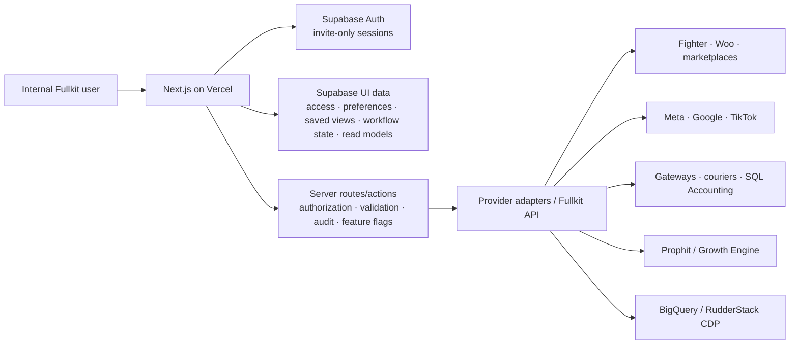

# Fullkit Frontend UI/UX Plan and Fable Prompt

Related product decisions: [[Fullkit Product Portfolio PRD]], [[Fullkit Technical Architecture]], [[Fullkit Schema Blueprint]], [[Growth Engine]], [[P1 - Customer Revenue Engine]], [[P3 - Marketing Execution and Commerce Experience]], [[P4 - Commerce Operations and WMS]], and [[P6 - Finance Control]].

## 1. Product decision

Yes: build and deploy the Fullkit frontend first.

The first frontend should be a **working internal operating shell**, not a complete replacement for Fighter and not a collection of unrelated dashboards. It should let the EFFEN team learn the product, validate the navigation and workflows, and progressively connect real read-side data before any risky system takes over order, ad, payment, or fulfilment writes.

Use:

- **Vercel** for the Next.js frontend, preview deployments, and server-side routes/actions.
- **Supabase** initially for invite-only authentication, role and brand access, UI preferences, saved views, integration metadata, prototype fixtures, comments/assignments, and frontend-serving read models.
- **Adapters and server-side commands** for Fighter, WooCommerce, Meta, Google, TikTok, marketplaces, gateways, couriers, Prophit/Growth Engine, and the future Fullkit operational API.
- **Feature flags and explicit operating modes** so every surface says `Demo`, `Shadow`, or `Live`.

### Important system boundary

During the frontend-first phase:

- Fighter/Woo/marketplaces remain the order source or operating authority where they are today.
- Ad platforms remain the campaign-delivery authority.
- The Prophit/Growth Engine remains a recommendation and planning source.
- Supabase can serve the UI and hold frontend workflow state, but must not silently become a second authority for payment, stock, shipment, or ad-delivery facts.
- A user may create a **draft order** in the prototype. A real order is pushed only through a guarded server-side adapter after validation, permission, idempotency, and audit are implemented.

This resolves the apparent conflict with the existing Cloud SQL/BigQuery architecture: Supabase accelerates the first product surface; provider and Fullkit contracts keep it replaceable. If Supabase later becomes the accepted operational PostgreSQL core, that should be an explicit architecture decision rather than an accidental result of frontend development.

## 2. Product mental model

Fullkit is the place where an operator answers:

1. **What needs attention now?**
2. **What is happening across brands and channels?**
3. **What is the trusted customer, order, product, inventory, and money context?**
4. **What should we do next, why, and who owns it?**
5. **Did the action work?**

The default landing page is therefore a **Command Centre**, not a vanity KPI dashboard.

## 3. Primary users and jobs

| User | What they come to Fullkit to do |
|---|---|
| HQ / management | See cross-brand performance, exceptions, cash and contribution signals, approve important actions, and know who owns each problem |
| Sales / customer service | Create a chat or phone order, search a customer, inspect order and conversation history, correct permitted fields, and hand off an issue |
| Marketing / growth | Connect ad accounts, map them to brands and markets, consolidate performance, inspect campaigns/creative, compare target versus actual, and act on recommendations |
| Brand / product owner | Maintain brand, store, product, variant, price, claims, FAQs, media, market eligibility, and source-system mappings |
| Operations / warehouse | Work order exceptions, release fulfilment, generate or inspect AWBs, track shipments, handle returns, and see inventory constraints |
| Finance | Reconcile payments, payouts and ad spend, review contribution, approve commissions and allocations, and work exceptions |
| Platform admin / analyst | Manage users, roles, integrations, sync health, data quality, metric definitions, exports, and audit history |

## 4. Information architecture

### Global shell

Always available:

- EFFEN workspace and brand/market switcher
- global date range
- operating-mode badge: `Demo`, `Shadow`, or `Live`
- universal search for order ID, customer phone, SKU, campaign, or integration
- create menu: order, import, customer note, recommendation/action, integration
- data freshness and reconciliation indicator
- notifications and assigned-work inbox
- user, role, and environment menu

### Primary navigation

1. **Command Centre**
2. **Commerce**
   - Orders
   - Customers
   - Fulfilment
3. **Growth**
   - Marketing
   - Prophit
   - Creative
4. **Merchandise**
   - Brands & Catalog
   - Inventory
   - Production
5. **Control**
   - Finance
   - Reports
6. **Platform**
   - Integrations
   - Data Health
   - Audit
   - Settings

Messaging and lifecycle work should appear inside the relevant customer and order context first. A larger Lifecycle/Conversation module can become its own navigation item when that operating workflow is ready.

## 5. Complete UI inventory

| Area | What people do | Main screens | Delivery |
|---|---|---|---|
| Command Centre | Review exceptions, risks, targets, failed syncs, approvals, and assigned work | Morning brief, attention queue, approval inbox, activity feed | **First build** |
| Orders | Create a chat/manual order, import orders, find and work an order, inspect its full timeline | Order list, saved queues, new order, import preview, order detail | **First build** |
| Customers / CDP | Find a person, understand identity and value, see orders/conversations/consent, build a segment | Customer list, Customer 360, segments | **First build** |
| Marketing | Add ad accounts, map account → brand/market/store, consolidate Meta/Google/TikTok results, inspect campaign and creative | Overview, accounts, connection wizard, campaign explorer | **First build** |
| Prophit / Growth | Compare target versus actual, diagnose variance, review evidence, approve or assign recommendations, track outcomes | Scoreboard, diagnosis, recommendation detail, action history | **First build** |
| Brands & Catalog | Manage brands, sites/stores, products, variants, price, claims, content, FAQs, media, and external IDs | Brand directory/detail, product list/detail | **First build** |
| Reports | View governed order, customer, media, contribution and operating reports; drill through and export | Report library, report canvas, saved reports | **First build** |
| Integrations | Connect and monitor Fighter, Woo, ad platforms, marketplaces, gateways, couriers, Prophit and SQL Accounting | Registry, add-connection wizard, integration detail and logs | **First build** |
| Data Health | Review freshness, missing mappings, failed jobs, reconciliation, and definition coverage | Health overview, issues, sync runs, metric glossary | **First build**, lightweight |
| Fulfilment | Release orders, reserve, pick, pack, book courier, print AWB, track, and handle returns | Work queues, fulfilment detail, shipment/return views | Next |
| Creative | Capture ideas, plan demand, make briefs, manage calendar/capacity/assets, approve, bind to ads, learn | Idea inbox, calendar, brief, asset library, performance | Next |
| Inventory | Inspect stock, availability, reservations, incoming supply, stockout risk, movements and counts | Inventory overview, item detail, movements, count session | Next |
| Finance | Reconcile order → payment → settlement → payout, match ad spend/invoice/card, run commissions, inspect contribution | Control centre, cases, spend reconciliation, commissions, close | Next |
| Lifecycle / Messaging | Run customer journeys, work conversations, manage templates/contact policy and service cases | Inbox, customer timeline, journeys, templates, exceptions | Later |
| Production / MRP | Plan demand and supply, manage BOMs and work orders, record batch/yield/QC | Plan, exceptions, work orders, batches | Later |
| Iteratus | Collect trend evidence, rank idea cards, accept/defer into creative briefs | Research collections, idea board, idea detail | Later |
| Admin / Audit | Invite users, assign role and brand scope, inspect structured events and configuration changes | Users/roles, security, audit timeline | Foundation |

### Explicit exclusions

- No Fullkit wallet.
- No page builder; Novomira/Woo remains the owned-commerce publishing system.
- No accounting ledger; SQL Accounting remains authoritative.
- No autonomous payment, budget, stock, fulfilment, or high-risk customer action.
- No generic “revenue” or “profit” number without a precise metric definition and source.

## 6. First-build screen specifications

### 6.1 Command Centre

The page starts with a short sentence such as:

> Good morning. Four items need a decision, two sources are stale, and yesterday's contribution is 7.4% below plan.

Layout:

1. **Attention strip** — urgent order exceptions, failed syncs, ad pacing risk, stock risk, and approvals.
2. **Commercial scorecard** — net revenue, contribution, ad spend, MER, orders, new-customer mix, target variance. Every card shows definition, source, and freshness on hover or drill-through.
3. **Today versus plan** — compact chart by brand and market.
4. **My work** — owned tasks with due time, severity, and next action.
5. **Growth recommendations** — ranked by expected contribution, confidence, risk, and expiry.
6. **Data trust panel** — account coverage, last successful sync, reconciliation state, and unmapped records.

### 6.2 Orders

#### Order list

- Saved views: My work, Unassigned, New, SLA risk, Payment exception, Fulfilment exception, Failed automation, In transit, Returns, All.
- Filters: brand, market, store, channel, order/payment/fulfilment/shipment state, SKU, gateway, courier, assignee, age, risk, currency.
- Each row keeps the states separate rather than merging them into one status.
- Bulk actions show a preview of affected records and do not offer unsafe undo claims.

#### Create order

A three-step flow:

1. **Cart** — search by product, variant, SKU, alias, or barcode; see price, sellability, and available-to-promise.
2. **Customer and delivery** — search existing customer by phone/email, or create a provisional customer; capture address, source conversation, salesperson, brand, market, and store.
3. **Payment and review** — choose verified online payment or COD policy, shipping option, review warnings, then save draft or submit.

Include a quick-entry panel that accepts pasted WhatsApp/order text and produces reviewable extracted fields. It must say “Review required” and never create a live order silently.

#### Order detail

- header with order ID, source, brand/store, current owner, next action, and live/shadow status
- customer summary and contact permissions
- items and amount breakdown
- separate order, payment, fulfilment, shipment, notification, and return states
- evidence-backed chronological timeline
- integration/source identifiers
- permitted actions in a right-side action rail
- audit and retry state

### 6.3 Customer 360

Show:

- resolved identity and linked identifiers
- brand relationships and market
- contact consent and suppression
- lifetime orders, net revenue, contribution LTV, last order, repeat state, return/refund and COD risk
- order and conversation timeline
- purchased products and replenishment cues
- active segment/journey memberships
- service cases, feedback, objections, and owner
- data provenance and confidence

Use privacy-safe masking in lists. Reveal only what the user's role needs.

### 6.4 Marketing

#### Consolidated overview

- account coverage and freshness
- spend, platform revenue, Fullkit orders, new customers, blended MER, contribution, and target variance
- breakdown by platform, brand, market, account, campaign, product, and creative
- clear warning that platform attribution is not accounting revenue or incrementality

#### Connect ad account wizard

1. Choose provider: Meta, Google, or TikTok.
2. Authenticate through a server-side OAuth start.
3. Select accessible accounts.
4. Map each account to legal entity, brand, market, currency, business purpose, and owner.
5. Select read scopes; live write scopes stay disabled until separately approved.
6. Review data range and expected objects.
7. Test connection and show exact result.
8. Start initial sync and display progress.

The UI never displays client secrets or long-lived tokens.

#### Campaign explorer

Provide a three-pane drill-down:

- campaign/ad-set/ad tree
- performance and target comparison
- creative, product, landing-page, inventory, and customer-quality context

### 6.5 Prophit / Growth

This is not another chart page. It is a decision chain:

**target → expectation → actual → variance → diagnosis → recommendation → approval → action → outcome**

The first version needs:

- portfolio scoreboard by brand and market
- target-versus-actual waterfall or variance chart
- ranked diagnoses with evidence and confidence
- recommendation cards with expected contribution impact, risks, dependencies, owner, due date, and expiry
- action detail with approve, reject, assign, schedule, or request evidence
- execution receipt and outcome follow-up
- decision history showing what was tried before

Prophit recommendations arrive through a read-only integration first. Fullkit owns assignment, approval, action tracking, and outcome evidence.

### 6.6 Brands & Catalog

#### Brand detail

- legal entity, markets, currencies, domains/stores and channels
- logos and brand presentation
- per-brand operating rules
- approved sender/contact policy
- product eligibility and claims policy
- connected integrations and data health

#### Product detail

- product, variants/SKUs, aliases, barcodes, bundle composition
- prices by market/currency and effective date
- stock and sellability summary
- approved claims, prohibited claims, FAQs, usage, warnings, target customer, objection handling
- media and content assets
- Woo/Fighter/marketplace/ad catalog mappings
- version history, review state, owner, and effective dates

### 6.7 Reports

Start with five governed reports:

1. Commercial overview
2. Order and fulfilment performance
3. Marketing consolidation
4. Customer/cohort and repeat behavior
5. Product contribution and inventory constraint

Every report shows:

- metric definition
- grain and filters
- source lineage
- freshness
- reconciliation/data-quality state
- drill-through to contributing records
- export permission and audit

### 6.8 Integrations and Data Health

Cards and details for:

- Fighter
- WooCommerce / Novomira stores
- Meta Ads
- Google Ads
- TikTok Ads and TikTok Shop
- Shopee / Lazada
- payment gateways
- couriers
- RudderStack / CDP
- Prophit / Growth Engine
- SQL Accounting

Each connection displays owner, brand/store scope, environment, scopes, direction, last success/failure, freshness, sync checkpoint, error count, and rotation/expiry. Credentials are secret references, never plaintext.

## 7. UX rules

1. **Exception first.** Show what needs action before general metrics.
2. **One object, one timeline.** Orders, customers, integrations, recommendations, and campaigns have an evidence timeline.
3. **Trust is visible.** Every analytical surface exposes source, freshness, definition, and quality.
4. **States stay separate.** Order, payment, fulfilment, shipment, notification, and return are linked but never collapsed into one misleading badge.
5. **Scope is obvious.** Brand, market, store, channel, currency, and date selection are visible.
6. **Actions explain consequences.** Material actions show what changes, which external system receives it, and whether rollback is possible.
7. **AI proposes; a human owns.** AI output carries evidence, confidence, risk, expiry, and a named approval path.
8. **Dense, not cramped.** Desktop-first operational tables with strong hierarchy, saved views, sticky filters, and keyboard-friendly search.
9. **Progressive disclosure.** Summary → reason → evidence → raw source.
10. **No dead ends.** Empty states explain which integration or mapping unlocks the screen.

## 8. Visual direction

Fullkit should feel like a calm, modern commerce command centre:

- desktop-first, optimized around 1440 px and usable at 1024 px
- dark mode by default, with a complete light mode
- deep graphite/navy surfaces rather than pure black
- warm white text, restrained borders, and generous spacing
- emerald for healthy/positive, amber for attention, coral/red for urgent, blue for informational, violet for AI/recommendations
- Geist or a similarly neutral sans serif; tabular numerals for metrics
- charts use a limited, consistent palette and direct labels
- icons are quiet and functional
- no excessive gradients, glassmorphism, giant cards, decorative 3D, or consumer-social visual language

## 9. Frontend and data architecture



### Frontend implementation shape

- Next.js App Router with TypeScript
- Tailwind CSS and shadcn/ui primitives
- Recharts or an equivalent accessible React chart library
- server components for authenticated data pages where useful
- client components only for filters, drawers, charts, tables, and interactive workflows
- typed domain objects and repository interfaces
- mock repository enabled when Supabase environment variables are absent
- Supabase repository enabled when configured
- no provider secret or Supabase secret/service-role key in the browser

### Initial Supabase domains

These tables support the product shell without claiming ownership of external facts:

- `workspaces`
- `brands`
- `markets`
- `stores`
- `profiles`
- `memberships`
- `membership_brand_scopes`
- `user_preferences`
- `saved_views`
- `work_items`
- `assignments`
- `approvals`
- `comments`
- `integration_connections`
- `integration_account_mappings`
- `sync_runs`
- `data_quality_issues`
- `metric_definitions`
- `feature_flags`
- `audit_events`
- optional frontend-serving read models for orders, customers, campaigns, products, and recommendations

For the prototype, seed only synthetic data. Do not place real customer PII or live credentials in Fable-generated fixtures.

### Authorization

- Invite-only; no public signup.
- Membership roles: HQ admin, management, sales/CS, marketing/growth, brand/product owner, operations/warehouse, finance, analyst, and integration admin.
- Authorization always combines role with workspace, brand, market/store, action, and environment.
- RLS on every exposed Supabase table.
- Use immutable membership and scope data for authorization; never use user-editable metadata.
- Use explicit table grants as well as RLS. New Supabase projects no longer expose new tables to the Data API automatically by default.
- Sensitive mutations go through server-side handlers that re-check the user, scope, state, and feature flag.

### Deployment environments

| Environment | Purpose | Data |
|---|---|---|
| Local | Development | Fixtures or local/dev Supabase |
| Preview | Review every meaningful change | Synthetic or privacy-safe staging data |
| Production | Internal Fullkit app | Approved live read data and explicitly enabled commands |

Create a Vercel preview deployment first, validate all core flows, then promote the tested build. Keep preview and production environment variables separate.

## 10. Delivery sequence

### Slice 0 — Fable prototype

- Build the complete shell and clickable P0 routes.
- Use realistic synthetic EFFEN/Lipidri data.
- Make the six main flows work entirely in the browser.
- Validate names, navigation, density, terminology, roles, and mobile/tablet constraints.

### Slice 1 — Deployed frontend foundation

- Move the generated design into the real repository.
- Add Supabase invite-only auth, memberships, brand scopes, preferences, saved views, work items, and RLS.
- Deploy to a protected Vercel preview URL.
- Add error, empty, loading, permission-denied, stale-data, and disconnected-source states.

### Slice 2 — Real read side

- Connect Fighter/Woo order evidence.
- Connect ad-account metadata and normalized daily facts.
- Connect Customer 360 read models.
- Connect Prophit recommendations.
- Add integration health, freshness, and reconciliation.
- Keep all business-system writes disabled.

### Slice 3 — Bounded write pilot

- Enable draft/manual order creation for one pilot brand.
- Add review and approval.
- Push through one idempotent adapter.
- Record execution receipt and audit event.
- Reconcile against Fighter/source and retain rollback/fallback.

### Slice 4 — Expand workflows

- Fulfilment and inventory
- creative supply and activation bindings
- lifecycle/customer service
- finance controls
- additional brands, accounts, and provider commands

## 11. First-release acceptance criteria

- A user can understand Fullkit's structure without training.
- The workspace/brand/date/mode scope is always clear.
- The command centre answers what needs attention and who owns it.
- A sales/CS user can create a reviewable draft order in under two minutes.
- A user can find an order and understand its separate states and full history.
- A user can find a customer and understand identity, value, consent, history, and next context.
- A marketer can add and map a synthetic ad account and see consolidated coverage.
- A growth operator can move from variance to evidence to an assigned recommendation.
- A product owner can inspect brand and product truth, including claims and external mappings.
- Every report communicates definition, source, freshness, and quality.
- Demo, shadow, and live data/actions cannot be confused.
- No secret or real PII appears in generated fixtures or client code.
- Keyboard navigation, contrast, focus, form labels, table semantics, and reduced motion are verified.

## 12. One-shot Fable build prompt

Copy everything inside the following block into Fable:

```text
You are a senior product designer and frontend engineer. Build a high-fidelity, interactive, desktop-first internal commerce operations web app called “Fullkit”.

PRODUCT CONTEXT
Fullkit is the internal commerce command centre for EFFEN International Sdn Bhd. It unifies operational visibility and decision workflows across Fighter/WooCommerce orders, customers and CDP data, Meta/Google/TikTok advertising, brands and products, inventory and fulfilment, governed reports, integrations, and the Prophit/Growth Engine.

The app is not a generic analytics dashboard and not a Fighter clone. Its default question is: “What needs attention now, why, who owns it, and what should happen next?”

This first build is a frontend prototype using realistic synthetic data. It must be ready to connect later to Supabase and deploy on Vercel. Do not use real customer PII, real credentials, or live provider calls.

TECHNICAL FOUNDATION
- Work inside this existing Fullkit project directory:
  C:\Users\Nadeem\Desktop\Obsidian\build-blog\build-vault\5. Idea Vault\1. Internal Application\Fullkit - Commerce Backend Infrastructure
- Treat that directory as the project root. Inspect and preserve its existing product plans and reference material. Do not create a separate sibling project or place the app outside this directory.
- Put the frontend application in:
  C:\Users\Nadeem\Desktop\Obsidian\build-blog\build-vault\5. Idea Vault\1. Internal Application\Fullkit - Commerce Backend Infrastructure\apps\web
- If `apps\web` does not exist, create it. If it already exists, inspect it before editing and preserve unrelated work.
- Use Next.js App Router, TypeScript, Tailwind CSS, shadcn/ui, Lucide icons, and Recharts or an equivalent React chart library.
- Organize code into reusable app-shell, navigation, table, metric, timeline, status, chart, filter, drawer, dialog, form, empty-state, error-state, and skeleton components.
- Create typed domain models and a repository interface.
- Provide a MockRepository with seeded synthetic data and make it the default.
- Prepare a SupabaseRepository adapter but do not require environment variables for the prototype to run.
- If Supabase variables are absent, the entire prototype must still run with mock data.
- Do not expose a service-role/secret key in browser code.
- Make all routes and major interactions functional. Avoid dead buttons.

APP SHELL
Create a persistent left sidebar, top context bar, and main content area.

Top context bar:
- workspace: “EFFEN International Sdn Bhd”
- brand/market selector with “All brands”, “Lipidri MY”, and clearly labeled synthetic demo brands
- date range selector
- global search for order ID, phone, SKU, campaign, or integration
- operating-mode pill: Demo / Shadow / Live, default Demo
- data-freshness indicator
- create button
- notifications
- user/role menu

Sidebar navigation:
1. Command Centre
2. Commerce
   - Orders
   - Customers
   - Fulfilment
3. Growth
   - Marketing
   - Prophit
   - Creative
4. Merchandise
   - Brands & Catalog
   - Inventory
   - Production
5. Control
   - Finance
   - Reports
6. Platform
   - Integrations
   - Data Health
   - Audit
   - Settings

Build the first-release routes in full. Show the other routes as thoughtful “next module” pages that explain their future workflow and required integrations rather than blank pages.

CORE ROUTES AND INTERACTIONS

1. /command-center
- Start with: “Good morning. Four items need a decision, two sources are stale, and yesterday’s contribution is below plan.”
- Attention strip containing order exceptions, failed syncs, ad pacing risk, stock risk, and approvals.
- Commercial scorecard: net revenue, contribution, ad spend, blended MER, orders, new-customer mix, and target variance.
- Each metric reveals definition, source, and freshness.
- Today-versus-plan chart by brand.
- “My work” queue with owner, severity, due time, next action.
- Ranked Prophit recommendations with expected contribution impact, confidence, risk, and expiry.
- Data trust panel showing source coverage, last sync, reconciliation, and unmapped records.

2. /orders
- Dense operational table with saved views: My work, Unassigned, New, SLA risk, Payment exception, Fulfilment exception, Failed automation, In transit, Returns, All.
- Filters for brand, market, store, channel, separate order/payment/fulfilment/shipment states, SKU, gateway, courier, assignee, age, risk, and currency.
- Row fields include order ID, customer, source, brand/store, items, separate status pills, amount/currency, owner, age, and next action.
- Clicking a row opens /orders/[id].

3. /orders/new
Create a three-step order flow:
- Cart: search product/variant/SKU/alias, choose variant/quantity, show price and available-to-promise.
- Customer and delivery: find existing customer by phone/email or create provisional customer; include source conversation, salesperson, brand, market, store, and address.
- Payment and review: choose verified online payment or COD, shipping option, see policy warnings, save draft or submit for review.
- Add a “Paste chat order” panel that accepts a sample WhatsApp message and populates reviewable extracted fields. Clearly label “AI extraction — review required”. It must not silently create an order.
- After submission, show a success receipt and link to the draft order.

4. /orders/[id]
- Header with order ID, source, brand/store, owner, next action, and Demo/Shadow/Live mode.
- Customer summary, items, amount breakdown, payment, fulfilment and shipment panels.
- Keep order, payment, fulfilment, shipment, notification, and return states separate.
- Full chronological evidence timeline containing user, system, connector, rule, and courier events.
- Source identifiers and integration health.
- Right-side action rail with only state-appropriate actions; risky actions open an impact-preview confirmation dialog.

5. /customers
- Searchable Customer 360 list with privacy-safe phone/email masking.
- Filters for brand, cohort, lifecycle state, consent, last order, repeat state, value tier, service risk, and source.
- Clicking a row opens /customers/[id].

6. /customers/[id]
- Resolved identity and linked identifiers.
- Consent and suppression.
- Lifetime orders, net revenue, contribution LTV, last order, repeat state, return/refund and COD risk.
- Order and conversation timeline.
- Purchased products and replenishment cues.
- Segment/journey memberships, cases, feedback, objections, and owner.
- Data source/provenance panel with confidence.

7. /marketing
- Consolidated overview for Meta, Google, and TikTok.
- Account coverage and freshness.
- Spend, platform-attributed revenue, Fullkit orders, new customers, blended MER, contribution, and target variance.
- Breakdown by platform, brand, market, account, campaign, product, and creative.
- Include a visible note: platform attribution is not accounting revenue or proven incrementality.
- Campaign explorer with campaign/ad-set/ad hierarchy, performance and target comparison, and linked creative/product/landing-page/inventory/customer-quality context.

8. /marketing/accounts/new
Create a realistic “Connect ad account” wizard:
- choose Meta, Google, or TikTok
- simulated OAuth authentication
- select accessible accounts
- map account to legal entity, brand, market, currency, business purpose, and owner
- choose read scopes; disable write scopes with “requires separate approval”
- review data range and objects
- test connection
- initial-sync progress and success result
Never display a client secret or token.

9. /prophit
Design this as a decision chain, not another dashboard:
target → expectation → actual → variance → diagnosis → recommendation → approval → action → outcome.
- Portfolio scoreboard by brand and market.
- Target-versus-actual variance chart.
- Ranked diagnoses with evidence and confidence.
- Recommendation cards with expected contribution impact, risks, dependencies, owner, due date, and expiry.
- Clicking a recommendation opens a detail drawer or route where the user can approve, reject, assign, schedule, or request more evidence.
- Show prior decision and outcome history.
- Label imported recommendations as coming from the Prophit/Growth Engine read-side integration.

10. /catalog/brands and /catalog/products
- Brand directory and detail with legal entity, markets, currencies, domains/stores, channels, brand rules, sender/contact policy, product eligibility, claims policy, integrations, and data health.
- Product list and detail with variants/SKUs, aliases, barcodes, bundle composition, effective-dated market prices, stock/sellability, approved and prohibited claims, FAQs, usage, warnings, target customer, objection handling, media, and Woo/Fighter/marketplace/ad-catalog mappings.
- Include version, review state, owner, and effective date.

11. /reports
Create a governed report library and five working report views:
- Commercial overview
- Order and fulfilment performance
- Marketing consolidation
- Customer/cohort and repeat behavior
- Product contribution and inventory constraint
Every report shows metric definition, grain, filters, source lineage, freshness, quality/reconciliation, drill-through, and export permission.

12. /integrations
Create integration cards and details for Fighter, WooCommerce/Novomira, Meta Ads, Google Ads, TikTok Ads/Shop, Shopee, Lazada, payment gateways, couriers, RudderStack/CDP, Prophit/Growth Engine, and SQL Accounting.
Each connection shows brand/store scope, environment, read/write scopes, owner, direction, last success/failure, freshness, sync checkpoint, error count, and rotation/expiry.
Create a useful integration detail page with sync history and reason-coded errors.

13. /data-health
- Overall trust score
- freshness by source
- missing brand/account/SKU mappings
- failed or partial syncs
- reconciliation coverage
- metric-definition coverage
- owned issue queue

ROLE BEHAVIOR
Include a demo role switcher for HQ admin, Sales/CS, Marketing/Growth, Operations, Finance, and Analyst. Change visible navigation, metrics, fields, and actions to demonstrate least-privilege behavior. This switcher is for the prototype only and must be clearly labeled.

DATA AND STATES
Seed coherent synthetic data across pages so the same order, customer, product, brand, campaign, recommendation, and integration can be followed between screens. Use MYR and SGD examples. Make all names and contact details obviously synthetic.

Always distinguish:
- order state
- payment state
- fulfilment state
- shipment state
- notification state
- return state

Always expose:
- brand
- market
- store
- channel
- currency
- source
- owner
- data freshness
- Demo/Shadow/Live mode

VISUAL DIRECTION
Create a calm, premium, modern internal command centre:
- desktop-first at 1440px, usable at 1024px
- dark mode default plus complete light mode
- deep graphite/navy surfaces, not pure black
- warm white text and restrained borders
- emerald for healthy, amber for attention, coral/red for urgent, blue for information, violet for AI/recommendations
- Geist or a similarly neutral sans serif with tabular numerals
- dense but breathable tables
- limited chart palette with direct labels
- subtle transitions and excellent loading/skeleton states
- no excessive gradients, glassmorphism, giant empty cards, 3D decoration, or generic SaaS landing-page styling

UX AND QUALITY RULES
- Exception first; action before decoration.
- Summary → reason → evidence → raw source.
- Every analytical metric exposes definition, source, freshness, and data-quality state.
- Material actions show impact, external destination, reversibility, and audit behavior.
- AI output includes evidence, confidence, risk, expiry, and a human owner.
- Empty states explain which integration or mapping unlocks the view.
- Include polished loading, empty, error, stale-data, disconnected-source, and permission-denied states.
- Make navigation, forms, dialogs, tables, and keyboard focus accessible.
- Respect reduced motion.
- Do not use lorem ipsum.
- Do not fabricate claims that the app is connected to live systems.

DONE WHEN
- The prototype runs without Supabase credentials.
- All first-release routes render and link together.
- The six core user flows work: morning review, create draft order, inspect order, inspect customer, connect/map ad account, and act on a Prophit recommendation.
- Shared synthetic entities stay consistent across pages.
- No action button is dead; every action changes prototype state, opens a meaningful flow, or explains why it is unavailable.
- The UI clearly communicates scope, trust, and operating mode.
- The code is clean enough to move into a production repository and connect to Supabase/Vercel next.
```

## 13. Recommended Fable follow-up prompts

Use these only after the one-shot build is stable.

### Follow-up 1 — UX audit

```text
Walk through the six core Fullkit user flows as each demo role. Fix broken navigation, dead actions, inconsistent seeded entities, missing loading/error/empty states, confusing terminology, keyboard traps, contrast issues, and any point where Demo/Shadow/Live or data freshness is unclear. Do not add new modules.
```

### Follow-up 2 — Supabase preparation

```text
Refactor the Fullkit prototype so every page reads through typed repository interfaces. Keep MockRepository as the default. Complete a SupabaseRepository implementation using browser and server clients appropriately, invite-only auth, membership plus brand scopes, and environment-based selection. Do not place secret/service-role keys in client code. Do not create live business-system writes yet.
```

### Follow-up 3 — Vercel readiness

```text
Prepare Fullkit for a Vercel preview deployment. Add environment validation by key name without printing values, protected authenticated routes, a health endpoint, safe error handling, build checks, and a README covering local, preview, and production configuration. Confirm the app builds successfully with mock mode and with Supabase mode.
```

## 14. Implementation notes to preserve

- Supabase's current Next.js guidance uses the App Router, cookie-based auth, a publishable browser key, and separate browser/server clients.
- In current Supabase projects, new tables may require explicit Data API grants in addition to RLS; do not assume table creation makes a table reachable.
- Authenticated, user-specific routes must not leak through inappropriate response caching.
- Vercel should produce a preview deployment for review before production promotion.
- Provider OAuth and credential exchange must be server-side.
- Fable output is the beginning of the product repository, not the accepted production security model.

Official implementation references:

- [Supabase Auth with Next.js](https://supabase.com/docs/guides/auth/quickstarts/nextjs)
- [Supabase Auth advanced SSR guide](https://supabase.com/docs/guides/auth/server-side/advanced-guide)
- [Supabase Data API exposure change](https://supabase.com/changelog/45329-breaking-change-tables-not-exposed-to-data-and-graphql-api-automatically)
- [Vercel Next.js deployment](https://vercel.com/docs/frameworks/full-stack/nextjs)
- [Vercel preview deployment workflow](https://vercel.com/docs/deployments/overview)
