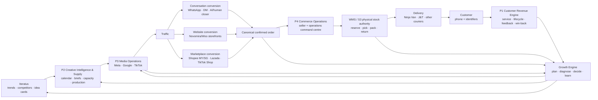
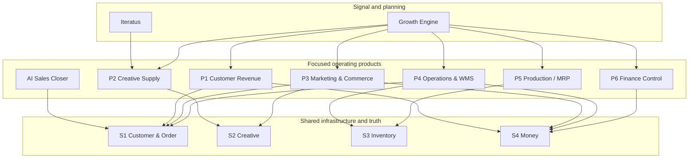
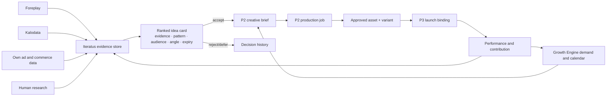

# Fullkit Product Portfolio PRD

> [!summary] Portfolio decision
> Fullkit is one shared commerce infrastructure with several bounded products on top. We should **not** build one giant application. We should give each product its own workflow, permissions, state and success metric, then stitch products together through canonical APIs and events.

Infrastructure foundation: [[PRD]], [[Fullkit Schema Blueprint]], and [[Fullkit Technical Architecture]]. Analytical decision layer: [[Growth Engine]].

Product deep dives:

- [[Iteratus - Trends and Ideas]]
- [[P1 - Customer Revenue Engine]]
- [[AI Sales Closer]]
- [[P2 - Creative Intelligence and Supply]]
- [[P3 - Marketing Execution and Commerce Experience]]
- [[P4 - Commerce Operations and WMS]]
- [[P5 - Production Planning and MRP]]
- [[P6 - Finance Control]]

Infrastructure deep dives:

- [[S1 - Customer and Order Hub]]
- [[S2 - Creative Loop]]
- [[S3 - Inventory]]
- [[S4 - Money]]

## 1. Product vision

Fullkit should turn EFFEN's complete commerce loop into a measurable, coordinated system:

**signal → idea → creative supply → media → conversation/storefront → confirmed order → fulfilment → customer → lifecycle value → learning**

The portfolio must solve three problems at the same time:

1. **Operational truth:** one trusted customer, order, inventory and money backbone across brands and channels.
2. **Specialized work:** focused products for creative, marketing, customer revenue, operations, production and finance.
3. **Closed-loop learning:** commercial results feed the Growth Engine, Iteratus and P2 so the next plan and creative supply improve.

## 2. Complete commerce loop

### The three conversion locations

| Conversion location | Conversion owner | What creates the order | What Fullkit receives |
|---|---|---|---|
| Conversation | [[AI Sales Closer]] or human CS/closer | Approved cart plus payment/COD decision | Canonical order command through S1 |
| Website | [[P3 - Marketing Execution and Commerce Experience]] plus Novomira/Woo | Checkout completion | Idempotent order webhook/import through S1 |
| Marketplace | External marketplace storefront | Marketplace checkout | Normalized marketplace order through S1 adapter |

The source differs; the downstream order contract does not. Every accepted order must have a source, store, brand, customer identity reference, items, amounts, payment state and fulfilment state.

### The confirmed-order boundary

An order may become operationally confirmed only when it passes the applicable channel rules:

- source event or command is authentic and idempotent;
- product and quantity resolve to canonical variants;
- customer identifiers and delivery address meet minimum validity;
- pricing, discount and currency snapshots are retained;
- payment is verified by the payment provider, or COD terms are accepted;
- fraud, duplication and inventory policies return an allowed or review state.

`order_confirmed` does **not** mean paid, packed, shipped or delivered. Those remain separate state machines.

## 3. Portfolio map

The arrows mean “uses the spine contract,” not “owns every table in the spine.”

### Product-to-spine relationship

“Primary” means the product is the main operational interface/writer for that part of the spine contract. “Consumes” means it reads or issues bounded commands without owning the canonical record.

| Product | S1 Customer & Order | S2 Creative | S3 Inventory | S4 Money |
|---|---|---|---|---|
| Iteratus | Customer/search signals as governed inputs | Publishes selected refs; consumes creative outcomes | — | Reads governed opportunity economics only |
| P1 Customer Revenue | **Primary** lifecycle/service interface over S1 | Customer feedback may create creative evidence | Reads availability/replenishment | Reads value, payment/refund and contribution traits |
| AI Sales Closer | **Primary** opportunity-to-order client; S1 remains order authority | Reads approved campaign/creative context when needed | Live availability read only | Hosted checkout/COD command and verified outcome read |
| P2 Creative Supply | Reads customer/objection evidence | **Primary** planning/production interface | Reads product/availability constraints | Reads production and commercial economics |
| P3 Marketing & Commerce | Sends website/channel order intake | **Primary** media launch/binding client | Reads pre-launch availability | Shared adapter produces spend evidence; P3 reads pacing/contribution |
| P4 Operations & WMS | **Primary** order/fulfilment operations interface | — | **Primary** warehouse/stock workflow interface | Reads payment/COD; creates bounded cost evidence |
| P5 Production / MRP | Reads actual/backlog demand | — | **Primary** material/production client; physical moves remain S3/WMS | Publishes cost evidence; reads cash/cost constraints |
| P6 Finance Control | Reads order/customer references | Reads creative/media cost references | Reads quantity/cost/movement evidence | **Primary** reconciliation/close interface over S4 |
| Growth Engine | Consumes and plans | Consumes and creates creative demand | Consumes constraints and creates demand signals | Consumes governed economics and records decisions |

## 4. Product definitions and boundaries

| Product | Primary outcome | Standalone posture | Owns | Does not own |
|---|---|---|---|---|
| **Iteratus** | Better evidence-backed creative opportunities | Standalone satellite, lightly stitched | Trend observations, inspiration evidence, idea cards, source snapshots, research collections | Creative calendar, production jobs, ads or commercial truth |
| **P1 Customer Revenue Engine** | More retained contribution and faster service | Standalone product suite | Lifecycle journeys, eligibility, consent-aware contact policy, conversation/service workflow | Canonical order/payment truth or autonomous sales-closing policy |
| **AI Sales Closer** | Convert qualified conversations safely | Isolated AI product connected by scoped APIs | Opportunities, closer sessions, requirements, objections, recommendations, follow-ups and handoffs | Warehouse queries, arbitrary discounts, payment verification or stock mutation |
| **P2 Creative Intelligence & Supply** | Produce enough high-quality, deployable creative on time | Standalone operating product | Calendar, demand orders, briefs, concepts accepted for production, jobs, assets, approvals, capacity and iteration | External trend-source truth or ad-platform delivery |
| **P3 Marketing Execution & Commerce Experience** | Acquire demand and convert it through media and websites | Product with two modules | Media plans/activation state, campaign bindings, owned site/page versions, experiments | Canonical ad facts, order truth, lifecycle journeys or WMS |
| **P4 Commerce Operations & WMS** | Move every confirmed order accurately and quickly | Standalone transactional product/UI | Order work queues, fulfilment orchestration and—in an owned WMS—physical warehouse workflow | Duplicate order truth, production planning or accounting ledger |
| **P5 Production Planning & MRP** | Make the right quantity at the right time | Standalone planning/transaction product | BOMs, routings, material requirements, work orders, production batches, yield and QC | Warehouse bin truth or sales demand truth |
| **P6 Finance Control** | Reconcile commercial money and explain contribution | Standalone control product | Reconciliation cases, commission/payable calculations, cost allocation, close exceptions | General ledger; SQL Accounting remains official ledger |
| **Growth Engine** | Convert trusted facts into plans, diagnoses, decisions and learning | Horizontal decision product | Targets, forecasts, variances, recommendations, approvals, actions, experiments and outcome learning | Transactional source truth or specialist workflow state |

## 5. Standalone versus stitched

“Standalone” is a **bounded-context decision**, not necessarily a separate repository, database instance or cloud bill on day one.

| Relationship | Rule | Example |
|---|---|---|
| Fully shared | One canonical record used by many products | Customer, order, SKU, payment, shipment, spend fact |
| Strong stitch | Product-to-product workflow with required API/event contract | Confirmed order → P4 fulfilment; P5 receipt → S3 available stock |
| Light stitch | Useful exchange, but either product can continue without synchronous dependency | Iteratus idea card → P2 brief; P2 performance learning → Iteratus ranking |
| Isolated runtime | Sensitive or failure-prone component may only use allow-listed tools | AI Sales Closer |
| External bounded system | Vendor remains system of record and Fullkit mirrors/commands through an adapter | Marketplace, courier, SQL Accounting, optional WMS or CRM delivery platform |

Initial deployment can use one monorepo and one Cloud SQL cluster with separate schemas, roles and queues. Split a service physically only when scaling, security, release cadence, vendor isolation or team ownership requires it.

## 6. Iteratus and P2: the exact seam

Iteratus is the **outside-in opportunity radar**. P2 is the **inside-out creative supply system**.

Rules:

- Iteratus may ingest exports or API-derived snapshots from Foreplay and Kalodata, subject to their permitted access and terms. It must preserve source URL/ID, capture time and evidence provenance.
- External inspiration is evidence, not EFFEN's reusable asset. Usage rights and originality review happen in P2.
- Iteratus proposes; P2 accepts, rejects, combines or schedules.
- P2 owns the creative calendar, demand forecast, producer capacity, production status and delivery SLA.
- Performance feedback is aggregated through governed S2/Growth marts, not scraped back from screenshots.

## 7. P4 as the shared order-management surface

Yes: P4 should be the lightweight UI used by sellers, CS and operations **over shared infrastructure**.

P4 is not a second OMS database. Its screens compose three authoritative contracts:

| P4 screen/workflow | Authoritative source |
|---|---|
| New/exception/order queues | S1 order and state APIs |
| Customer and conversation context | S1 customer profile plus P1 conversation summary |
| Reserve, pick, pack, ship, return | S3/WMS |
| Payment, COD and settlement flags | S4 |
| Courier label/tracking | Courier adapter plus S1 shipment records |

Role-specific shells may show different actions, but the underlying order remains one record. A seller can create or correct an order; operations can approve or fulfil; warehouse can pick/pack; finance can review money exceptions. Every mutation is permissioned, idempotent and audited.

## 8. Shared data ownership

| Business object | Operational authority | Analytical authority | Major consumers |
|---|---|---|---|
| Customer and identifiers | S1 Cloud SQL | BigQuery/RudderStack governed profile | P1, closer, P3, P4, Growth Engine |
| Order and order state | S1 Cloud SQL | BigQuery conformed order facts | P1, closer, P3, P4, P6, Growth Engine |
| Creative asset lineage | S2/P2 operational store | BigQuery creative facts | Iteratus, P2, P3, Growth Engine |
| Inventory and warehouse movement | S3 or contracted external WMS | BigQuery inventory facts | P3, P4, P5, Growth Engine |
| Payment/settlement/cost | S4 operational records plus provider evidence | BigQuery governed money facts | P1, P3, P4, P6, Growth Engine |
| Plan, recommendation and action | Growth Engine Cloud SQL | BigQuery plan/outcome facts | P1–P6 |

Cloud SQL wins for current accepted operational state. BigQuery wins for historical facts and governed metrics after quality checks. RudderStack is the profile/event activation layer, not the canonical order database.

## 9. Portfolio-wide functional requirements

### FR-1 — One canonical identity and order intake

- Accept orders from conversation, website, Fighter imports and marketplaces.
- Normalize source identifiers while preserving full provenance.
- Resolve customer identities using phone, email and source identities with auditable merge logic.
- Prevent duplicate orders and duplicate revenue events.

### FR-2 — Closed creative loop

- Capture trend/inspiration evidence in Iteratus.
- Convert accepted ideas and Growth Engine demand into calendar capacity and briefs in P2.
- Track every concept → asset → variant → ad/campaign binding → performance observation.
- Forecast required creative supply without treating raw asset volume as success.

### FR-3 — Three conversion paths

- Support conversation-assisted, owned-site and marketplace conversion.
- Attribute each order to its source journey without forcing false last-click certainty.
- Preserve pre-order touchpoints and closer involvement for outcome evaluation.

### FR-4 — Fulfilment and delivery

- Route every confirmed order to a single fulfilment authority per location.
- Support reservation, pick, pack, handover, tracking, delivery, rejection, return and restock/disposition.
- Reconcile order counts and statuses against Fighter/marketplaces/WMS daily during migration.

### FR-5 — Customer revenue and service

- Trigger transactional, educational, feedback, replenishment, cross-sell, loyalty, at-risk and win-back journeys.
- Respect consent, channel policy, frequency caps, suppression and human escalation.
- Give service agents a unified customer/order/conversation view.

### FR-6 — Financial control

- Reconcile orders, payments, marketplace/gateway settlements, refunds, fees and payouts.
- Snapshot COGS and variable costs at the order-item level.
- Calculate commissions/payables deterministically and export approved entries to accounting.

### FR-7 — Governed AI

- AI products receive curated context through APIs and knowledge retrieval, never unrestricted database access.
- Tools use strict input/output schemas and least-privilege permissions.
- High-risk actions require explicit human approval.
- Every AI run, tool call, evidence item, policy version and outcome is observable and evaluable.

## 10. Non-functional requirements

| Requirement | Portfolio rule |
|---|---|
| Reliability | Idempotent commands, durable event delivery, retry/dead-letter handling and reconciliation |
| Security | Workspace/brand scopes, least-privilege service roles, secret manager, field-level PII controls |
| Privacy | Consent and purpose records; retention/deletion propagated across Cloud SQL, BigQuery, RudderStack and vendors |
| Explainability | Every KPI and recommendation shows metric definition, source lineage, freshness and confidence |
| Auditability | Human and automated mutations retain actor, reason, before/after state and correlation IDs |
| Portability | Canonical contracts isolate provider-specific payloads behind adapters |
| Human control | Approval gates, handoff queues, stop/rollback paths and named accountable owner |
| Multi-brand | Workspace, legal entity, brand, store, market and currency are first-class dimensions |

## 11. Build, buy and integrate posture

| Capability | Initial posture | Why |
|---|---|---|
| Cloud SQL/BigQuery/RudderStack backbone | Build/configure | This is the owned truth and strategic data asset |
| Iteratus workflow | Build thin product | EFFEN-specific research-to-creative learning is differentiating |
| Creative generation tools | Integrate | Canva, CapCut, Higgsfield, Flow and model providers are production tools, not Fullkit source truth |
| Website/page generation | Integrate Novomira/Woo | Already purchased; page-builder parity is not strategic now |
| Lifecycle delivery/editor | Hybrid first | Own customer/journey state and events; rent mature delivery, consent/deliverability and channel plumbing initially |
| Conversation inbox | Buy/integrate first | Omnichannel routing, channel compliance and agent inbox are commodity but operationally heavy |
| AI Sales Closer intelligence | Build | Product knowledge, policy, order tools and outcome learning are differentiating |
| WMS | Decide per operational depth | Buy if mature warehouse workflows are urgent; build the narrow S3 ledger regardless |
| Accounting | Integrate SQL Accounting | P6 is a control/reconciliation layer, not a general ledger replacement |
| Workflow glue | Use n8n selectively | Good for connectors and notifications; critical business state remains in product services |

Detailed lifecycle and AI choices are in [[Fullkit Technical Architecture]], [[P1 - Customer Revenue Engine]], and [[AI Sales Closer]].

## 12. Portfolio KPIs

### Commercial outcomes

- Contribution margin and cash contribution by brand, product, channel and cohort
- New-customer contribution and payback period
- Repeat-purchase rate, time to second order and contribution LTV
- Conversion rate by conversation, website and marketplace path

### Operating leverage

- Manual handoffs and spreadsheets retired
- Order exception rate and time to resolution
- Time from confirmed order to pick, ship and delivery
- Finance close/reconciliation cycle and auto-match rate
- First-response and resolution time by channel

### Creative supply and learning

- Distinct concepts and raw source packages created per period
- Brief-to-approved and approved-to-launched cycle time
- On-time capacity fulfilment versus Growth Engine demand
- Creative hit rate, useful-life and incremental contribution by concept family
- Iteratus idea acceptance and validated-learning rate

Volume goals—such as 50 posters/week and 10–20 raw videos/week—are capacity targets. They must be paired with originality, activation, learning and contribution metrics.

### System trust

- Source coverage, freshness and reconciliation pass rate
- Duplicate/missing event rates
- Inventory accuracy and order-to-WMS tally
- AI tool-call success, escalation accuracy, policy violation rate and verified outcome attribution

## 13. Delivery roadmap

### Phase A — Contracts and shadow truth

- Finish S1–S4 canonical contracts and source adapters.
- Ingest all orders, spend, inventory and settlement evidence into governed marts.
- Establish customer identity, consent and event vocabulary.
- Run read-only P4 and finance reconciliation views alongside current tools.

### Phase B — Focused operating MVPs

- Iteratus evidence store and idea-card handoff.
- P2 calendar, creative demand, brief, asset and launch lineage.
- P1 service/transactional journeys through a third-party delivery layer.
- P4 confirmed-order queue and narrow S3 inventory/WMS workflow.
- P6 spend/order/settlement matching.

### Phase C — Closed-loop action

- Growth Engine target-to-creative-demand loop.
- AI Sales Closer pilot on one brand/number with human approval and handoff.
- Lifecycle retention/win-back journeys using governed profile traits.
- P5 demand-to-production planning and finished-goods receipt.

### Phase D — Controlled autonomy

- Gated media, lifecycle and operational actions.
- AI closer handles eligible segments and offers within fixed limits.
- Outcome evaluation updates recommendations, idea ranking and production capacity plans.
- Replace rented workflow components only where cost, control or differentiation is proven.

## 14. Portfolio risks and guardrails

1. **Monolith risk:** shared infrastructure must not become shared mutable product logic. Enforce API/event contracts and schema ownership.
2. **Tool sprawl:** every new SaaS must either own a bounded external capability or feed canonical Fullkit contracts; no orphan data silos.
3. **False identity merges:** phone is an important identity key, not an infallible person ID. Preserve marketplace IDs, email, verification and merge provenance.
4. **AI overreach:** the closer cannot invent claims, prices, discounts, stock or payment success. Policy and tool results outrank model prose.
5. **Two stock authorities:** only one system may own physical inventory for a location. Mirrors are read models, not co-equal ledgers.
6. **Creative volume theatre:** capacity targets cannot replace concept diversity, performance and learning.
7. **Premature platform building:** do not rebuild Klaviyo, respond.io, Canva, a page builder, WMS and accounting simultaneously. Own the data and differentiated decisions first.
8. **Operator overload:** every product needs a named owner, exception queue and service-level target before automation expands.

## 15. Acceptance criteria for the portfolio architecture

This design is ready to move into implementation when:

- every product has a named owner, KPI, operational schema and non-goals;
- every shared object has exactly one operational authority;
- conversation, website and marketplace orders pass the same conformance tests;
- product-to-product writes occur only through versioned commands/events;
- P4 can display a complete order without creating a duplicate order store;
- Iteratus can hand an evidence-rich idea to P2 without becoming P2's calendar or DAM;
- P1 can change lifecycle vendors without losing journey/customer history;
- the closer can complete a sandbox sale using only approved APIs and can always hand off to a human;
- all key events reconcile into BigQuery with freshness and quality status;
- build-versus-buy decisions include an exit path and data-export contract.

## 16. Decisions still requiring operational evidence

- Exact WhatsApp number/brand/business-account topology and channel ownership
- Current Ida/CS workflows, response volumes, intent mix and handoff rules
- Marketplace API approval and write-back capabilities for each market
- Physical warehouse complexity: bins, lots, expiry, serials, waves and multi-location transfers
- BOM, yield, QC and raw-material processes used by production today
- Commission beneficiaries, rules, reversals and accounting export format
- Cross-brand identity/consent policy under Malaysian and Singaporean requirements
- Which lifecycle/conversation vendor is acceptable for the Phase B hybrid
