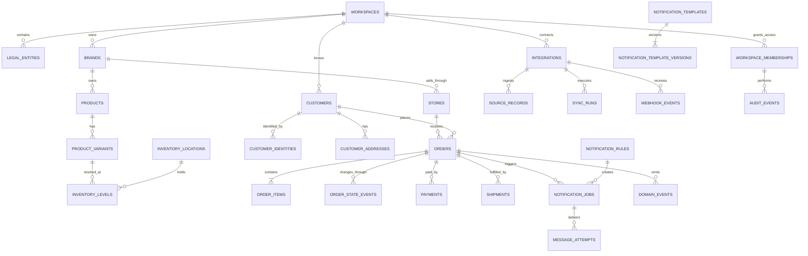

# Fullkit Schema Blueprint

This is the first canonical schema proposal requested in [[PRD]]. It translates the observed Fighter workflows into an owned operational model for Fullkit without copying Fighter's UI structure or agent-network assumptions.

Portfolio requirements and technical placement are defined in [[Fullkit Product Portfolio PRD]] and [[Fullkit Technical Architecture]]. This blueprint remains the canonical shared-core proposal; the following deep dives extend it without creating duplicate customer, order, creative, stock or money truth:

| Shared spine | Canonical deep dive | Workflow products that reference it |
|---|---|---|
| S1 Customer & Order | [[S1 - Customer and Order Hub]] | [[P1 - Customer Revenue Engine]], [[AI Sales Closer]], [[P3 - Marketing Execution and Commerce Experience]], [[P4 - Commerce Operations and WMS]] |
| S2 Creative | [[S2 - Creative Loop]] | [[Iteratus - Trends and Ideas]], [[P2 - Creative Intelligence and Supply]], [[P3 - Marketing Execution and Commerce Experience]], [[Growth Engine]] |
| S3 Inventory | [[S3 - Inventory]] | [[P4 - Commerce Operations and WMS]], [[P5 - Production Planning and MRP]], [[Growth Engine]] |
| S4 Money | [[S4 - Money]] | [[P1 - Customer Revenue Engine]], [[P3 - Marketing Execution and Commerce Experience]], [[P4 - Commerce Operations and WMS]], [[P6 - Finance Control]], [[Growth Engine]] |

Product-specific tables—such as lifecycle journeys, closer opportunities, Iteratus research, production work orders and finance close cases—live in their owning product context and reference these canonical spine IDs. They do not introduce second customer/order/SKU/payment records.

> [!important] Status
> This is a proposed logical schema, not a migration or accepted production contract. Tables and fields are tagged by evidence level. The next operational walkthroughs should validate status transitions, role boundaries, inventory ownership, shipment actions, export fields, and settlement behavior before implementation.

## Direct answer

Yes: the Fighter screens are sufficient to plan the **shape** of Fullkit's database. They show the main entities, workflows, joins, and event boundaries. They are not sufficient to finalize every field or business rule because a UI hides validation logic, database constraints, webhook payloads, failure states, permissions, and source-of-truth decisions.

The correct approach is therefore:

1. Design the normalized domain model now.
2. Label observed versus inferred fields.
3. Keep uncertain workflows flexible through event/state tables.
4. Validate them against real WooCommerce exports, gateway settlements, courier events, and staff workflows.
5. Only then turn the operational model into Cloud SQL PostgreSQL migrations and the analytical model into BigQuery/dbt contracts.

## Wallet decision

- **User report:** EFFEN no longer uses the Fighter Wallets feature.
- **Missing evidence:** the sales manager's reason is not visible in the supplied screenshot, so the reason remains uncaptured.
- **Schema decision:** do not create `wallet_accounts`, `wallet_transactions`, `wallet_balances`, or `withdrawal_requests` in Fullkit Phase 0-2.
- **Do retain:** payments, refunds, gateway/marketplace settlements, reconciliation, and—only if the workflow confirms it—commission calculation/payables.
- **Metric rule:** user sales performance must be derived from attributed orders with an explicit status/revenue definition. It must not come from a wallet balance.

Removing Wallets narrows scope; it does not remove S4 Money.

## Evidence legend

| Level | Meaning |
| --- | --- |
| Confirmed | Visible in first-party Fighter screenshots or directly stated by Nadeem |
| Strong inference | Required to support a confirmed workflow, but not directly visible |
| Candidate | Improvement or future requirement for Fullkit |
| Deferred | Excluded from current scope until a workflow proves the need |

## Design boundaries

- Fullkit is an internal EFFEN operating system, not a public multi-tenant SaaS in year 1.
- It still needs a `workspace_id` security boundary because EFFEN has multiple brands, stores, countries, users, and legal entities.
- `workspace_id` is an internal isolation/authorization key, not a billing or public-tenancy feature.
- Cloud SQL PostgreSQL is the operational system of record; BigQuery is the analytical source of truth.
- RudderStack collects standardized customer events, lands them in BigQuery and provides the Customer 360 identity/activation layer. It does not replace PostgreSQL or own transactional commands.
- Operational screens read current state from PostgreSQL. Analytical cards, cohorts and LTV read governed BigQuery models through the Fullkit API/serving layer—not direct browser queries.
- Raw source payloads are retained privately for replay and audit, while core query fields are normalized.
- Every operational mutation emits a structured event and audit record.
- Secrets are never stored or displayed as plaintext in application tables or logs.

## High-level domain model

## Schema namespaces

| Postgres schema | Purpose | Exposure posture |
| --- | --- | --- |
| `app` | Operational entities used by the internal UI | Expose selectively; RLS on every exposed table |
| `private` | Raw payloads, webhook bodies, credential references, sync internals and security helpers | Never expose through the Data API |
| `reporting` | Security-invoker operational views and governed exports | Read-only, role-gated |
| `identity` | External identity-provider subjects and application role mappings | Private; accessed only by the Fullkit API |

Cloud SQL is not exposed directly to the browser. The Fullkit API is the command boundary, enforces authorization and validation, and uses narrowly scoped database roles. Authentication remains separable from storage; `auth_user_id` in this blueprint means the immutable subject issued by the selected identity provider.

## Platform placement and source-of-truth rules

| Plane | Platform | Owns | Must not own |
| --- | --- | --- | --- |
| Operational | Cloud SQL PostgreSQL | Orders, inventory reservations, payment/fulfilment state, integrations, jobs, permissions, audit, idempotency and transactional outbox | Cross-channel analytical marts or historical cohort computation |
| Analytical | BigQuery | Raw immutable history, normalized staging, facts/dimensions, LTV, cohorts, MER, attribution, data-quality and reconciliation models | UI command handling, stock reservation or concurrent order-state writes |
| CDP | RudderStack Event Stream + Profiles | Event collection, identity graph, Customer 360 feature materialization, cohorts and activation | Canonical order state or financial ledger truth |
| Serving | Fullkit API + Retool/custom UI | Authorized operational commands and combined operational/analytical read models | Direct client access to database or warehouse credentials |

### Authority rule

- Cloud SQL wins for the latest accepted operational state.
- BigQuery wins for historical analytical facts and governed metrics after freshness checks pass.
- RudderStack identity output is a derived profile. Every stitched identity must preserve its source identifiers and merge provenance.
- BigQuery never writes order, stock, payment or shipment state back directly. Activation becomes an explicit, idempotent command through the Fullkit API.

## A. Organization, brands, stores and users

| Table | Minimum important fields | Evidence |
| --- | --- | --- |
| `workspaces` | `id`, `name`, `timezone`, `base_currency_code`, `status` | Strong inference |
| `legal_entities` | `id`, `workspace_id`, `legal_name`, `registration_number`, `country_code`, `default_currency_code`, `status` | PRD confirms two entities |
| `brands` | `id`, `workspace_id`, `default_legal_entity_id`, `name`, `slug`, `status` | Confirmed |
| `stores` | `id`, `workspace_id`, `brand_id`, `legal_entity_id`, `channel_type`, `name`, `domain`, `country_code`, `currency_code`, `status` | Confirmed; required for Woo/TikTok/Shopee |
| `user_profiles` | `auth_user_id`, `display_name`, `phone_e164`, `avatar_path`, `status` | Confirmed |
| `workspace_memberships` | `id`, `workspace_id`, `auth_user_id`, `role_key`, `status`, `joined_at` | Confirmed role/account concept |
| `membership_brand_access` | `membership_id`, `brand_id` | Candidate for scoped access |
| `membership_store_access` | `membership_id`, `store_id` | Candidate for scoped access |

### Initial role keys

- `hq_admin`
- `sales`
- `customer_service`
- `operations`
- `warehouse`
- `finance`
- `analyst`
- `system_automation`

Do not store authorization in user-editable profile metadata. Database memberships should be authoritative; JWT app metadata may carry small cached claims but must not be the only revocation mechanism.

## B. Integrations and source provenance

| Table | Minimum important fields | Evidence |
| --- | --- | --- |
| `integrations` | `id`, `workspace_id`, `brand_id`, `store_id`, `integration_type`, `provider`, `environment`, `auth_type`, `secret_ref`, `scopes`, `sync_direction`, `status`, `last_success_at`, `last_failure_at` | Confirmed API/connection screens; improved model |
| `sync_runs` | `id`, `integration_id`, `object_type`, `direction`, `started_at`, `finished_at`, `status`, `received_count`, `created_count`, `updated_count`, `rejected_count`, `error_summary` | Strong inference |
| `sync_cursors` | `integration_id`, `object_type`, `cursor_value`, `checkpoint_at` | Candidate; required for incremental sync |
| `webhook_events` | `id`, `integration_id`, `external_event_id`, `event_type`, `signature_valid`, `received_at`, `processed_at`, `processing_status`, `error_code` | Candidate |
| `source_records` | `id`, `integration_id`, `object_type`, `external_object_id`, `payload`, `payload_checksum`, `received_at`, `processed_status` | Strong inference; private replay layer |
| `idempotency_keys` | `id`, `integration_id`, `operation`, `external_key`, `result_object_type`, `result_object_id`, `created_at` | Candidate |

### Credential rule

`secret_ref` points to encrypted secret storage. The integration table must never hold an API secret, access token, refresh token, or service-role key in plaintext. The UI may show only a masked identifier and rotation state after creation.

### Required uniqueness

- One webhook event per `(integration_id, external_event_id)`.
- One idempotent operation per `(integration_id, operation, external_key)`.
- External object identity is unique within its integration and object type.

## C. Customer and identity hub - S1

| Table | Minimum important fields | Evidence |
| --- | --- | --- |
| `customers` | `id`, `workspace_id`, `display_name`, `first_name`, `last_name`, `locale`, `status`, `first_seen_at`, `last_seen_at` | Confirmed |
| `customer_identities` | `id`, `workspace_id`, `customer_id`, `identity_type`, `normalized_value`, `display_value`, `is_primary`, `is_verified`, `source_integration_id` | Phone-keyed CDP requirement |
| `customer_addresses` | `id`, `workspace_id`, `customer_id`, `address_type`, `recipient_name`, `phone_e164`, `line_1`, `line_2`, `city`, `state`, `postcode`, `country_code`, `is_default` | Confirmed |
| `customer_consents` | `id`, `workspace_id`, `customer_id`, `channel`, `purpose`, `status`, `source`, `captured_at`, `revoked_at` | Candidate; PDPA/notifications gate |
| `customer_merge_events` | `id`, `workspace_id`, `survivor_customer_id`, `merged_customer_id`, `reason`, `confidence`, `approved_by`, `merged_at` | Candidate for identity resolution |

### Identity rules

- Phone and email are identities, not primary keys.
- Normalize Malaysian/Singaporean phone numbers to E.164 before matching.
- Preserve source-specific marketplace customer IDs through integration references.
- Customer merging must be reviewable and auditable; never silently overwrite two people into one profile.
- Cross-brand visibility is a policy decision, not a default assumption.

## D. Catalog, variations and inventory - S3

| Table | Minimum important fields | Evidence |
| --- | --- | --- |
| `products` | `id`, `workspace_id`, `brand_id`, `name`, `description`, `category_key`, `status` | Confirmed |
| `product_variants` | `id`, `workspace_id`, `product_id`, `sku`, `name`, `attributes`, `weight`, `status` | Confirmed |
| `price_lists` | `id`, `workspace_id`, `name`, `currency_code`, `country_code`, `channel_type`, `valid_from`, `valid_to`, `status` | Strong inference from MY/SG prices |
| `variant_prices` | `id`, `price_list_id`, `product_variant_id`, `amount`, `valid_from`, `valid_to` | Strong inference |
| `inventory_locations` | `id`, `workspace_id`, `name`, `location_type`, `country_code`, `status` | Candidate |
| `inventory_levels` | `id`, `workspace_id`, `inventory_location_id`, `product_variant_id`, `on_hand_qty`, `reserved_qty`, `updated_at`, `version` | Confirmed stock availability |
| `inventory_reservations` | `id`, `workspace_id`, `order_item_id`, `inventory_location_id`, `quantity`, `status`, `expires_at` | Candidate |
| `inventory_movements` | `id`, `workspace_id`, `inventory_location_id`, `product_variant_id`, `movement_type`, `quantity_delta`, `source_type`, `source_id`, `occurred_at` | Candidate; append-only stock ledger |

`available_qty` should be calculated as `on_hand_qty - reserved_qty`; do not store three independently editable quantities. Inventory reservation/update must be atomic to prevent overselling.

## E. Orders and manual/bulk intake - S1

| Table | Minimum important fields | Evidence |
| --- | --- | --- |
| `orders` | See canonical order fields below | Confirmed core |
| `order_items` | `id`, `workspace_id`, `order_id`, `product_variant_id`, `source_sku`, `name_snapshot`, `quantity`, `unit_price`, `discount_amount`, `tax_amount`, `line_total` | Confirmed |
| `order_addresses` | `id`, `workspace_id`, `order_id`, `address_type`, address snapshot fields | Strong inference |
| `order_state_events` | `id`, `workspace_id`, `order_id`, `state_type`, `from_state`, `to_state`, `actor_type`, `actor_id`, `reason_code`, `occurred_at` | Confirmed activity/status behavior |
| `order_assignments` | `id`, `workspace_id`, `order_id`, `team_key`, `membership_id`, `assigned_at`, `released_at` | Candidate for operations ownership |
| `order_notes` | `id`, `workspace_id`, `order_id`, `author_membership_id`, `visibility`, `body`, `created_at` | Candidate |
| `import_batches` | `id`, `workspace_id`, `source_label`, `template_version`, `payment_method_key`, `courier_integration_id`, `file_path`, `status`, counts, timestamps | Confirmed bulk import |
| `import_rows` | `id`, `import_batch_id`, `row_number`, `raw_data`, `validation_status`, `error_details`, `created_order_id` | Strong inference |

### Canonical `orders` fields

| Field group | Fields |
| --- | --- |
| Identity | `id`, `workspace_id`, `order_number`, `source_order_id`, `source_type`, `integration_id` |
| Ownership | `legal_entity_id`, `brand_id`, `store_id`, `customer_id`, `sales_membership_id`, `assigned_team_key`, `assigned_membership_id` |
| Current states | `order_status`, `payment_status`, `fulfillment_status`, `shipment_status`, `notification_status`, `exception_status` |
| Money | `currency_code`, `subtotal`, `discount_total`, `shipping_total`, `tax_total`, `grand_total`, `refunded_total` |
| Provenance | `source_channel`, `source_domain`, `source_campaign_ref`, `import_batch_id`, `created_by_membership_id` |
| Time | `placed_at`, `approved_at`, `cancelled_at`, `completed_at`, `created_at`, `updated_at` |
| Control | `idempotency_key`, `version`, `is_test`, `archived_at` |

### State rule

Do not reproduce Fighter's single status as the entire truth. Keep separate current states for order, payment, fulfilment, shipment, notification and exception handling. Record every transition in `order_state_events`.

Example: an order can be `approved`, payment `cod_pending`, fulfilment `packed`, shipment `in_transit`, notification `delivered`, and exception `none` simultaneously.

### Source-order uniqueness

Use a unique constraint on `(integration_id, source_order_id)` for integrated orders. Manual and import orders receive an internal idempotency key so retries cannot create duplicates.

## F. Payments, settlements and reconciliation - S4 without Wallets

| Table | Minimum important fields | Evidence |
| --- | --- | --- |
| `payments` | `id`, `workspace_id`, `order_id`, `integration_id`, `external_payment_id`, `payment_method`, `currency_code`, `amount`, `status`, `authorized_at`, `captured_at` | Confirmed gateways/COD |
| `payment_events` | `id`, `workspace_id`, `payment_id`, `event_type`, `external_event_id`, `amount`, `occurred_at`, `payload_ref` | Strong inference |
| `refunds` | `id`, `workspace_id`, `order_id`, `payment_id`, `external_ref`, `currency_code`, `amount`, `reason_code`, `status`, `requested_at`, `completed_at` | Candidate |
| `settlement_batches` | `id`, `workspace_id`, `integration_id`, `external_settlement_id`, `currency_code`, `gross_amount`, `fee_amount`, `net_amount`, `period_start`, `period_end`, `settled_at` | PRD money spine |
| `settlement_lines` | `id`, `settlement_batch_id`, `external_transaction_id`, `line_type`, `gross_amount`, `fee_amount`, `net_amount`, `occurred_at` | PRD money spine |
| `reconciliation_matches` | `id`, `workspace_id`, `settlement_line_id`, `payment_id`, `order_id`, `match_status`, `match_method`, `confidence`, `reviewed_by`, `reviewed_at` | PRD money spine |
| `commission_runs` | `id`, `workspace_id`, `period_start`, `period_end`, `status`, `approved_by`, `approved_at` | Deferred until actual workflow confirmed |
| `commission_entries` | `id`, `commission_run_id`, `beneficiary_ref`, `order_id`, `rule_ref`, `amount`, `status` | Deferred; no wallet dependency |

There is no wallet account or withdrawal model. If commission calculation remains necessary, approved entries should become an accounting/payables export rather than an internal stored-value wallet unless the business deliberately reintroduces one.

## G. Fulfilment, shipment and returns

| Table | Minimum important fields | Evidence |
| --- | --- | --- |
| `fulfillments` | `id`, `workspace_id`, `order_id`, `inventory_location_id`, `status`, `assigned_membership_id`, `packed_at`, `handed_over_at` | Strong inference |
| `fulfillment_items` | `fulfillment_id`, `order_item_id`, `quantity` | Candidate; supports split fulfilment |
| `shipments` | `id`, `workspace_id`, `order_id`, `fulfillment_id`, `courier_integration_id`, `service_code`, `tracking_number`, `awb_file_path`, `status`, timestamps | Confirmed |
| `shipment_events` | `id`, `workspace_id`, `shipment_id`, `external_event_id`, `event_type`, `location_text`, `occurred_at`, `received_at` | Strong inference |
| `returns` | `id`, `workspace_id`, `order_id`, `shipment_id`, `return_type`, `reason_code`, `status`, timestamps | Confirmed return status; workflow unknown |
| `return_items` | `return_id`, `order_item_id`, `quantity`, `condition_code`, `resolution` | Candidate |
| `claims` | `id`, `workspace_id`, `order_id`, `shipment_id`, `claim_type`, `status`, `liability_party`, `resolution`, timestamps | Deferred until Claimify walkthrough |

Order completion must not be inferred only from shipment delivery. The accepted business definition of completed/collected/reconciled still needs confirmation.

## H. Automation and Brand Rules

| Table | Minimum important fields | Evidence |
| --- | --- | --- |
| `automation_rules` | `id`, `workspace_id`, `brand_id`, `store_id`, `name`, `trigger_event_type`, `priority`, `status` | Confirmed AutoPilot/Brand Rules |
| `automation_rule_versions` | `id`, `automation_rule_id`, `version`, `conditions`, `actions`, `created_by`, `created_at`, `published_at` | Candidate |
| `automation_runs` | `id`, `workspace_id`, `automation_rule_version_id`, `trigger_event_id`, `object_type`, `object_id`, `status`, `started_at`, `finished_at`, `error_details` | Strong inference |

Rules should be versioned and testable. Every automated action must name the rule version and trigger event in the audit timeline.

## I. Notifications and messaging

| Table | Minimum important fields | Evidence |
| --- | --- | --- |
| `sender_profiles` | `id`, `workspace_id`, `brand_id`, `channel`, `integration_id`, `sender_identity`, `is_default`, `status` | Confirmed connections |
| `notification_templates` | `id`, `workspace_id`, `brand_id`, `name`, `reason_key`, `channel`, `recipient_type`, `status` | Confirmed |
| `notification_template_versions` | `id`, `notification_template_id`, `version`, `locale`, `cod_variant`, `body`, `variable_schema`, `created_by`, `published_at` | Confirmed + improvement |
| `notification_rules` | `id`, `workspace_id`, `brand_id`, `trigger_event_type`, `template_id`, `sender_profile_id`, `conditions`, `status` | Strong inference |
| `notification_jobs` | `id`, `workspace_id`, `order_id`, `customer_id`, `rule_id`, `event_id`, `recipient`, `rendered_body`, `status`, `idempotency_key`, `scheduled_at` | Strong inference |
| `message_attempts` | `id`, `notification_job_id`, `attempt_number`, `provider_message_id`, `status`, `sent_at`, `delivered_at`, `failed_at`, `error_code` | Candidate |
| `message_delivery_events` | `id`, `message_attempt_id`, `external_event_id`, `event_type`, `occurred_at`, `payload_ref` | Candidate |

Use a unique idempotency constraint so the same order event/rule/recipient/channel combination cannot send twice unintentionally.

## J. Domain events, audit and reliable handoff

| Table | Minimum important fields | Evidence |
| --- | --- | --- |
| `domain_events` | `id`, `workspace_id`, `event_type`, `aggregate_type`, `aggregate_id`, `actor_type`, `actor_id`, `correlation_id`, `causation_id`, `occurred_at`, `payload` | Confirmed need; structured replacement for Activities |
| `audit_events` | `id`, `workspace_id`, `actor_type`, `actor_id`, `action`, `object_type`, `object_id`, `before_data`, `after_data`, `request_id`, `ip_hash`, `occurred_at` | Confirmed need |
| `outbox_events` | `id`, `workspace_id`, `domain_event_id`, `destination`, `status`, `attempt_count`, `available_at`, `processed_at`, `last_error` | Candidate; reliable warehouse/notification integration |
| `export_jobs` | `id`, `workspace_id`, `requested_by`, `export_type`, `filters`, `schema_version`, `status`, `row_count`, `file_path`, `checksum`, timestamps | Confirmed CSV export; improved governance |

`domain_events` describe what happened in the business. `audit_events` describe who or what changed data. They are related but should not be collapsed into one human-readable text column.

## Operational views - derived, not source tables

| View | Purpose |
| --- | --- |
| `reporting.order_queue` | Order/customer/source/payment/shipment summary for operations |
| `reporting.customer_360_snapshot` | Operational customer identity and the last synchronized BigQuery/RudderStack traits needed for live service workflows |
| `reporting.inventory_available` | On-hand, reserved and available-to-promise by variant/location |
| `reporting.integration_health` | Freshness, last success/error, lag and backlog |
| `reporting.notification_exceptions` | Failed, undelivered and retry-exhausted messages |
| `reporting.order_flow_daily` | Daily status transitions and cycle times for operational monitoring |

Any exposed Postgres view should use `security_invoker = true` on supported Postgres versions so underlying RLS is respected.

## BigQuery analytical and CDP model

The normalized PostgreSQL tables above remain the operational contract. BigQuery uses purpose-specific datasets rather than copying the OLTP schema as the reporting interface.

| BigQuery dataset | Purpose | Example models |
| --- | --- | --- |
| `raw` | Immutable source-shaped landings with ingestion metadata | Woo orders, Fighter exports, marketplace orders, gateway settlements, courier events, RudderStack events, PostgreSQL outbox |
| `staging` | Typed, deduplicated, normalized source models | `stg_woo_orders`, `stg_tiktok_orders`, `stg_gateway_settlements`, `stg_rudder_events` |
| `core` | Conformed dimensions and facts across brands/channels | `dim_customer_identity`, `dim_product`, `dim_channel`, `fct_orders`, `fct_order_items`, `fct_payments`, `fct_refunds`, `fct_shipments` |
| `marts` | Governed business metrics and operational analytics | `customer_ltv`, `customer_cohorts`, `order_funnel`, `channel_economics`, `inventory_velocity`, `delivery_performance` |
| `cdp` | RudderStack Profiles outputs and activation-ready traits | identity graph, Customer 360, audience memberships, profile snapshots |
| `quality` | Freshness, volume, uniqueness, reconciliation and source-coverage checks | missing orders, duplicate source IDs, outbox lag, payout mismatch |

### RudderStack event contract

Start with a small governed vocabulary: `customer_identified`, `product_viewed`, `checkout_started`, `order_created`, `payment_collected`, `order_approved`, `order_shipped`, `order_delivered`, `order_returned`, `order_rejected`, `refund_completed`, and `message_engaged`.

Every event requires `event_id`, `event_name`, `occurred_at`, `received_at`, `anonymous_id` or known identity, `workspace_id`, `brand_id`, `store_id`, `source_channel`, and the relevant aggregate IDs. Revenue events also carry currency and exact monetary amounts. Event IDs are globally unique so warehouse replay cannot double-count revenue or lifecycle transitions.

RudderStack transformations standardize and enrich events; they do not silently redefine canonical order status, revenue or customer identity. The source mapping and transformation version must remain queryable.

### Customer 360 and LTV contract

The analytical Customer 360 should expose at minimum: first/last order, order count, average order value, 30/90/180/365-day and lifetime value, repeat rate, days since purchase, preferred brand/channel, acquisition source, COD success rate, return/refund rate, payment preference, consent state and current segments.

LTV must be published as separate governed metrics:

- `gross_ltv`: accepted completed/collected revenue before refunds and returns.
- `net_ltv`: gross revenue less refunds, returns and discounts.
- `contribution_ltv`: net revenue less COGS, payment fees, fulfilment costs and shipping subsidies.
- `predicted_ltv`: deferred until observed history, identity resolution and cost coverage pass quality thresholds.

Do not show one unlabeled “LTV” number. Every Fullkit surface must state the definition, currency, observation window and warehouse freshness timestamp.

## UI-to-schema traceability

| Fullkit/Fighter surface | Primary source tables |
| --- | --- |
| My Account | `user_profiles`, `workspace_memberships`, derived attributed-sales view |
| Make Order | `products`, `product_variants`, `variant_prices`, `inventory_levels`, draft `orders` and `order_items` |
| Bulk Orders | `import_batches`, `import_rows`, resulting `orders` |
| Order queues | `orders`, `order_state_events`, `order_assignments`, operational views |
| Customer profile | `customers`, `customer_identities`, `customer_addresses`, `customer_consents` |
| Payment & Shipping | `payments`, `shipments`; never one combined database field |
| Reports | BigQuery marts plus governed PostgreSQL operational views |
| Exports | `export_jobs` and versioned export contracts |
| Notification Templates | `notification_templates`, versions and rules |
| Notification Connections | `sender_profiles`, `integrations`, private secret references |
| API Manager | `integrations`, `sync_runs`, `sync_cursors`, `webhook_events` |
| Activities | `domain_events`, `audit_events`, `automation_runs` |
| Wallets | Not implemented; payments/settlements/reconciliation remain |

## Key constraints and indexes

### Data types

- Internal primary keys: `bigint generated always as identity` for the single operational Postgres database.
- Public order numbers and external IDs are separate from primary keys.
- Timestamps: `timestamptz`.
- Money: exact `numeric`, never floating point; recommended starting precision `numeric(19,4)`.
- Currency: ISO-4217 text with validation.
- Country: ISO-3166 alpha-2 text with validation.
- Phone: normalized E.164 text in protected customer-identity tables.
- Statuses: lowercase text plus check constraints or reference tables; avoid UI labels as stored values.
- JSONB: raw payloads, provider metadata, rule conditions and versioned attributes only—not frequently filtered canonical fields.

### Required unique constraints

- `stores`: unique normalized domain within a workspace.
- `product_variants`: unique SKU within the chosen workspace/brand scope.
- `customer_identities`: unique normalized identity within the accepted cross-brand identity boundary.
- `orders`: unique `(integration_id, source_order_id)` when integrated.
- `webhook_events`: unique `(integration_id, external_event_id)`.
- `inventory_levels`: unique `(inventory_location_id, product_variant_id)`.
- `shipments`: unique tracking number within a courier integration.
- `notification_jobs`: unique idempotency key.

### Initial indexes

- Every foreign-key column.
- `orders (workspace_id, order_status, created_at desc, id desc)` for queues.
- `orders (workspace_id, customer_id, placed_at desc, id desc)` for customer history.
- `orders (integration_id, source_order_id)` unique.
- `order_state_events (order_id, occurred_at, id)`.
- `shipments (courier_integration_id, tracking_number)` unique.
- `domain_events (workspace_id, aggregate_type, aggregate_id, occurred_at, id)`.
- `audit_events (workspace_id, object_type, object_id, occurred_at, id)`.
- Partial indexes for active exceptions, failed syncs and undelivered messages after real query patterns are measured.

Use cursor/keyset pagination on `(created_at, id)` or `(occurred_at, id)` instead of deep page offsets such as Fighter's 600-page Activities screen.

## Cloud SQL, BigQuery and CDP security posture

1. Keep Cloud SQL on private connectivity where practical; require encrypted connections and narrowly scoped service identities.
2. Do not expose PostgreSQL or BigQuery credentials to Retool browser code or any client. All commands pass through the Fullkit API.
3. Put `workspace_id` directly on operational rows used in authorization and index it. Use PostgreSQL RLS as defense in depth where connection/session design can supply trusted workspace context.
4. Authorize through current workspace memberships and role/scope checks, not user-editable profile metadata.
5. Apply least-privilege PostgreSQL roles separately for runtime commands, migrations, CDC/outbox readers, reporting reads and support diagnostics.
6. Keep provider tokens and API secrets in a secret manager. Application tables store only credential references and safe metadata.
7. Separate BigQuery raw PII from curated marts. Use dataset/table/view permissions, policy tags or masking where needed, and never expose raw RudderStack payloads to general analysts.
8. Hash or tokenize joinable identities when full phone/email values are not required. Preserve a controlled re-identification path only for authorized operational use.
9. Enforce retention/deletion workflows across Cloud SQL, BigQuery and RudderStack so a customer privacy request does not clear only one copy.
10. Log access and mutations without logging plaintext secrets, full message bodies or unnecessary PII.

## Phased implementation

### Phase 0 - shadow/read foundation

- Cloud SQL PostgreSQL instance, private connectivity, runtime/migration/CDC roles and backup policy.
- Workspace, legal entity, brand, store and membership boundaries.
- Integrations, source records, webhook events, sync runs and idempotency.
- Customers, identities and addresses.
- Products, variants and price lists.
- Orders, items and order state events.
- Payments and shipments.
- Domain/audit/outbox events.
- BigQuery `raw`, `staging`, `core`, `marts`, `cdp` and `quality` datasets with regional location fixed before data lands.
- Reliable PostgreSQL outbox/CDC delivery to BigQuery with replay, deduplication, lag monitoring and reconciliation.
- RudderStack source/destination setup and the versioned core event contract.

### Phase 1 - operational control

- Inventory locations, levels, reservations and movements.
- Manual order completion flow and bulk import validation.
- Order assignments, exception queues and automation rules/runs.
- Notification templates, rules, jobs and delivery attempts.
- Governed export jobs and operational views.
- BigQuery conformed facts/dimensions, RudderStack identity graph and the first governed Customer 360/LTV models.
- Safe serving path for analytical traits in Fullkit, including freshness and metric-definition labels.

### Phase 2 - money and exception depth

- Gateway/marketplace settlement ingestion and reconciliation.
- Refunds, returns and return items.
- Claims only after the Claimify workflow is understood.
- Commission runs/entries only if EFFEN still needs commission calculation.
- No wallet or withdrawal subsystem unless a new accepted decision explicitly reintroduces it.

## Decisions still required before implementation contracts

| Decision | Why it changes the schema |
| --- | --- |
| Customer identity across brands | Determines unique identity scope and RLS visibility |
| Identity provider/SSO | Determines immutable user subject, session validation and role provisioning |
| BigQuery region and GCP project boundaries | Data location is difficult to change after ingestion and affects IAM/cost ownership |
| CDC/outbox mechanism and freshness SLO | Determines delivery guarantees, replay strategy and acceptable analytical lag |
| RudderStack Event Stream only versus Profiles | Determines identity/activation scope, cost and which Customer 360 models we operate ourselves |
| Canonical gross/net/contribution LTV definitions | Determines revenue, refund, discount, COGS, payment-fee and fulfilment joins |
| Shared versus brand-specific inventory | Determines location/variant ownership and reservations |
| Exact order/payment/fulfilment/shipment states | Determines checks, transitions and queue logic |
| Operation/warehouse access model | Determines memberships, scopes and RLS policies |
| Who creates/updates AWB and tracking | Determines command ownership and webhook precedence |
| Woo/TikTok/Shopee source-of-truth behavior | Determines bidirectional sync and conflict rules |
| Completion and revenue definitions | Determines reporting and money reconciliation |
| Return, rejection, refund and Claimify relationship | Determines exception and financial state transitions |
| Whether commissions remain necessary | Determines commission tables; does not justify a wallet |
| Sales manager's actual wallet explanation | Confirms why Wallets were removed and whether any residual workflow remains |

## Verification gates

Before converting this blueprint into migrations:

1. Obtain a privacy-safe one-month WooCommerce/Fighter order export and gateway settlement sample.
2. Capture one order's detail, action buttons, complete timeline and write-back behavior.
3. Capture AutoPilot/Brand Rules and operations-role permissions.
4. Confirm inventory location and reservation behavior.
5. Confirm notification histories/delivery receipts.
6. Test canonical uniqueness and idempotency against duplicate source events.
7. Draft API authorization and PostgreSQL RLS tests for HQ, sales, CS, operations, warehouse, finance and analyst roles.
8. Test PostgreSQL → BigQuery outbox/CDC lag, replay, deduplication and reconciliation under failure.
9. Validate RudderStack identity merges, consent handling and deletion propagation using privacy-safe fixtures.
10. Review Cloud SQL, BigQuery and RudderStack IAM, network, secret and audit settings before release.

## Sources

- [[Fighter Walkthrough - WordPress Integration and HQ Dashboard]]
- [[Fighter Walkthrough - Order Operations and Integrations]]
- [[Fighter Teardown]]
- [[Luxana Teardown]]
- [[PRD]]
- [Cloud SQL for PostgreSQL overview](https://cloud.google.com/sql/docs/postgres/introduction)
- [BigQuery overview](https://cloud.google.com/bigquery/docs/introduction)
- [BigQuery multi-statement transactions](https://cloud.google.com/bigquery/docs/transactions)
- [BigQuery primary and foreign key constraints](https://cloud.google.com/bigquery/docs/primary-foreign-keys)
- [BigQuery Storage Write API](https://cloud.google.com/bigquery/docs/write-api)
- [RudderStack Profiles](https://www.rudderstack.com/product/profiles/)
- [RudderStack documentation](https://www.rudderstack.com/docs/)
