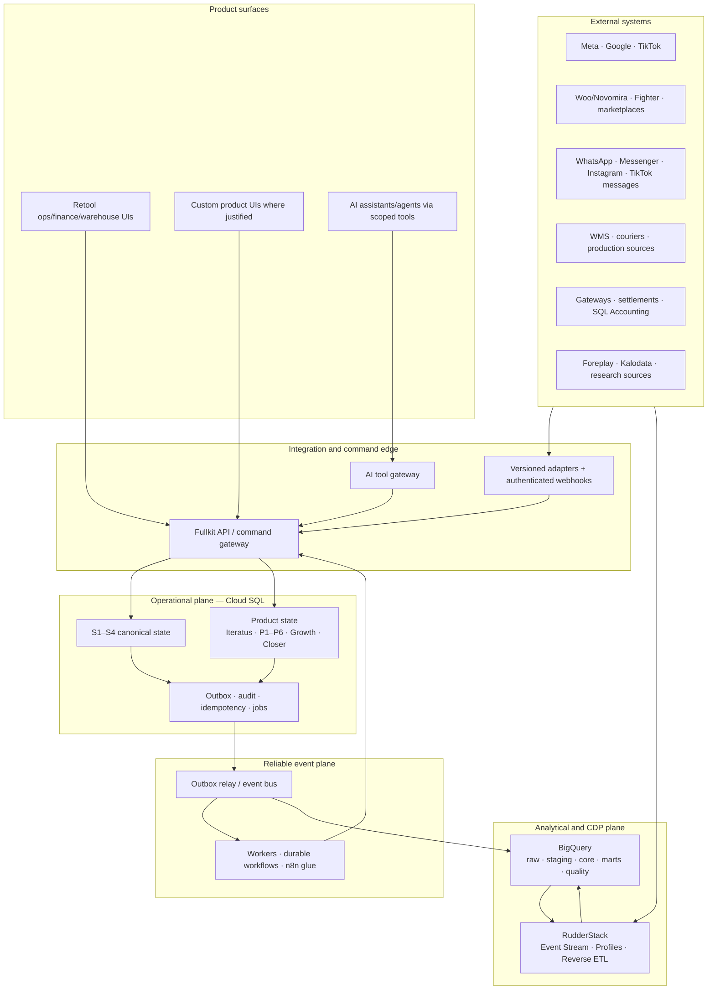
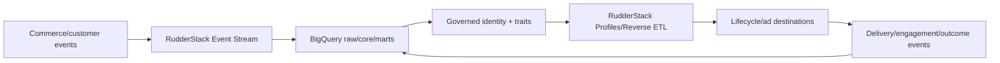
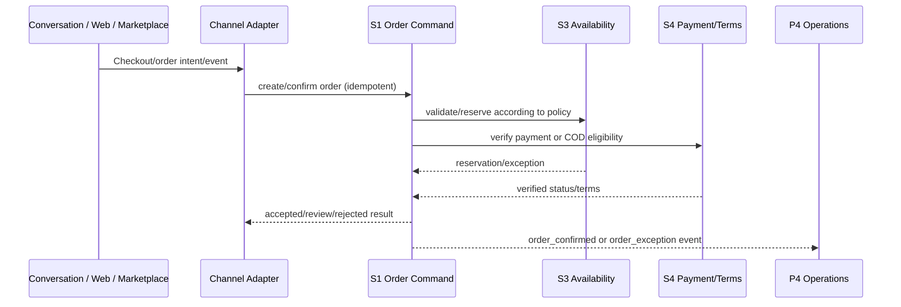
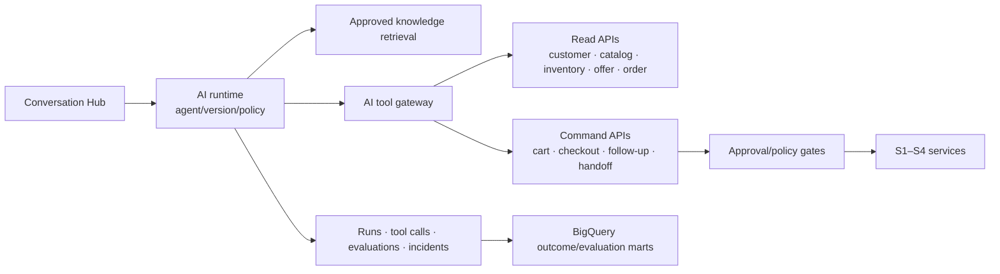

# Fullkit Technical Architecture

Product requirements: [[Fullkit Product Portfolio PRD]]. Canonical starting schema: [[Fullkit Schema Blueprint]]. Infrastructure details: [[S1 - Customer and Order Hub]], [[S2 - Creative Loop]], [[S3 - Inventory]], and [[S4 - Money]].

> [!summary] Architecture decision
> Build Fullkit as a **modular commerce platform**, not a distributed microservice estate. Start with one monorepo, one Cloud SQL cluster and a small number of deployable services. Enforce bounded contexts through schemas, roles, APIs, events and ownership. Split deployment units only when an actual security, scaling or release boundary appears.

## 1. Architecture principles

1. **One authority per fact.** A location has one physical-stock authority; an order has one canonical state; payment success comes from the provider/S4, not an AI or dashboard.
2. **Products own workflow; spines own shared truth.** P1–P6, Iteratus and the closer own their decisions and work queues. S1–S4 own reusable commercial entities.
3. **Read from governed models; write through commands.** BigQuery can explain and target. It never writes order, stock, payment or shipment state directly.
4. **Adapters contain vendor differences.** Provider payloads, IDs, credentials, rate limits and capability rules stop at the adapter boundary.
5. **Events are facts, not hidden remote commands.** Commands request change; events describe accepted outcomes.
6. **AI is a client of Fullkit.** Models receive curated context and scoped tools. They have no unrestricted SQL, channel or credential access.
7. **Portability before replacement.** Own identifiers, consent, state, outcome and export contracts before deciding to rebuild a mature SaaS capability.
8. **Shadow before cutover.** Reconcile read-side truth against Fighter, Woo, marketplaces, WMS and finance before enabling writes.

## 2. Logical architecture

## 3. Recommended technology stack

| Layer | Recommended stack | Role and decision |
|---|---|---|
| Operational database | **Cloud SQL for PostgreSQL** | Transactional authority for shared spines and product workflow state |
| Analytical warehouse | **BigQuery** | Immutable history, conformed facts/dimensions, dbt marts, forecasting and evaluation |
| CDP/event activation | **RudderStack Event Stream + Profiles + Reverse ETL as justified** | Standardized events, identity graph, profile features and audience activation |
| Transform/quality | **dbt** | Versioned SQL models, tests, metric definitions and lineage |
| Data orchestration | **Dagster** | Scheduled ingestion/transforms, assets, backfills and data-quality dependencies |
| API/runtime | **TypeScript services on a managed container runtime; Cloud Run is the default GCP fit** | Fullkit REST/command APIs, adapters, workers and webhooks |
| Internal UI | **Retool first** | P4 queues, inventory, reconciliation, approvals and exception operations |
| Custom web UI | **Next.js/React when workflow quality or product identity justifies it** | Iteratus/P2 planning surfaces or a future owned lifecycle/AI interface |
| Durable event delivery | **Transactional outbox + relay/event bus + idempotent consumers** | Reliable product-to-product and warehouse handoff |
| Workflow glue | **n8n, internal only** | Connector prototypes, alerts, low-risk back-office flow and approvals; never source of truth |
| Object storage | **GCS** | Creative/media files, imports, AWBs, exports and immutable raw artifacts |
| Secrets | **Google Secret Manager** | Provider credentials; databases retain only secret references |
| Observability | **OpenTelemetry + managed logs/metrics/traces/alerts** | Correlation across webhook → command → event → downstream action |
| Infrastructure | **Terraform or equivalent reviewed IaC** | Repeatable environments, IAM, networks, databases, queues and secrets |
| AI provider abstraction | **AI SDK 7 or a replaceable equivalent behind Fullkit's own runtime contract** | Structured generation, tool calling, model routing and streaming without making the SDK the business authority |
| AI long-running execution | **Durable workflow adapter** | Approval waits, follow-ups, retries and payment/operational waits that survive deployments |

The exact container/event-bus/durable-workflow product can be selected during implementation. The invariant is the Fullkit command/event contract, not the vendor.

## 4. Deployment shape

### Initial deployable units

Avoid one deployment per product at the start. Recommended initial units:

1. `fullkit-api` — authenticated operational reads/commands for S1–S4 and product modules.
2. `integration-gateway` — external webhooks, outbound provider adapters, rate limits and credentials.
3. `worker` — outbox relay, retries, sync jobs, notifications and asynchronous commands.
4. `ai-runtime` — isolated closer/assistant orchestration and AI tool gateway; no database-owner credential.
5. `web` — any custom UI/BFF; Retool talks to the same Fullkit API.
6. `data-platform` — Dagster/dbt jobs and warehouse ingestion, separately permissioned.

Logical product modules can live in the same codebase while retaining separate packages, database roles and event contracts.

### When to split a module physically

Split only if at least one is true:

- it needs materially different scaling or latency;
- it handles a distinct high-risk security boundary;
- provider failures must be isolated from the transaction path;
- it has an independent release cadence/owner;
- its data-residency or licensing requirements differ;
- measured contention or blast radius justifies the operational cost.

The AI runtime and integration gateway are likely first candidates. The spines are not automatically separate microservices.

## 5. PostgreSQL domain layout

The existing [[Fullkit Schema Blueprint]] uses physical schemas `app`, `private`, `reporting` and `identity`. Product deep dives use logical domain names. Preserve both ideas as follows:

| Logical owner | Initial physical placement | Future split trigger |
|---|---|---|
| Platform/org/integrations/S1–S4 | `app` with explicit table ownership and roles | Migration into domain schemas only when implementation complexity warrants it |
| Sensitive payloads/webhook bodies | `private` | Remains private; may move to object storage with indexed metadata |
| Authentication mappings | `identity` | Independent IdP integration or stricter isolation |
| Operational read models | `reporting` | Purpose-specific serving database only if load requires it |
| Iteratus | logical `iteratus.*` tables | Separate schema/role before external collaborators or heavy media processing |
| P1 lifecycle | logical `lifecycle.*` | Separate schema when Fullkit controls journey execution |
| P1 conversations | logical `conversation.*` | Separate schema/runtime when message volume or channel risk grows |
| AI closer/governance | logical `closer.*` and `ai.*` | Separate role immediately; separate database only for security/scale |
| Growth Engine | logical `growth.*` | Separate schema for planning/action state before gated activation |
| P2–P6 workflow state | logical product namespaces | Split only where transactional ownership differs from the spine |

The namespace labels in the documentation are ownership contracts, even if MVP migrations use `app.lifecycle_journey_definitions`-style names. Do not refactor solely for aesthetic purity.

### Cross-domain database rule

- A domain may reference canonical spine identifiers.
- It may not update another domain's tables directly from application code.
- Writes cross through an in-process command handler initially and an API/event boundary when separately deployed.
- Database roles prevent the AI runtime, data jobs and adapters from acquiring broad write access.
- Cross-domain reporting joins belong in governed views/BigQuery, not ad hoc browser SQL.

## 6. BigQuery layout

| Dataset | Contract |
|---|---|
| `raw` | Immutable source-shaped records with ingestion metadata and replay provenance |
| `staging` | Typed, normalized and deduplicated source models |
| `core` | Conformed dimensions/facts: customer, order, item, creative, channel, inventory, payment, shipment, spend |
| `marts` | Governed domain and product read models |
| `cdp` | Identity graph, Customer 360 traits, audience memberships and profile snapshots |
| `growth` | Forecasts, targets, variances, recommendations and outcome-learning projections where separate dataset access helps |
| `quality` | Freshness, volume, uniqueness, event lag, reconciliation and coverage checks |
| `sandbox` | Time-limited exploration; never a production metric or activation source without promotion |

Every mart must declare grain, owner, definition, allowed dimensions, freshness SLO, quality tests, PII class and upstream lineage.

### Core conformed dimensions

- Workspace, legal entity, brand, store, market, currency
- Customer and identity bridge
- Product, variant/SKU and inventory item
- Channel, integration and source campaign
- Creative concept, asset, variant and launch binding
- Date/time and lifecycle/cohort state

### Core facts

- Orders and order items
- Payments, refunds, settlements, fees and payouts
- Shipments, returns and fulfilment events
- Inventory movements, snapshots and availability
- Ad delivery/spend and attributed/observed outcomes
- Conversations, messages and lifecycle dispatches
- Creative production/activation/performance
- Production consumption/yield/finished-good receipts
- Plan, action, experiment and measured outcome

## 7. RudderStack boundary

RudderStack is used for standardized behavior/lifecycle events, warehouse-native identity/profile features and activation. It does not replace S1 or the product databases.

Rules:

- Event IDs are globally unique and replay-safe.
- Canonical order/payment states originate from operational services, not browser instrumentation.
- Identity merges preserve source identifiers, confidence, approval and merge history.
- Consent cannot be inferred from an email/phone merely existing.
- Activation uses versioned audience/trait snapshots with freshness and purpose.
- Vendor-only profile traits do not become governed business metrics until modeled/tested in BigQuery.

## 8. Canonical event envelope

Every domain event should carry:

| Field | Purpose |
|---|---|
| `event_id` | Globally unique deduplication key |
| `event_type` and `event_version` | Stable semantic contract |
| `occurred_at` / `recorded_at` | Business time versus acceptance time |
| `workspace_id`, `brand_id`, `store_id` | Authorization and business scope where applicable |
| `aggregate_type`, `aggregate_id`, `aggregate_version` | Entity and optimistic ordering context |
| `actor_type`, `actor_id` | Human, service, provider or AI actor |
| `correlation_id`, `causation_id`, `trace_id` | End-to-end lineage |
| `idempotency_key` | Safe command/replay behavior where relevant |
| `source_integration_id`, `external_event_id` | Provider provenance |
| `payload` | Versioned domain-specific fields; no unnecessary secrets/PII |
| `data_classification` | Handling/retention category |

Consumers must tolerate duplicate delivery and new optional fields. Breaking semantic changes require a new event version.

## 9. API architecture

### Fullkit API

- REST/JSON first for operational commands and stable reads.
- OpenAPI contracts generated/validated in CI.
- Idempotency key required for order, payment, fulfilment, messaging and external-action commands.
- Optimistic concurrency/version checks on contested state.
- Authorization evaluates workspace, brand/store scope, role and action policy.
- Command response returns accepted result or durable job reference—not an unverified promise.
- MCP is a governed adapter over the same business APIs, not a database bypass.

### Adapter interface

Every external adapter should expose only the capabilities it can actually support:

- connection/capability discovery;
- authenticated webhook verification;
- pull/sync with cursor and replay;
- canonical read normalization;
- allow-listed outbound commands;
- provider ID/reference mapping;
- rate-limit, retry and dead-letter behavior;
- delivery/execution receipts;
- sandbox/certification fixtures.

Provider payloads stay privately queryable for audit, but business code consumes canonical DTOs/events.

## 10. Three conversion paths to one order contract

For asynchronous marketplace orders, validation may create an accepted order with a fulfilment exception rather than rejecting an already-created external sale. Channel policy defines this behavior; provenance is never lost.

## 11. P4 UI and write ownership

P4 is a role-based composition layer:

- seller/CS order creation and correction;
- operations approval and exception handling;
- warehouse pick/pack/return;
- finance-visible payment/COD flags;
- courier label/tracking actions.

P4 never updates tables with ad hoc SQL. Its UI calls S1/S3/S4 commands. Every screen field must show its authority and freshness when combining operational and analytical reads.

If an external WMS remains physical-stock authority, P4 sends idempotent commands and mirrors WMS events. Fullkit's S3 mirror cannot independently adjust the same location.

## 12. Lifecycle CRM architecture

### Recommended staged hybrid

- **Customer.io:** initial lifecycle journey builder and email/push delivery.
- **respond.io:** live WhatsApp/social inbox, assignment, routing and first closer shell.
- **Fullkit:** customer/order/consent truth, eligibility, frequency caps, vendor-neutral journey/message IDs and outcome measurement.
- **RudderStack/BigQuery:** governed traits, audiences and evaluation.
- **n8n:** internal connector/alert/approval glue only.

Klaviyo is the commerce-native alternative; Mautic is the control/self-host alternative; GetResponse is a viable tactical suite but not the preferred architectural core.

Official integration references: [RudderStack → Customer.io](https://www.rudderstack.com/integration/customer-io/), [RudderStack → Klaviyo](https://www.rudderstack.com/integration/klaviyo/), [RudderStack → Mautic](https://www.rudderstack.com/integration/mautic/), [Customer.io workflow builder](https://docs.customer.io/journeys/send/workflows/builder/), and [respond.io Developer API](https://respond.io/help/integrations/developer-api).

### Channel ownership

One system owns live transport for each account/number. Fullkit authorizes the contact; the selected transport sends it; all delivery events return with Fullkit IDs. Do not connect competing automation products to the same WhatsApp number without a verified routing design.

### What Fullkit builds first

- Canonical identity, consent, suppression and contact-policy evaluation
- Customer lifecycle and offer-eligibility traits
- Vendor-neutral journey, enrollment, dispatch and outcome identifiers
- Cross-channel frequency caps and stable experiment/holdout assignment
- Messaging command/receipt contract
- Conversation/order/customer linkage

### What Fullkit rents first

- Email reputation/deliverability
- Marketer-grade visual workflow/editor
- WhatsApp/social transport and platform-compliance plumbing
- Omnichannel inbox and human assignment UI

The long-term owned “Klaviyo-like” product should start as a **control plane**, not a send engine.

## 13. AI architecture

### Runtime boundary

### Current runtime recommendation

For a new implementation, evaluate and pin the current AI SDK release—AI SDK 7 was announced in June 2026. Use a short-turn tool loop for request-scoped conversation and a durable workflow layer for follow-ups, approvals and waits that must survive restarts. Keep this orchestration replaceable behind Fullkit's own `AgentRuntime` interface. Official references: [AI SDK 7 release](https://vercel.com/changelog/ai-sdk-7), [ToolLoopAgent](https://ai-sdk.dev/docs/reference/ai-sdk-core/tool-loop-agent), [tool calling/approval](https://ai-sdk.dev/docs/ai-sdk-core/tools-and-tool-calling), and [WorkflowAgent guidance](https://vercel.com/kb/guide/what-is-workflowagent).

The SDK is not the business state machine. Cloud SQL retains opportunity, conversation, approval and order state; workflow history is execution state.

### Tool rules

- Strict input/output schema, server-side authorization and idempotency per tool.
- The tool gateway derives workspace/customer/conversation scope; the model cannot choose arbitrary tenant IDs.
- Read tools return minimal, freshness-labelled context.
- Commands revalidate price, offer, stock, consent and order state in their owning service.
- Human/internal approval flags do not replace explicit customer confirmation.
- The model never sends directly to channel APIs; outbound messages use the P1 outbox/policy gate.

### Knowledge architecture

- Authoritative documents and structured product/policy/claims records retain owner, version, effective dates and review status.
- Retrieval is filtered by brand, market, language, audience, product and policy version.
- Answers retain citations/evidence IDs internally for audit.
- Revoked/expired knowledge is excluded from active retrieval but retained for replay/evaluation.
- Sensitive customer history comes from scoped APIs, not the semantic knowledge index.

### WhatsApp-specific guardrails

For MY/SG, Fullkit must operate as a merchant-specific sales/support service provider under the merchant's WhatsApp Business account—not as a general-purpose AI product. Current WhatsApp terms restrict general-purpose AI as a primary product and restrict using WhatsApp Business Solution Data to improve shared models. Obtain legal/Meta validation, require model-provider no-training terms and isolate merchant data. See the [WhatsApp Business Solution Terms](https://www.whatsapp.com/legal/business-solution-terms) and [Business Messaging Policy](https://whatsappbusiness.com/policy/).

Mandatory controls include opt-in/opt-out, the active service-window/template rule, direct human escalation, sensitive-data restrictions, template approval and merchant/product-policy compliance.

The terms last modified **6 March 2026** also restrict using Business Solution Data to track/build/augment individual profiles, subject to their stated message-thread-content exception. Do not assume WhatsApp delivery, referral or derived metadata can feed the general CDP or model features. Tag it by source/purpose, minimize it, and obtain a written legal/Meta interpretation for the intended Customer 360 use.

WhatsApp's current policy treats medical and healthcare products as restricted and defines country-specific exceptions for some regulated verticals. Because EFFEN may sell health-related products, validate the exact SKU, classification, market, catalog/checkout behavior and claims before enabling any recommendation or commerce flow. A permitted message does not automatically mean an in-chat commerce transaction is permitted.

## 14. Reliability patterns

### Webhook inbox

1. Verify signature before accepting business processing.
2. Persist immutable event metadata/body reference and provider event ID.
3. Acknowledge quickly.
4. Process asynchronously with idempotency.
5. Record normalized command/event and result.
6. Retry transient failures; dead-letter and alert terminal failures.

### Transactional outbox

The same database transaction that changes operational state writes the domain event/outbox row. A relay publishes it. Consumers deduplicate by event ID and maintain checkpoint/lag. Reconciliation detects accepted events that failed to reach downstream systems.

### Out-of-order events

Provider events retain both provider occurrence time and receipt time. Current state changes only through versioned transition rules; a late “sent” event cannot overwrite a later “read” event merely because it arrived last.

### SLO starting targets

| Flow | Initial target |
|---|---|
| Operational API availability | 99.9% monthly for critical order/customer reads and commands |
| Webhook durable acceptance | p95 under 2 seconds after signature verification |
| Operational event propagation | p95 under 60 seconds |
| Message/order-status interaction | p95 first automated response under 30 seconds when dependencies are healthy |
| BigQuery operational-fact freshness | Under 15 minutes for event-driven feeds; daily feeds explicitly labelled |
| Daily order/WMS/payment reconciliation | Complete before morning command centre opens |

Targets must be revised after measuring provider and current-system constraints.

## 15. Security, privacy and governance

- Managed identity provider/SSO remains separate from database choice.
- Workspace, brand, store, role and purpose checks on every API request.
- Separate runtime, migration, adapter, worker, AI, CDC/data and support database roles.
- Private connectivity for Cloud SQL where practical; encrypted transport everywhere.
- Secrets in Secret Manager; masked references only in application data.
- Raw PII and message bodies restricted; curated marts use masking/tokenization where full values are unnecessary.
- Immutable audit records for user, service, automation and AI mutations.
- Customer deletion/retention propagates across Cloud SQL, BigQuery, RudderStack, object storage and vendors with completion evidence.
- Provider payload retention is minimized and policy-bound.
- AI logs exclude raw secrets/payment credentials and minimize unnecessary message/customer content.
- High-risk actions use four-eyes approval or named human ownership.

## 16. Testing and release gates

### Contract tests

- Provider fixtures → canonical adapter objects/events
- API request/response and event schema compatibility
- Idempotent duplicate and replay behavior
- State-transition and optimistic-concurrency tests
- Permission tests by role/brand/store

### Reconciliation tests

- Source order count/amount versus S1 and BigQuery
- Payment/order/settlement/payout matching
- WMS movement/availability versus S3 mirror
- Message dispatch versus provider delivery receipts
- Creative launch IDs versus ad-platform delivery facts

### AI evaluation gates

- Golden cases by intent, product, brand and language
- Tool choice/argument correctness
- Policy/claims and hallucination tests
- Human-handoff trigger accuracy
- Price/offer/stock/payment truthfulness
- Duplicate-send and service-window compliance
- Conversion plus customer-satisfaction/complaint guardrails
- Shadow/canary rollout and immediate kill switch

No AI capability earns autonomy only from offline response quality; it needs tool/policy correctness and observed operational outcomes.

## 17. Environment and delivery strategy

- Separate development, staging and production projects/environments.
- Synthetic or privacy-safe fixtures outside production.
- Provider sandbox/test accounts where available.
- Database migrations are forward-compatible, reviewed and reversible through compensating migrations/backups.
- Feature flags for each write-side integration and autonomous AI action.
- Brand-by-brand canary with Fighter/vendor fallback during strangler migration.
- Deployment promotion requires schema/contract tests, reconciliation checks and observability dashboards.

## 18. Implementation sequence

### Stage 0 — Foundation contracts

- Repository/package boundaries, auth scopes and API conventions
- Cloud SQL schemas/roles, audit, idempotency and outbox
- BigQuery datasets/dbt conventions and quality gates
- Source integration registry and provider fixture library
- Canonical customer/order/creative/inventory/money IDs

### Stage 1 — Read side and shadow operations

- Ingest Fighter, Woo, marketplace, ad, gateway and WMS evidence
- Customer identity and Customer 360
- Read-only P4, P6 and Growth views
- Daily reconciliation and source-freshness monitoring

### Stage 2 — Bounded workflows

- P4 order queue and S3 inventory control for one location/brand
- P1 hybrid lifecycle/inbox with Fullkit IDs and outcomes
- Iteratus → P2 evidence/brief/asset/launch lineage
- P6 commission and settlement exception workflow

### Stage 3 — Write side and AI pilot

- One-brand order command/fulfilment cutover
- AI Sales Closer sandbox → shadow → assisted → bounded autonomy
- Growth Engine plans and recommendations create approved product commands
- P5 material/production plan tied to S3 movements

### Stage 4 — Optimization and selective replacement

- Scale adapters and durable workflows based on measured load
- Build vendor-replacement features only where economics/control warrant
- Introduce stronger service isolation if blast radius or ownership demands it
- Expand experiment/incrementality and cross-product learning loops

## 19. Architecture decisions still open

| Decision | Default until resolved |
|---|---|
| GCP project/BigQuery region and residency | Choose MY/SG-compatible location before first production data; do not mix locations casually |
| Identity provider/SSO | Managed IdP; immutable subject stored in `identity` mapping |
| Event transport | Transactional outbox is mandatory; select bus/relay after throughput and ops evaluation |
| Durable workflow runtime | Abstract behind Fullkit interface; evaluate GCP alignment versus AI SDK WorkflowAgent path |
| Physical Postgres schemas | Preserve current `app/private/reporting/identity` start; enforce logical ownership now |
| Customer.io versus Klaviyo | Customer.io default; validate marketer workflow, price, region and data export in pilot |
| respond.io versus direct channel hub | respond.io default for pilot; retain Fullkit normalized conversation/command contract |
| WMS build versus buy | S3 canonical contract regardless; one authority per location |
| Cross-brand identity/consent | Do not enable cross-brand activation until policy/legal decision is documented |
| AI model/provider | Provider-neutral routing with no-training/data-processing terms; evaluate per task and market |

## 20. Definition of architecture-ready

- Each table, API and event has a named owning domain.
- Order, stock, payment, message and creative facts each have one authority.
- All three order sources pass shared conformance/idempotency tests.
- External vendors can be changed without losing Fullkit customer/journey/conversation/outcome IDs.
- AI can complete a sandbox workflow using only scoped tools and can never bypass consent, payment, stock or human ownership.
- Every operational mutation reaches audit/outbox and reconciles into BigQuery.
- P4, P1, P2, P5 and P6 can share canonical records without direct cross-domain table mutation.
- The team can explain fallback, replay and manual recovery for every critical external integration.
