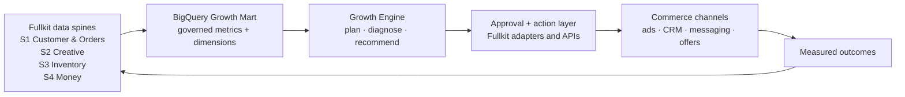
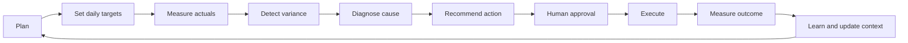

# Fullkit Growth Engine

> This is a living concept note. Additional YouTube videos, articles, frameworks, and operating examples will be broken down here as research inputs arrive.

Portfolio context: [[Fullkit Product Portfolio PRD]]. Technical execution boundary: [[Fullkit Technical Architecture]]. The Growth Engine is horizontal across P1–P6; it does not absorb their specialist workflow or the S1–S4 source-of-truth roles.

## Product Thesis

The **Growth Engine** is a distinct Fullkit product layer built on top of the data infrastructure and governed data marts.

The data infrastructure answers:

- What happened?
- Which customer, order, product, channel, campaign, creative, inventory movement, and financial event does it belong to?
- Which numbers are trustworthy?

The Growth Engine answers:

- What were we trying to achieve?
- Where are we ahead or behind?
- Why is the variance happening?
- What should we do next?
- Who must approve it?
- Was the action executed?
- Did it improve the business outcome?
- What should the system learn and reuse next time?

**One sentence:** *The Growth Engine converts Fullkit's commercial truth into targets, diagnoses, decisions, actions, and measured learning.*

## Is This a Product on Top of the Data Mart?

**Yes — with one important qualification.**

The Growth Engine consumes a governed **Growth Mart** in BigQuery, but it is not only a dashboard or analytical mart. It is a hybrid read-and-write product:



The architecture therefore needs four different surfaces:

1. **Analytical read model — BigQuery/dbt:** actuals, targets, cohorts, contribution margin, LTV, channel performance, creative performance, inventory constraints, and attribution/incrementality outputs.
2. **Operational decision state — Cloud SQL PostgreSQL:** plans, recommendations, approvals, assignments, actions, experiments, exceptions, audit history, and outcomes.
3. **Activation layer — Fullkit APIs and adapters:** Meta, Google, TikTok, marketplaces, email, SMS, WhatsApp, promotions, and internal workflows.
4. **Operator experience — Retool first, custom UI when justified:** daily command centre, diagnostic drill-down, approval queue, experiment registry, and action history.

The data mart makes the engine possible. The operational write path and action adapters make it a product.

## Position in the Fullkit Product Stack

| Layer | Fullkit capability | Primary question |
|---|---|---|
| 1. Source systems | Commerce channels, gateways, couriers, messaging, ad platforms | Where did the event originate? |
| 2. Operational backbone | Cloud SQL, canonical entities, state machines, outbox | What is the live operational truth? |
| 3. Analytical backbone | BigQuery raw/staging/marts, dbt metrics, RudderStack | What happened, and how do the entities join? |
| 4. Growth Mart | Governed commercial metrics and dimensions | What is the trusted state of growth? |
| 5. **Growth Engine** | Targets, diagnosis, recommendations, approvals, actions, learning | What should we do next, and did it work? |

The Growth Engine is therefore an **application product produced by the infrastructure**, just as Customer 360, reconciliation, commission management, and inventory operations are other products produced by the same spines.

## The Core Loop



The value is not any single dashboard. The value is reducing the time from **signal → understanding → decision → execution → verified outcome**.

## Product Principles

### 1. Begin with commercial clarity

The system must unify the business state across:

- Advertising spend and delivery
- Orders and order items
- New and returning customers
- Customer cohorts, LTV, retention, and risk
- Revenue, discounts, refunds, cancellations, and returns
- COGS, fulfillment cost, gateway fees, commissions, and contribution margin
- Product, SKU, inventory, and availability
- Campaigns, creative assets, messages, promotions, and marketing moments
- Forecasts, targets, experiments, and previous decisions

Fast decision-making depends on shared definitions and reliable joins. AI cannot compensate for an ambiguous customer identity, missing COGS, mismatched campaign IDs, or an ungoverned revenue definition.

### 2. Start forecasting from intended actions

Revenue plans should be connected to the actions expected to generate the revenue:

- Product launches
- Promotions and offers
- Email and SMS sends
- Paid-media campaigns
- Creative launches
- Organic content and PR moments
- Marketplace events
- Inventory availability
- Retention and win-back activity

The marketing calendar becomes an input into the forecast rather than a separate planning artifact.

#### Demand composition lens

Every revenue plan should also explain where demand is expected to originate:

1. **Existing customers:** the most stable layer, driven by the size and behavior of acquired cohorts.
2. **Owned audiences:** email, SMS, organic search, organic social, community, and other permissioned or earned distribution.
3. **Paid acquisition:** the most volatile layer, driven by spend, marginal acquisition efficiency, auction conditions, creative, offer, and conversion.

```text
total demand revenue
= existing-customer revenue
+ owned-audience revenue
+ paid-acquisition revenue
```

This is a composition and uncertainty lens, not a fifth forecast model. Plans and actuals need a governed `demand_layer`, attribution method, and confidence state. The engine must allow blended or residual demand rather than double-counting orders that touched several channels.

The planning sequence is:

```text
Marketing calendar
→ acquisition-spend and efficiency model
→ new-customer revenue
→ returning-customer/cohort revenue
→ product and inventory constraints
→ monthly commercial plan
→ daily channel and campaign expectations
→ contribution-margin target
```

#### Connected four-model chain

Research Input 02 clarifies that the planning system contains **three commercial forecast models plus one execution-feasibility model**:

1. **Spending Power:** planned advertising spend → expected new-customer acquisition efficiency → new-customer revenue.
2. **Retention:** each historical and planned acquisition cohort → expected returning-customer revenue by cohort age.
3. **Event Effect:** monthly new and returning revenue → daily distribution based on tagged commercial moments while preserving the monthly constraint.
4. **Creative Demand:** approved media plan + current creative portfolio health → required creative supply.

The outputs compose rather than run independently:

```text
Spending Power → new-customer revenue
new-customer cohorts → Retention → returning revenue
new + returning revenue + marketing calendar → Event Effect → daily P&L map
media plan + portfolio health → Creative Demand → execution requirement
```

The Growth Engine should reproduce these decision problems and evaluation contracts, not claim to reproduce CTC's proprietary black-box implementations. Full detail: [[CTC Growth Engine Methodology Research]].

#### CAC is a response, not a constant input

CAC typically changes with spend volume, recent performance, seasonality, marketing events, product mix, new-customer AOV, creative regime, channel mix, macro demand, and brand-search demand. Holding CAC constant while scaling spend creates false growth capacity.

Fullkit should model aMER/ACONS as the primary spend-response relationship and retain CAC as a related output:

```text
CAC = ad_spend / new_customers
aMER = new_customer_revenue / ad_spend
```

Every forecast must expose a supported spend range, prediction interval, probability of breaching the economic target, forecast horizon, and planned-versus-realized input variance. A change in agency, campaign structure, product mix, offer, attribution, or creative system is a possible structural break and must be tagged.

### 3. Treat a forecast as a navigation system

The goal is not to predict every day perfectly. The goal is to expose deviation early enough to change the route while preserving the business destination.

For every governed metric, the engine should retain:

- Expected value
- Actual value
- Absolute and percentage variance
- Confidence or data-quality state
- Diagnosed drivers
- Recommended action
- Owner and approval state
- Execution state
- Measured result

This makes **forecast accuracy an operational feedback capability**, not merely a planning score.

### 4. Diagnose from the business outcome downward

The engine needs a versioned **Hierarchy of Metrics** so it does not optimize a local platform metric while damaging the business.

The canonical hierarchy has three levels:

1. **Business outcomes:** contribution margin, revenue, total ad spend, MER, and cash implications. This level identifies whether the business is on target.
2. **Customer economics:** new versus returning revenue, paid versus organic acquisition, new orders, CAC, AOV, retention, and cohort value. This level identifies which economic engine contains the gap.
3. **Channel and campaign controls:** channel iROAS/iCM, spend versus plan, campaign performance, bids, budgets, audiences, offers, landing pages, and creative. This is where corresponding actions occur.

Product, inventory, creative supply, and execution blockers act as cross-cutting constraints and diagnostic sublevels. The hierarchy must be configurable by brand and business model; its ordering and definitions are versioned methodology, not universal truth.

Every material miss should also be classified as **volume**, **efficiency**, or a combination. Critically, performance far above an economically derived efficiency target may indicate underspend and uncaptured profitable demand rather than success.

### 5. Normalize channel decisions around incremental value

Platform-reported ROAS is not sufficient for cross-channel allocation. The engine should support:

- Incrementality tests and geo holdouts
- Channel-specific incrementality factors
- New-customer contribution margin
- Marginal rather than average efficiency
- Spend-response and saturation curves
- Cohort quality and downstream LTV
- Confidence intervals and test freshness

The output should distinguish:

- Observed platform performance
- Modeled incremental performance
- Target performance
- Recommended allocation
- Evidence strength

#### Progressive measurement truth

The engine should not store one timeless incrementality factor. It needs a versioned evidence system:

```text
incrementality_factor = incremental_revenue / platform_reported_revenue
normalized_incremental_revenue = platform_reported_revenue × current_factor
iROAS = normalized_incremental_revenue / ad_spend
```

The measurement progression is:

1. Start with an aggregate prior when the brand has no test evidence.
2. Add brand-specific results weighted by confidence.
3. Accumulate a distribution rather than replacing the prior with one test.
4. Weight evidence by comparable season, event state, market, and spend level.
5. Retest because channel efficacy and scale effects change over time.

The engine also needs a congruence test. If modeled iROAS improves while revenue or contribution margin remains flat or declines, the measurement system is drifting from business reality and must be recalibrated.

### 6. Compress the distance between insight and action

Traditional workflow:

```text
Leader notices a gap
→ asks analyst or media buyer
→ waits for diagnosis
→ requests creative or operational work
→ waits for execution
→ receives a report
→ makes another decision
```

Growth Engine workflow:

```text
Operator sees the governed gap
→ system exposes likely drivers
→ operator reviews the recommended action
→ approval is captured
→ Fullkit executes through an adapter
→ outcome is measured automatically
```

The objective is not blind automation. It is to give a capable operator the context and tools required to move safely without coordination becoming the bottleneck.

### 7. Make creative a demand-planning problem

Creative production should connect to the brand's growth ambition, spend target, product priorities, marketing calendar, and historical creative behavior.

Candidate measures include:

- **Zero-conversion or zero-revenue rate:** active ads that never produce a commercial result
- **Activation rate:** assets that cross a defined spend or result threshold
- **Outlier rate:** the small subset receiving or generating disproportionate results
- **Scaling success:** ability to absorb more spend without unacceptable efficiency degradation
- **Decay curve:** how performance changes as the asset ages
- **Evergreen share:** proportion of active assets sustaining useful performance beyond a defined period
- **Creative rotation:** turnover within the account's top-performing set
- **Replacement requirement:** assets needed to replace those expected to decay
- **Product and message coverage:** whether creative supply supports the actual commercial plan
- **Production economics:** expected incremental contribution after creative cost

The output is a **Creative Demand Plan**:

- How many assets are needed?
- For which products and moments?
- In which formats and concepts?
- By which dates?
- What proportion is expected to activate?
- How many outliers might reasonably emerge?
- What existing evergreen assets reduce the replacement requirement?

### 8. Use AI as a context-enabled operator interface

AI is not the source of truth and should not invent the operating methodology.

The useful AI layer combines:

- Governed Fullkit data
- Business targets and current plan
- Metric definitions and lineage
- A versioned hierarchy of metrics
- Brand-specific commercial rules
- Historical experiments and decisions
- CTC/EFFEN/Fullkit methodology documents
- Permissions and action boundaries
- Live tool access through MCP and Fullkit APIs

Without that context, an AI can misread a dashboard, confuse good variance with bad variance, optimize the wrong metric, or recommend an action that violates inventory, margin, brand, or compliance constraints.

The AI should show:

- The evidence used
- The metric definition and time window
- The reasoning path through the hierarchy
- The proposed action and expected impact
- Confidence and uncertainty
- Required approval
- Available rollback or stop condition

### 9. Keep a human accountable

The intended operating role is a **Growth Operator** or **Growth Engineer**: one person with the clarity, authority, and tooling to diagnose and act across previously fragmented workflows.

Human control remains essential for:

- Budget changes
- Campaign launches and pauses
- Offer or pricing changes
- Customer-facing messages
- Material inventory commitments
- Low-confidence recommendations
- Novel situations outside known methodology
- Actions with legal, brand, or financial risk

Automation levels should be explicit:

| Level | Behaviour |
|---|---|
| L0 | Observe and report only |
| L1 | Recommend; human executes |
| L2 | Draft action; human approves execution |
| L3 | Execute within approved limits; notify human |
| L4 | Autonomous closed loop for narrow, reversible, proven actions |

### 10. Separate optimization from transformation

The Growth Engine optimizes the realized business:

- Existing products
- Available inventory
- Existing channels
- Known offers and stories
- Current creative supply
- Defined financial objectives

It does not replace the leadership work that creates step-change growth:

- Product development
- New distribution channels
- Supply-chain strategy
- Capital allocation
- Major partnerships
- New market entry
- Breakthrough positioning and brand stories

The engine should give leaders operational confidence and time to work on those transformative bets.

### 11. Connect budget, creative, measurement, and activation as one plan graph

The operating system is not a collection of independent dashboards. A change in the business objective or budget must propagate through the rest of the plan:

```text
business objective
-> spend and revenue scenario
-> channel allocation and efficiency targets
-> creative demand and production ownership
-> measurement uncertainty and test roadmap
-> approved campaign build
-> daily actuals and variance
-> diagnosis, reallocation, and learning
```

Every downstream record must retain the upstream plan and model version that created it. A budget increase is incomplete until the system confirms that inventory, creative supply, measurement confidence, cash, and execution capacity can support it.

### 12. Prescribe the binding constraint, not a generic growth tactic

The stage-specific growth map is a useful hypothesis: early brands may need creative volume, then marketing moments, offer testing, creative scale, LTV-oriented product development, incremental channel tactics, bespoke media buying, and finally stronger operating talent.

Fullkit must not hard-code revenue bands as universal truth. Revenue is context; the recommendation should be driven by a versioned readiness assessment across:

- Product-market and offer-market fit
- Creative volume, hit rate, concentration, decay, and production cost
- Marketing-calendar density and event performance
- Acquisition headroom and marginal efficiency
- Cohort retention, payback, and LTV confidence
- Product and merchandising capacity
- Channel and geographic concentration
- Data and measurement maturity
- Inventory, cash, and operator capacity

The engine should recommend one primary constraint to resolve, the evidence behind it, the expected economic effect, and the conditions that would falsify that diagnosis.

## First-Class Product Objects

These should exist as addressable records rather than being buried in dashboards or chat history:

1. **Business target** — outcome, metric, period, owner, scenario, and constraints
2. **Marketing moment** — planned commercial action and expected effect
3. **Daily expectation** — metric target by brand, channel, campaign, product, or cohort
4. **Actual result** — governed observation with lineage and data-quality status
5. **Variance** — difference between expectation and actual
6. **Diagnosis** — ranked drivers, supporting evidence, confidence, and methodology version
7. **Recommendation** — proposed action, expected impact, risk, and expiry
8. **Approval** — human decision, limits, conditions, and rationale
9. **Action** — command sent to a system, execution result, and rollback state
10. **Experiment** — hypothesis, treatment, control, measurement, and conclusion
11. **Outcome** — measured post-action effect and attribution confidence
12. **Decision history** — reusable organizational memory connecting the full chain
13. **Model version and run** — specification, training window, supported range, prediction interval, evaluation, and approval state
14. **Measurement factor version** — channel, evidence set, confidence weighting, applicable context, and expiry
15. **Allocation plan** — proposed portfolio allocation, constraints, scenarios, and expected incremental contribution
16. **Data-quality gate** — freshness, reconciliation, identity, coverage, and actionability state
17. **Responsibility assignment** — function, accountable owner, producer, approver, service level, and escalation path
18. **Growth readiness assessment** — capability state, binding constraint, evidence, confidence, and methodology version
19. **Creative capacity plan** — required assets, formats, products, moments, producers, due dates, and delivery state
20. **Measurement roadmap** — ranked tests based on uncertainty, spend at risk, decision value, power, and operational cost
21. **Growth lever hypothesis** — proposed constraint, intervention, expected economic effect, falsification rule, and review date

Conceptual relationship:

```text
business_target
  └── daily_expectation
        └── actual_result
              └── variance
                    └── diagnosis
                          └── recommendation
                                └── approval
                                      └── action
                                            └── outcome
                                                  └── learning
```

## Growth Mart — Minimum Governed Models

The first version should be narrow. Candidate marts:

### Commercial scoreboard

- `fct_commercial_daily`
- Grain: date × brand × market
- Revenue, discounts, refunds, COGS, fulfillment, gateway fees, ad spend, contribution margin, new/returning mix

### Demand composition

- `fct_demand_layer_daily`
- `fct_owned_audience_activity_daily`
- Grain: date x brand x market x demand layer x demand source
- Planned and actual revenue, customer state, attribution method, confidence, audience/contact activity, overlap state, and residual demand

### Channel performance

- `fct_channel_daily`
- Grain: date × brand × channel × objective
- Spend, platform results, orders, new customers, modeled incremental revenue, contribution, target, marginal efficiency

### Campaign and creative

- `fct_campaign_daily`
- `fct_creative_daily`
- Campaign/creative delivery, spend, revenue, contribution proxies, activation state, age, decay, product/message/format attributes

### Customer economics

- `fct_customer_cohort`
- `dim_customer_growth_state`
- Acquisition source, first-order contribution, repeat behavior, LTV, retention state, risk, and lifecycle eligibility

### Product and inventory constraints

- `fct_product_daily`
- Demand, contribution, inventory cover, availability, stockout risk, promotion state, and forecast requirement

### Plan and target bridge

- `fct_growth_expectation_daily`
- The analytical projection of operational plans and targets, joined to actuals for variance analysis

### Model inputs, outputs, and evaluation

- `fct_cohort_ltv_lift`
- `fct_marketing_event_daily`
- `fct_event_effect_observation`
- `fct_creative_portfolio_health`
- `fct_cac_response_curve`
- `fct_search_demand_daily`
- `fct_macro_demand_signal`
- `fct_model_regime`
- `fct_model_prediction_accuracy`
- These preserve actual observations, model outputs, supported ranges, uncertainty, and backtest results instead of exposing only the latest point estimate

### Measurement-learning models

- `fct_incrementality_test_result`
- `fct_channel_incrementality_factor`
- Geo-holdout specifications, lift estimates, confidence, total-distribution coverage, factor versions, scale context, and applicability windows

### Capability, capacity, and responsibility

- `fct_growth_readiness_assessment`
- `fct_growth_lever_return`
- `fct_creative_capacity_plan`
- `fct_operator_capacity`
- `fct_responsibility_coverage`
- `dim_growth_capability_stage`
- Evidence for the current binding constraint, estimated return on each possible lever, responsible parties, capacity gaps, and change history

All marts require governed metric definitions, freshness tests, reconciliation, lineage, and explicit source-of-truth ownership.

## Growth Engine Components

### 1. Planning service

- Marketing calendar
- Scenario builder
- Monthly and daily target decomposition
- Channel/product/cohort expectations
- Inventory and margin constraints
- Versioned plans and reforecasts

### 2. Scoreboard and variance service

- Target versus actual
- Contribution-margin-first view
- Materiality thresholds
- Data freshness and quality flags
- Portfolio view across all brands

### 3. Diagnostic engine

- Versioned hierarchy of metrics
- Deterministic diagnostic rules first
- Statistical driver analysis where justified
- AI explanation over governed outputs
- Evidence, confidence, and alternative hypotheses

### 4. Recommendation engine

- Ranked actions
- Expected contribution impact
- Risk and reversibility
- Dependencies and constraints
- Recommendation expiry and invalidation

### 5. Approval and policy engine

- Role-based authority
- Budget and action limits
- Brand-specific rules
- Four-eyes approval for high-risk actions
- Escalation and exception handling

### 6. Activation service

- Commands through Fullkit adapters
- Idempotency and retries
- Dry-run and preview mode
- Execution receipts
- Rollback or stop conditions

### 7. Experiment and measurement service

- Hypothesis registry
- Test design and power assumptions
- Treatment/control assignment
- Geo holdouts and incrementality factors
- Confidence-weighted factor versions and aggregate priors
- Total-distribution measurement across owned commerce, marketplaces, and other observable points of sale
- Scale-in tests and incremental-return degradation
- Congruence checks between modeled incrementality, revenue, and contribution margin
- Post-action outcome measurement
- Methodology freshness and revalidation

### 8. Context and methodology registry

- Metric glossary
- Hierarchy of Metrics versions
- Brand operating rules
- Playbooks and decision templates
- Previous diagnoses and outcomes
- Evaluation cases for AI recommendations

### 9. Growth Operator UI

- Morning command centre
- Prioritized exception queue
- Drill-down from margin to action
- Approval inbox
- Experiment timeline
- Decision and execution history

### 10. Readiness and responsibility service

- Capability-based maturity assessment
- Binding-constraint ranking
- Configurable RACI and service boundary
- Operator capacity and workload limits
- Missing-owner and missing-producer detection
- Recommended operating mode: software, guided, assisted, managed, or bounded autonomy
- Escalation when a single operator becomes a control or continuity risk

## Mapping to the Four Fullkit Spines

| Spine | Growth Engine contribution |
|---|---|
| **S1 Customer & Order Hub** | Revenue, customers, orders, lifecycle state, cohorts, LTV, retention, risk, offers, and messaging eligibility |
| **S2 Creative Loop** | Campaigns, creatives, concepts, messages, activation, outliers, decay, rotation, production demand, and learning |
| **S3 Inventory** | Product availability, stock cover, replenishment constraints, promotion feasibility, and lost-demand risk |
| **S4 Money** | Spend, COGS, fees, commissions, refunds, contribution margin, cash implications, and reconciled commercial truth |

The Growth Engine is the first product that requires **all four spines simultaneously**. That is why it belongs after the foundational marts are trustworthy, but its target schema should influence the mart design now.

## MVP Sequence

### Stage 0 — Instrument the loop during infrastructure work

- Define canonical growth dimensions and metric contracts
- Preserve marketing, campaign, creative, offer, and experiment identifiers during ingestion
- Add target/plan entities to the operational schema
- Create the first `actual vs expected` mart
- Record data quality and lineage from day one

**Output:** the infrastructure does not paint the Growth Engine into a corner.

### Stage 1 — Read-only Growth Scoreboard

- Daily contribution-margin scoreboard
- Target versus actual by brand/channel/product
- Variance materiality and data-quality flags
- Manual diagnosis and action notes
- Portfolio view across EFFEN brands

**Automation:** L0 — observe and report.

### Stage 2 — Guided diagnosis

- Version 1 Hierarchy of Metrics
- Deterministic diagnostic rules
- AI-generated explanation grounded in governed metrics
- Ranked drivers and recommended investigation path
- Decision history and feedback capture

**Automation:** L1 — recommend; human executes.

### Stage 3 — Planning and creative demand

- Marketing calendar connected to forecast
- Daily target decomposition
- Creative activation, durability, rotation, and replacement models
- Product/moment/format creative demand plan
- Scenario simulation

**Automation:** L1–L2.

### Stage 4 — Gated activation

- Approval policies
- Draft actions through Fullkit adapters
- Budget, campaign, audience, messaging, and offer workflows
- Execution receipts, outcome windows, and rollback

**Automation:** L2–L3 for narrow actions.

### Stage 5 — Measured learning loops

- Experiment registry and incrementality program
- Recommendation evaluation
- Brand-specific methodology refinement
- Safe closed loops for proven, bounded, reversible actions

**Automation:** selective L3–L4.

## Success Metrics

### Business outcomes

- Contribution margin versus plan
- Forecast-to-target variance and recovery speed
- Incremental contribution per growth action
- Spend capacity at acceptable marginal efficiency
- Customer cohort quality and LTV

### Operating leverage

- Time from variance detection to diagnosis
- Time from diagnosis to approved action
- Time from approval to execution
- Percentage of actions with measured outcomes
- Handoffs eliminated
- Brands managed per Growth Operator without outcome degradation

### Decision quality

- Recommendation acceptance rate
- Recommendation success rate
- False-positive and harmful-action rate
- Confidence calibration
- Percentage of decisions with complete evidence and lineage
- Repeated use of learned decision templates

### Creative system

- Activation and outlier rates
- Evergreen share and creative half-life
- Required versus delivered creative volume
- Cost per activated creative and per outlier
- Incremental contribution after creative production cost

## Guardrails and Critical Questions

### Evidence before sales claims

Any claim that one operator replaces several people or that forecasting reaches a particular accuracy must define:

- Baseline and comparison group
- Included roles and tasks
- Error formula and reporting period
- Distribution across brands, not only the average
- Labor, tooling, and creative-production costs
- Independent or reproducible validation

### Spend is not the same as incremental performance

If an outlier is defined by high platform spend, the result partly reflects the platform's own allocation system. The engine must avoid treating high spend as proof of causal business value. Where possible, join creative analysis to incremental orders, new-customer contribution, cohort quality, and controlled tests.

### Creative attempts are correlated

Two hundred related assets are not two hundred independent statistical trials. Concepts, formats, products, audiences, and production processes create correlation. Expected-outlier simulations must expose assumptions rather than presenting false precision.

### Volume has a cost

The objective is not maximum asset count. It is the creative volume and diversity that maximize expected incremental contribution after production cost, opportunity cost, fatigue, and brand risk.

### Context can scale bias

Encoding methodology into AI scales good judgment only when the methodology is valid. Every methodology version needs evaluation cases, review, outcome monitoring, and a path to challenge the dominant explanation.

### One operator can become one point of failure

Reducing handoffs must not remove controls. Permissions, approvals, audit logs, decision lineage, peer review, monitoring, and rollback remain mandatory.

### Data quality gates actionability

The engine must refuse or downgrade recommendations when:

- Required data is stale or missing
- Metric reconciliation fails
- Entity matching confidence is low
- The target or plan is absent
- Inventory, margin, or compliance constraints are unknown
- The situation is outside evaluated methodology

## Non-Goals for the First Version

- Fully autonomous media buying
- Replacing brand, product, or executive strategy
- Universal attribution certainty
- Optimizing every channel at once
- Generating large creative volumes without production-economics controls
- A polished external SaaS product
- Multi-tenancy, billing, or public onboarding

The first objective is an internal EFFEN operating product that proves the loop on one brand.

## Research Input 01 — Prophit Engine Walkthrough

**Video:** [How the Prophit Engine Actually Works — Full Walkthrough](https://www.youtube.com/watch?v=8lAouUczg88)

**Publisher transcript:** [Common Thread Collective episode page](https://commonthreadco.com/blogs/ecommerce-playbook/how-the-prophit-engine-actually-works-full-walkthrough)

Concepts carried into this product note:

- Data infrastructure as the prerequisite for durable speed
- Marketing calendar → forecast → daily target decomposition
- Forecast as a course-correction system
- Contribution-margin-first diagnostic hierarchy
- Normalized and incremental channel allocation
- One accountable operator empowered to diagnose and execute
- Creative demand planning
- Activation, outlier, decay, rotation, and evergreen measures
- AI grounded in data, business targets, and operating methodology
- Explicit recognition that ungrounded AI can misdiagnose the business
- Knowledge compounding through reusable analysis and methodology
- Clear boundary between execution optimization and transformative growth strategy
- Self-reported claims treated as hypotheses to validate, not inherited facts

## Research Input 02 — CTC Methodology Pack

Detailed synthesis: [[CTC Growth Engine Methodology Research]].

Changes carried into the canonical product design:

- Three commercial forecast models plus one creative execution-feasibility model
- ACONS/aMER spend-response modeling and explicit capital-strategy points
- Cohort LTV Lift and active-versus-lapsed customer modeling
- Event Effect with a monthly reconciliation constraint
- Creative portfolio health as a decomposable score rather than an opaque number
- Three-level Hierarchy of Metrics: business → customer → channel/campaign
- Volume-versus-efficiency classification and over-efficiency detection
- Calendar-first, adaptive media planning that optimizes incremental contribution
- Progressive measurement truth through confidence-weighted incrementality experiments
- Incrementality factors as versioned evidence with context and expiry
- Scale-degradation testing and total-distribution measurement
- Model-versus-P&L congruence checks
- Structured What / So What / Now What decision records
- Data, decision, and communication clarity as separate product outcomes
- One engine supporting infrastructure, guided, assisted, managed, and bounded-autonomy operating modes
- Transparent baselines and evaluation gates before complex models
- Preservation of source identifiers and event tags during the infrastructure phase

## Research Input 03 - Demand Architecture and CAC Forecasting

Detailed synthesis: [[CTC Growth Engine Methodology Research]] and [[Designing an Operating System for Profit - Video Analysis]].

Changes carried into the canonical product design:

- A three-layer demand composition: existing customers, owned audiences, and paid acquisition
- Increasing uncertainty as the plan moves from retained demand toward paid acquisition
- Demand-layer plans, actuals, attribution confidence, and overlap state
- Owned-audience activity drivers rather than attributed revenue alone
- CAC treated as a spend-sensitive response instead of a constant forecast input
- aMER/ACONS preferred as the primary acquisition-response relationship when AOV and CAC move together
- Near-term and long-horizon models using different available information
- Prediction ranges and probability of economic-target breach
- Planned-versus-realized spend decomposition before assigning model error
- Structural-break tags for changes in operator, product mix, offer, media structure, creative system, and measurement
- Optional macro and search-demand signals as contextual features, not assumed causal drivers
- Rolling-origin model evaluation against transparent seasonal and recency baselines
- Growth-velocity constraint defined by the point where marginal acquisition crosses the contribution, cash, or payback boundary

## Research Input 04 - System Integration, Operating Roles, and Growth Maturity

Detailed synthesis: [[CTC Video Research Pack 04]].

Changes carried into the canonical product design:

- Budget, creative demand, measurement, and activation modeled as one dependency graph
- Every downstream plan object linked to the objective, scenario, and model run that produced it
- Measurement tests prioritized by uncertainty, spend at risk, expected decision value, test power, and cost
- A configurable responsibility map separating engine, operator, brand, producer, approver, and specialist ownership
- One operator supported by encoded methodology does not imply one unchecked operator; approvals, capacity limits, auditability, and continuity remain necessary
- Product tiers differ primarily by operating responsibility and cadence, not by creating unrelated analytical systems
- Sparse-data brands use transparent priors and wider intervals rather than false precision
- Revenue-stage playbooks retained as hypotheses and priors, while recommendations are triggered by capability and constraint evidence
- A growth-readiness assessment identifies the current binding constraint and one primary intervention
- Creative supply is treated as a capacity plan with assigned producers and due dates
- Transformative work such as products, offers, future marketing peaks, and brand strategy remains distinct from daily optimization

## Research Input 05 - Scenario Governance, Daily Control, and Creative Supply

Detailed synthesis: [[CTC Video Research Pack 05]].

Changes carried into the canonical product design:

- One traceable plan graph from business objective through scenario, model run, marketing calendar, creative demand, channel plan, activation, variance, action, and learning
- Purpose-specific board/bank, operating-budget, and bonus/stretch scenarios with explicit audiences, risk posture, permitted commitments, and bridges between them
- Scenario upside expressed through modeled interventions and capacity rather than unsupported percentage lifts
- A model dependency ledger preserving upstream runs, input snapshots, optimization objective, constraints, prediction interval, and evaluation state
- Marketing events represented as planned interventions with products, cohorts, channels, offers, readiness, historical analogs, expected effects, and confidence
- Brand-specific month and day-of-week opportunity curves used for portfolio allocation rather than universal seasonality rules
- A daily and weekly operating ledger covering What / So What / Now What / Result, assumption falsification, approval, execution, and close-the-loop review
- Signal-to-action latency measured across data availability, detection, diagnosis, approval, execution, observation, and learning
- Creative operations governed through six capabilities: volume/velocity, moment coverage, portfolio health, delivery diversity, production economics, and production maturity
- Spend and calendar plans converted into creative demand orders, vendor capacity, formats, product/persona coverage, lead times, costs, and approvals
- Acquisition cohorts connected to downstream retention by channel, creative, offer, landing page, first product, and calendar context
- Measurement stopping rules based on decision sufficiency rather than the pursuit of perfect attribution
- A versioned methodology registry with applicability rules, procedures, exceptions, evaluation cases, ownership, and retirement criteria
- Metric contracts and reconciliation retained as hard gates before high-impact optimization
- Growth Plan, Growth Control Tower, Creative Supply Planner, Measurement Roadmap, and Methodology Registry treated as modules of one Growth Engine above the Growth Mart

## Questions for the Next Research Inputs

For each additional video or article, extract:

1. What part of the Growth Engine loop does it improve?
2. What data and grain does it require?
3. What methodology or assumptions does it introduce?
4. Is it descriptive, predictive, causal, or prescriptive?
5. What action can the system take from it?
6. What approval and risk boundary applies?
7. How will the outcome be measured?
8. Does it belong in the Growth Mart, operational engine, activation layer, or UI?
9. What evidence supports the claim?
10. What would falsify it?

## Immediate Design Decisions

1. Decide whether **Growth Engine** is the permanent product name or the category name.
2. Add plan, target, variance, diagnosis, recommendation, approval, action, experiment, model-version, measurement-factor, and outcome records to the canonical schema design.
3. Define the first three-level Hierarchy of Metrics and volume/efficiency action tree for one EFFEN brand.
4. Define the minimum `fct_commercial_daily`, `fct_growth_expectation_daily`, `fct_customer_cohort`, and marketing-event contracts.
5. Begin canonical marketing-event tagging and creative/campaign identifier preservation during ingestion.
6. Select the pilot brand and a single daily decision loop.
7. Ship transparent baselines before predictive models: cohort matrix, spend-efficiency curve, event summaries, and creative-health components.
8. Keep the initial loop read-only until metric reconciliation and model evaluation are trusted.
9. Add a governed demand-layer taxonomy and residual/blended state before building layer-level forecasts.
10. Preserve planned and realized model inputs so execution variance can be separated from forecast error.
11. Define the first Fullkit responsibility matrix for planning, creative production, media execution, inventory, finance, and approvals.
12. Define a capability-based growth-readiness assessment without using revenue as the sole stage trigger.
13. Add a measurement-roadmap score based on uncertainty, spend at risk, decision value, power, and cost.
14. Define scenario-purpose contracts for board/bank, operating budget, and stretch goals, including which commitments each may authorize.
15. Add a plan-graph lineage key across scenario, calendar, creative, allocation, activation, and outcome records.
16. Define the first Daily Operating Note and weekly reset/close-loop workflow for the pilot brand.
17. Add creative-demand orders, producer capacity, expected-value, and entity-diversity contracts before automating creative-volume recommendations.
18. Create a versioned methodology registry so AI-supported diagnosis can cite, evaluate, challenge, and retire operating rules.
19. Measure signal-to-action latency separately from data latency and model error.
