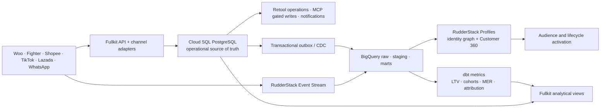

# Fullkit PRD

> Working name — see [[#Naming]] for alternatives. Research inputs: [[Luxana Teardown]] and [[Fighter Teardown]]. Strategy substrate: the EFFEN Applied AI family in `career-path/1. Vault/EFFEN/` — **the `Presentation/` folder (00–04) is the approved infrastructure plan currently being built; Fullkit extends it, it does not compete with it.** Working detail: Context & Operating Model, Roadmap, Tooling Roadmap, Build Playbook, `04 consolidated context and gaps`.

First-party Fighter tenant evidence: [[Fighter Walkthrough - WordPress Integration and HQ Dashboard]] and [[Fighter Walkthrough - Order Operations and Integrations]].

Canonical operational data model: [[Fullkit Schema Blueprint]].

Analytical decision-and-action product built on the governed marts: [[Growth Engine]].

Umbrella application portfolio and the complete idea-to-retention commerce loop: [[Fullkit Product Portfolio PRD]].

Target stack, service boundaries, lifecycle build-versus-buy posture, event/API contracts, and AI runtime guardrails: [[Fullkit Technical Architecture]].

Deep dives are organized under `Products/` for Iteratus, P1–P6 and the AI Sales Closer, and under `Spines/` for S1–S4. The spine notes own shared truth; the product notes own workflow, UI, decisions and success metrics.

## Product Summary

Fullkit is **not an app. It is EFFEN's owned commerce backend** — the set of composable services you get when you unbundle what Fighter and Luxana sell as SaaS, keep only the subsystems a multi-brand DTC operator actually needs, and rebuild them on infrastructure we control, with every service agent-legible (MCP) and every event flowing into the warehouse from day one.

The founding insight: **Luxana and Fighter are the same ~15 subsystems in different packaging.** Order pipeline, courier layer, payments abstraction, commission/wallet ledger, WhatsApp messaging, COD risk engine, CRM-lite, reporting. Neither is magic; both are small teams (Fighter is a Laravel monolith; Luxana is a solo-founder Supabase+React app less than a year old). What they sell is *convenience bundled with constraints*: tier-gated exports, per-seat pricing on network size, data locked in someone else's Postgres, and zero AI surface.

We don't need their SaaS packaging (multi-tenancy, billing, white-label, free-tier funnel — roughly a third of their build). We need their *internals*, mapped onto the four EFFEN data spines — and we need those internals to be readable and actionable by Claude, which no rented OMS will ever be.

**One sentence:** *Fullkit is the four data spines (S1 Customer & Order Hub, S2 Creative Loop, S3 Inventory, S4 Money) implemented as real services — the CDP and operational backbone the Applied AI strategy runs on.*

**Product above the spines:** the [[Growth Engine]] converts their governed commercial data into plans, daily targets, variance diagnoses, recommendations, approvals, executed actions, measured outcomes, and reusable organizational learning. The Growth Mart is its analytical read model; Cloud SQL and Fullkit's adapters provide the operational decision and action path.

## Problem

**Every department runs its own tool, and every tool adds work instead of removing it.** EFFEN (26 staff, 5 brands + NuroKids upcoming, 2 entities, MY + Shopee SG) has accumulated a tool per silo — CS in WhatsApp inboxes, orders split across Fighter/Woo/marketplace seller centres, finance in SQL Accounting + commission spreadsheets, ops and production in Excel, marketing in three ad platforms — and none of them talk to each other. The connective tissue is people: copy-paste, export-import, "check the group chat," ask-in-meeting. Headcount effort scales with the *number of silos × brands*, which is the exact opposite of the lean-scaling thesis. Fullkit exists to replace that human middleware with owned infrastructure.

The silos, concretely:

- **Orders fragment across rented and manual systems.** One brand's orders live in Fighter; the rest flow through WooCommerce funnels; marketplaces (Shopee MY/SG, Lazada, TikTok Shop) are their own silos; WhatsApp closes are human and unrecorded. There is no single customer or order record — S1 doesn't exist.
- **The money trail is manual.** 4 gateways (Chip, Stripe, HitPay, Billplz), 5 marketplaces/gateways with commissions, 7 credit cards, 2 finance staff reconciling by hand. FN-1 (commission engine) is the highest pain÷effort quick win precisely because no system owns S4.
- **Inventory is Excel.** Warehouse and production run on spreadsheets — S3 doesn't exist. Boss decision D3 ("WMS build vs buy") is open.
- **CS is one person (Ida) across 5 brands and every channel.** The CS-first priority (CS-2/3, the AI closer for W2) needs a phone-keyed customer hub and a WhatsApp API surface — neither exists.
- **Rented tools cap data maturity.** Fighter's exports are tier-gated to 7/14/31-day windows; Luxana's CSV export is 32 days. The gating law (`value ≈ AI × min(data, org)`) means every silo directly caps what the AI multiplier can return. You cannot build a CDP on someone else's export button.

The alternative of "just subscribe to more SaaS" (Luxana Lux RM998/mo, Fighter Infinity RM999/mo — *per system, forever*) buys features but not the substrate. The subscriptions aren't the real cost; the ceiling on data maturity is. And every additional rented tool is one more silo added to the pile above.

## Where We Are Now — Stage 1 of the approved plan

The infrastructure being built *first* is the one in `EFFEN/Presentation/00–04` — presented, approved, and in execution. Fullkit's sequencing hangs off it, so state it plainly:

- **In flight (stage 1):** Notion + Google Workspace rollout has started (the WhatsApp migration, Track A); **Novomira purchased** for automated landing pages (MK-6 workflow drafted); the operator bench and knowledge backbone (Git + OpenKnowledge vault) are forming; Reporting Tier 1 is the first Track C ship.
- **Next per the approved Gantt:** customer-data source audit (Jul) → warehouse phase 1, one brand (Aug–Sep) → **CDP phase 1: identity resolution as dbt models** (Sep–Oct) → segmentation + attribution (Nov+).
- **Already approved as a substrate:** the presentation names **customer-data (CDP) maturity** as the third substrate, riding Track B's warehouse — no new budget letter. The end-state it references is the Common Thread Collective "Prophit Engine" loop, built in-house.

**Fullkit's position relative to that plan:** the approved plan builds the *analytical* side — warehouse, pipelines, CDP-as-dbt-models, reporting. Fullkit is the *operational* side of the same Track B: the systems of record that de-silo the departments and let agents *act*, not just read. Same spines, two faces:

| | Approved plan (Presentation) | Fullkit |
|---|---|---|
| Customer data | CDP phase 1: identity stitching in dbt (read-only) | S1 hub: the operational record CS/orders/messaging run on |
| Money | MER reporting, cost model | S4 ledger: commission engine, reconciliation, payouts |
| Inventory | (not covered) | S3: SKU registry replacing Excel |
| Sequence | warehouse → CDP → attribution | shadows the same ingestion, then adds the write side |

This matters for scope discipline: **Fullkit Phase 0–1 is not new work — it is largely the same ingestion and identity-resolution work the approved Gantt already schedules**, done once, landing in both BigQuery (analytical) and Cloud SQL PostgreSQL (operational). Fullkit only becomes genuinely additional work at the write side (Phase 2+), by which point the read side has proven the model.

## The Thesis (why unbundle instead of clone)

If we tried to *clone Luxana or Fighter as products*, we'd spend most of the effort on what makes them sellable: multi-tenant isolation, billing, tier gating, white-label, onboarding funnels, support tooling. That's their business, not ours.

If we *unbundle them as infrastructure*, the build collapses to the subsystems EFFEN operationally needs — and each subsystem lands on a spine we already decided to build:

| # | Subsystem (union of both products) | Luxana | Fighter | EFFEN need | Spine |
|---|---|---|---|---|---|
| 1 | SaaS shell: multi-tenancy, billing, tiers, white-label | ✓ | ✓ | ✗ — single org | — |
| 2 | **Multi-brand core** (per-brand AWB, payment collection, WA numbers, rules) | partial | ✓✓ | **✓✓ 5+ brands, 2 entities** | all |
| 3 | **Channel ingestion / order sync** (Woo, marketplaces, forms, API) | ✓ (11 ch.) | ✓ (no marketplaces) | **✓✓ Woo + Shopee MY/SG + Lazada + TikTok Shop** | S1 |
| 4 | **Order pipeline** (state machine, bulk ops, dedupe, fraud) | ✓ | ✓ | **✓✓** | S1 |
| 5 | **Catalog & inventory** (variations, per-variation stock, price books) | light | ✓ | **✓✓ replaces Excel; answers D3** | S3 |
| 6 | Courier/fulfilment (AWB, tracking, pickup, labels) | ✓ (8) | ✓ (9) | ✓ — keep Fighter's initially, adapt later | S3/S1 |
| 7 | **Payments abstraction + reconciliation** | ✓ (3 gw) | ✓ (13 gw) | **✓✓ 4 gateways + marketplaces = FN-2..4** | S4 |
| 8 | COD tracker / delivery recovery / buyer-risk engine | ✓✓ | partial | ✓ — COD-heavy WhatsApp closes | S1/S4 |
| 9 | **Commission engine + wallet/ledger + payouts** | ✓ | ✓✓ (6 types) | **✓✓ FN-1 is quick win #1** (staff/marketplace commissions; skip network genealogy) | S4 |
| 10 | **Messaging** (WABA, SMS, status triggers, follow-up) | ✓✓ | ✓ (BYO) | **✓✓ CS-2/3; gated on boss decision D1** | S1 |
| 11 | **CRM / customer profiles / LTV** | light | light | **✓✓ — this grows into the CDP** | S1 |
| 12 | Page/funnel builder | ✓ (Laman) | ✗ | ✗ — Novomira + Woo already cover it | — |
| 13 | Promotions engine (coupons, cart rules) | light | ✓ | ✓ light | S1 |
| 14 | Reporting / leaderboards / exports | ✓ | ✓ | ✓ — but ours is the warehouse (MK-2, Reporting Tier 2), not a tab in an OMS | S2/S4 |
| 15 | AI services (order parsing, assistance) | ✓ | ✗ | **✓✓ superset: parse-from-WhatsApp, CS bot, AI closer** | the multiplier |
| 16 | Automation / webhooks / API surface | ✓ | ✓ | ✓ — native, since n8n/Dagster/MCP *are* our platform | — |
| 17 | Agent-network genealogy (roles, ranking, role automation) | ✓ | ✓✓ (moat) | **✗/defer** — EFFEN is paid-ads DTC, not sistem-ejen. Revisit only if an agent program launches | — |

Read the ✓✓ rows top to bottom and they *are* the spine map from `04 consolidated context and gaps`. **Fullkit = the spines, made concrete by two working reference implementations we can study feature-by-feature.**

Two things the incumbents prove for us:

1. **Buildable by a tiny team.** Luxana: one founder, Supabase + React + Vercel, live in under a year. Fighter: a ~3-person Laravel shop serving 470 businesses. With AI-assisted development and no SaaS packaging to build, the scope is honest.
2. **The Malaysian adapter set is known and finite.** Couriers (Ninja Van, J&T, Pos, SPX, DHL, Flash, City-Link), gateways (Chip, Billplz, Stripe, HitPay, toyyibPay, senangPay), WhatsApp (Meta Cloud API + BSPs). Both products integrate the same lists. These APIs are documented and commodity.

## Strategy Alignment (how Fullkit plugs into the Applied AI plan)

- **Fullkit is Track B made operational.** BigQuery + ingestion + Dagster/dbt is the *analytical* substrate. Fullkit adds Cloud SQL PostgreSQL as the *operational* substrate — the system of record the warehouse ingests from and the agents act through. This revises the earlier MotherDuck/Supabase proposal while preserving the same Track-B scope.
- **S1 is the CDP substrate's operational face.** The presentation already names customer-data (CDP) maturity as the third substrate and builds phase 1 as identity-resolution dbt models over the warehouse. Fullkit S1 takes the *same* stitched identity (phone-keyed, across Woo/Fighter/marketplaces/WhatsApp) and makes it a live system of record: unified order + conversation history, LTV/risk/retention traits that CS and messaging *act on*, not just report on. Downstream: audiences for Meta/TikTok, CS context for the DM bot (Playbook §4), MER cohorts for Reporting Tier 2, and the customer-economics inputs the Prophit-Engine loop needs (LTV, buying patterns, cohort quality, win-back segments).
- **Every service ships with an MCP surface.** The Build Playbook's law — "nothing is bought that the agent can't reach" — becomes "nothing is *built* that the agent can't reach." Claude reads orders, writes follow-ups, drafts commission runs, flags risk — through the same API surface Retool uses.
- **Events land in the warehouse from day one.** Order/payment/shipment/message events flow from the operational outbox/CDC and RudderStack Event Stream into BigQuery. Reporting Tier 2, Customer 360, LTV models and the future MMM feature store share this backbone.
- **The AI order-parsing and CS-closer features are where we out-build the incumbents.** Luxana's "AI Paste" is a thin LLM call. Our version — grounded in the OpenKnowledge vault, with the substantiated-claims compliance gate for Lipidri, escalation to Ida, and the full S1 customer context — is the CS-3 "AI closer" the boss ranked as priority #1. No rented OMS will ever ship that, because it requires *our* knowledge base in the loop.

## Architecture

Principle: **every module = a headless service (API-first) + a Retool UI + an MCP surface + events to the warehouse.** No module is "an app"; the composition is the product.

**Architecture decision — revised 2026-07-16:**

- **Operational core: Cloud SQL for PostgreSQL.** It owns transactional orders, inventory reservations, payment/fulfilment states, users and permissions, job queues, idempotency, audit and the outbox. BigQuery must not be used as the sole operational database.
- **Analytical core: BigQuery.** It replaces MotherDuck for raw history, staging, dbt marts, reporting, cohorts, attribution and LTV. BigQuery is the analytical source of truth, not the request/response write path.
- **CDP layer: RudderStack.** Event Stream standardizes behavioral and lifecycle events into BigQuery. RudderStack Profiles provides warehouse-native identity stitching, Customer 360 features and activation. Canonical business metrics remain governed BigQuery/dbt models rather than vendor-only calculations.
- **Identity boundary:** authentication is separate from the database choice. Fullkit stores external identity subjects and role memberships in PostgreSQL; the final SSO/identity provider remains an implementation decision.
- **Internal UIs: Retool** (already proposed) for ops consoles — order queue, reconciliation review, commission approval. Custom UI only where Retool hurts (none expected in year 1).
- **Sync & orchestration:** Airbyte or source-native extracts for bulk/scheduled ingestion, n8n for event workflows/notifications, and Dagster + dbt for BigQuery transforms. RudderStack handles instrumented customer events; it does not replace operational commands or transactional integrations.
- **Adapters as thin services:** one repo of courier/gateway/WhatsApp adapters with a common interface — the pattern both incumbents validate. Start with only what EFFEN uses: Chip, Stripe, HitPay, Billplz; Ninja Van/J&T (whichever Fighter config shows we ship with); WhatsApp Cloud API.
- **AI layer:** Claude API + OpenKnowledge retrieval, per the Build Playbook §4 pattern (ManyChat or direct Cloud API webhook → our endpoint → grounded answer). Fullkit gives that endpoint the S1 context it's currently missing.
- **Non-goals:** no multi-tenancy, no billing, no white-label, no public signup, no genealogy engine, no page builder (Novomira), no marketplace *storefronts* (they stay source channels).

## Build Strategy: strangler pattern around Fighter

We do not rip out Fighter (or Woo) on day one. Fighter is the scaffold we build around, then replace brand-by-brand — the same way you'd strangle a legacy monolith.

**Step 0 — exploit before you build** (meta-gap #6): audit the Fighter tenant. Its per-brand AWB/payment/WhatsApp features, notification triggers, and duplicate/fraud checks may already cover CS-4 and parts of OP-3 as *configuration*. Every feature confirmed working in Fighter is a feature Fullkit can defer.

**Read side first, write side later:** shadow the incumbents (continuous ingestion, reconciliation, reporting) before taking over order *processing*. The read side delivers FN-1/FN-2/MK-2 value with zero migration risk; the write side (creating orders, pushing AWBs) migrates one brand at a time only after the read side has proven the data model.

## Phased Roadmap

Phases ride the approved Gantt in `Presentation/02 - The Roadmap` — Fullkit does not open a second front. Phase 0–1 items are shared work with the scheduled warehouse/CDP builds; each phase names its Gantt anchor. The reconciled quick-win set from `04` (FN-1 + MK-2 + CS-4 + CR-4) stays intact — Fullkit items are the infrastructure rows those quick wins stand on. Each phase also names the silo it retires: **a phase is only done when a department stops doing swivel-chair work it did before.**

### Phase 0 — Shadow & spine seed *(now — rides the "customer-data source audit" + "warehouse phase 1" Gantt items, Jul–Sep)*
- Audit Fighter config end-to-end; collect Section-E access artifacts (Fighter admin + 1-mo export, gateway dashboards, WhatsApp number×brand map). This *is* the scheduled customer-data source audit, extended to the operational sources.
- Stand up Cloud SQL PostgreSQL with the **canonical operational schemas**: `customers`, `orders`, `order_items`, `payments`, `shipments`, `skus` and the transactional outbox — the S1/S3/S4 seed. Naming conventions from the vault are the join keys.
- Stand up BigQuery raw/staging/mart datasets. Continuously ingest Fighter exports/API, Woo, gateway payouts and PostgreSQL outbox/CDC events. Instrument customer events through RudderStack. One collection design, clearly separated operational and analytical landings; beat the 7/31-day export windows permanently.
- **Ships:** FN-2 (ads-spend/payout auto-collect), the data for FN-1.
- *Silo retired:* manual export-collection from Fighter/gateways/marketplaces.
- *Success signal:* every order from every channel, one table, refreshed daily or better.

### Phase 1 — Money spine + read-side hub *(rides "CDP phase 1: identity resolution", Sep–Oct)*
- **FN-1 commission engine** on S4: deterministic matcher over ingested marketplace/gateway settlements (needs only Pack-6 sample exports). Retool approval UI; Claude drafts the run, finance approves.
- **S1 read model live**: deterministic identity resolution across normalized phone, email and source IDs in BigQuery/RudderStack Profiles, surfaced as a governed Customer 360 for Ida. Cloud SQL retains the operational customer record and the identifiers needed for live workflows.
- Gateway reconciliation (FN-3/4 groundwork): payments ↔ orders ↔ payouts matching with exception queue.
- *Silos retired:* the commission spreadsheet; per-channel order lookups for CS.
- *Success signal:* commission close goes from days to minutes; Ida answers "where's my order" from one screen.

### Phase 2 — Messaging + inventory *(with "segmentation + attribution" and warehouse fan-out, Nov+)*
- **WhatsApp service layer** (gated on boss decision D1): WhatsApp Cloud API per-brand numbers, template/status-trigger engine (order confirmed/shipped/delivered — the Luxana Notify / Fighter Notification-By-Brand equivalent), conversation logging into S1. PDPA consent capture at intake (D7).
- **S3 inventory MVP**: SKU registry, per-variation stock, stock movements (in/out/adjust), replacing the warehouse Excel — the *build* answer to D3, scoped deliberately smaller than a full WMS.
- **AI order parsing**: WhatsApp text → structured S1 order (the Lux-AI-Paste superset, grounded in our catalog).
- *Silos retired:* manual status-update messages; the warehouse/production Excel files.
- *Success signal:* customers get automated per-brand status messages; stock truth lives in S3, not Excel.

### Phase 3 — Write side + the AI closer *(with the "DM/CS pilot" and "Reporting Tier 2" Gantt items, Q4 2026 → 2027)*
- **Order pipeline write side** for one pilot brand: order creation, bulk approve, AWB push via courier adapters, dual invoices. Migrate the Fighter brand only when parity is proven; keep Fighter as fallback during cutover.
- **CS-2/3 — the AI closer on W2** (ad-lead → close → order): DM/CS bot per Build Playbook §4, now with full S1 context (order history, LTV, risk) + OpenKnowledge grounding + the Lipidri substantiated-claims gate + human handoff to Ida. This is the payoff feature — the one no incumbent can rent us.
- COD risk suite (duplicate grouping, high-risk buyer flags, delivery recovery follow-ups) — now trivial because all history is in S1.
- Reporting Tier 2 (MER) reads it all from BigQuery; S2 closes the loop into creative; RudderStack/BigQuery segments now have an operational surface to act through (CRM/retention flows per the dependency map).
- *Silos retired:* Fighter (pilot brand); manual WhatsApp closing for routine inquiries.
- *Success signal:* one brand runs end-to-end on Fullkit; the bot closes its first sale unassisted.

### Explicitly deferred
Genealogy/agent-network engine (until an agent program exists) · page builder · POS/mobile app · marketplace write-APIs (order fulfilment via Shopee/Lazada APIs) · accounting integration (SQL Accounting stays; export bridges only) · any external productization.

## The B2B Option (why this lives in the B2B idea vault)

Fullkit is built as internal infrastructure, but the unbundled architecture keeps a door open: if the spines prove out inside EFFEN, the same services + Retool consoles are a **sellable vertical stack for Malaysian multi-brand DTC operators** — the segment Fighter and Luxana both serve at RM500–2,000/mo with zero AI story. The differentiators would be exactly what we build anyway: AI-native CS/closing, warehouse-grade analytics, no export ceilings. **Decision explicitly deferred** — no multi-tenancy or billing until EFFEN itself runs on it. The option costs nothing if the internal architecture stays headless and API-first.

## Success Metrics

- **De-siloing (the headline metric):** count of swivel-chair handoffs retired per phase (manual exports, cross-tool lookups, copy-paste reconciliations, ask-in-meeting status checks). Each phase's "silo retired" line is its definition of done — if workload didn't drop for a named department, the phase isn't done.
- **Data:** % of all orders (all brands, all channels) present in S1 within 24h → target 100% by Phase 1; export-window ceiling eliminated.
- **Finance:** commission close cycle (days → <1 hr); % gateway/marketplace payouts auto-matched (>95%).
- **CS:** Ida's lookup time per inquiry; response time on order-status questions (target <5 min per D4); % status updates fully automated.
- **Inventory:** stock accuracy S3 vs physical count; Excel files retired.
- **AI:** % WhatsApp orders auto-parsed; bot containment rate on CS inquiries; first unassisted close.
- **Economics (the thesis):** Fullkit run-cost (Cloud SQL + BigQuery storage/query/streaming + RudderStack + orchestration/VPS + WhatsApp per-message + Claude usage) vs displaced SaaS (Fighter tier growth ×5 brands) + labor avoided — tracked in `EFFEN_Cost_Model.xlsx` as its own Track-B line.

## Risks & Open Questions

1. **Single-operator bus factor.** Nadeem builds and runs this *and* the approved Applied AI plan. The mitigation is structural: Fullkit Phase 0–1 is deliberately the *same work* as the scheduled warehouse/CDP builds (one ingestion design, two purpose-specific stores), not a parallel program — plus managed Cloud SQL/BigQuery, Retool UIs colleagues operate, everything documented in the vault, and hand-off bars per the two-bars discipline. Still the #1 risk — scope phases small, and if capacity forces a choice, the approved Gantt wins and Fullkit's write side slips.
2. **Dual-store consistency.** Cloud SQL is authoritative for live operational state; BigQuery is authoritative for analytical history and metrics. CDC/outbox lag, replay, idempotency and reconciliation must be observable so the warehouse never silently becomes an operational write source.
3. **Gated boss decisions:** D1 (WhatsApp Business API + per-brand numbers) gates Phase 2 messaging; D3 (WMS budget) gates S3 scope; D7 (PDPA) gates the Customer 360 — consent capture and a legal read are prerequisites, not afterthoughts; D8 (budget envelope) gates everything.
4. **G1 — the CS stack is still unmapped.** Pack 1 (Ida) is unanswered; W2 (ad-lead → close) is uncaptured. The AI closer cannot be specced until it is. Same blocker as the strategic plan — chase Pack 1 first.
5. **Marketplace API access** (Shopee Open Platform, TikTok Shop Partner Center, Lazada Open Platform) requires developer approval with lead times — request in Phase 0, not when needed.
6. **Write-side migration risk.** Order processing is the business's heartbeat; hence read-first strangler, one pilot brand, Fighter kept as fallback through cutover.
7. **Under-building vs Fighter.** Fighter has 6 commission types, 9 couriers, 13 gateways because 470 tenants need the union. We need the intersection EFFEN uses. Resist parity; build from EFFEN's actual workflows (W1–W12), not the incumbents' feature matrix.
8. **Scope creep into SaaS.** The B2B option must not pull multi-tenancy into year 1. Guardrail: no feature ships unless an EFFEN module (CS-x/FN-x/OP-x/MK-x) claims it.

## Naming

"Fullkit" works but has two problems: it collides with **FunnelKit** (the WordPress plugin already in EFFEN's Woo stack — guaranteed daily confusion in G1/CS conversations), and it says "kit of everything," which is the *opposite* of the unbundling thesis.

Candidates, in recommendation order:

1. **Rangka** *(Malay: chassis / skeleton / frame)* — precisely the thesis: not a single app but the load-bearing frame the operation is rebuilt on. Local, short, brandable, matches the "spine" vocabulary already in the EFFEN docs (S1–S4 spines hang off a *rangka*). If the B2B option ever activates, it's a strong Malaysian-market name.
2. **Teras** *(Malay: core)* — same logic, softer; slightly more generic.
3. **Fullkit** — keep if the FunnelKit collision doesn't bother you; it's memorable and the folder already exists.

Recommendation: **Rangka**. Rename is one folder + one frontmatter edit if adopted.

## Next Actions

1. Chase the same inputs the Applied AI plan needs — they're identical: Pack 1 (Ida/CS), Pack-6 sample exports (unblocks FN-1), Fighter admin access + 1-month export, D1/D3/D7/D8 decisions.
2. Run the **Fighter config audit** (Step 0) — produces the definitive "configure vs build" split per module.
3. Draft the **canonical S1/S3/S4 schemas** in the vault (naming conventions = join keys) — the first real build artifact.
4. Add the Fullkit cost lines (Cloud SQL, BigQuery, RudderStack, orchestration/VPS, WhatsApp per-message and marketplace API costs) to `EFFEN_Cost_Model.xlsx` and price the counterfactual (Fighter/Luxana tiers × brands × years).
5. Decide the name; rename folder if switching to Rangka.
