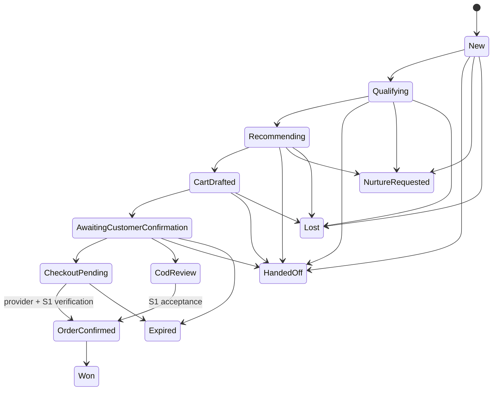
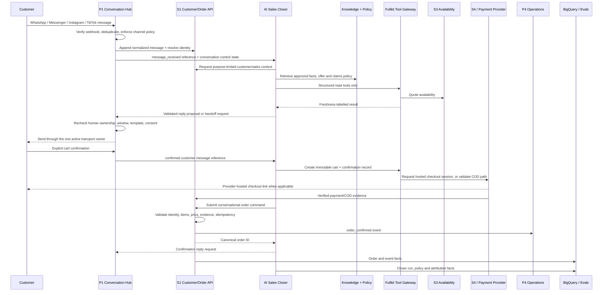
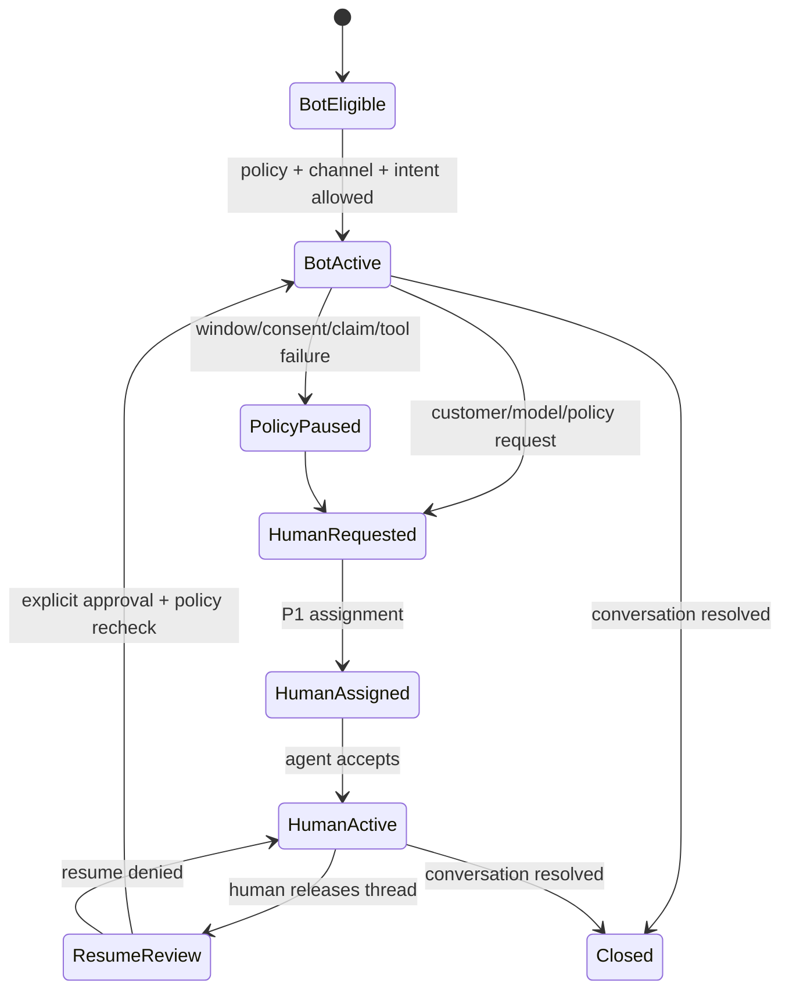
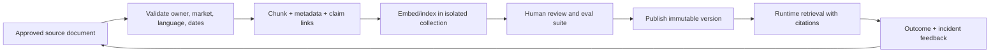

# AI Sales Closer

Parent portfolio: [[Fullkit Product Portfolio PRD]]. Technical placement: [[Fullkit Technical Architecture]]. Customer workflow owner: [[P1 - Customer Revenue Engine]]. Canonical customer and order infrastructure: [[S1 - Customer and Order Hub]].

> [!summary] Product decision
> The AI Sales Closer is a **separate, bounded AI product**. It converts an eligible sales conversation into an explicit customer choice, a validated cart, and then a checkout or COD order request. It uses curated Fullkit APIs and approved knowledge; it never receives raw warehouse access and never mutates payment or inventory directly.

> [!danger] WhatsApp launch gate
> The WhatsApp version must remain a **merchant-specific commerce agent for EFFEN's products and orders**, not a general-purpose AI assistant distributed through WhatsApp. Before any Malaysia or Singapore production launch, obtain a fresh legal review and written confirmation from Meta/BSP/provider that the implementation, products, claims, data processing, model provider, and message flows comply with the current terms. Meta's terms and regional exceptions can change.

## Product thesis

Paid traffic often lands in a conversation rather than a conventional checkout. The commercial opportunity is not merely to answer faster; it is to move a qualified prospect safely through:

**intent -> qualification -> product fit -> objection resolution -> approved offer -> cart -> explicit confirmation -> checkout/COD request -> verified order outcome**

The closer should deliver the responsiveness and consistency of software while preserving the judgment, accountability, and empathy of a human sales team. It is successful only when it creates **valid contribution-producing orders without harming customers, brand trust, channel standing, or operational accuracy**.

The closer is not the CDP, inbox, lifecycle CRM, order system, payment service, or WMS. It is the bounded decision and opportunity workflow between a live sales conversation and Fullkit's canonical commerce commands.

## Users and jobs to be done

| User | Job to be done |
|---|---|
| Prospect/customer | Get a quick, accurate answer and choose the right approved product/offer without pressure or confusion |
| Human closer / CS agent | Take over with the qualification, requirements, objections, recommendations, and proposed cart already summarized |
| Sales lead | Configure playbooks, offers, routing, targets, review queues, and quality standards by brand/market |
| Product/compliance owner | Approve product facts, claims, contraindication language, disallowed statements, and escalation rules |
| Growth operator | Understand which traffic, messages, objections, offers, and closer behaviors lead to valid contribution |
| AI/product operator | Version prompts, tools, policies, knowledge, models, evaluations, and rollout gates |
| Operations/finance | Receive only valid, auditable order requests and verified downstream order/payment events |

## Why this product is isolated

The closer has a different risk and state model from ordinary customer service:

- it actively influences product choice and purchase;
- it may propose commercial offers and create carts;
- it must distinguish persuasion from prohibited pressure or unsupported claims;
- it needs opportunity, objection, recommendation, confirmation, and outcome state that an inbox does not;
- a model or prompt change can materially affect revenue and compliance;
- it must fail closed to human service without taking the whole Conversation Hub offline.

Isolation means a separate bounded context, schema, service identity, tool allow-list, release process, evaluation suite, and success metric. It does **not** require a separate repository or database instance on day one. A separate `closer` schema and deployable Cloud Run service inside the Fullkit monorepo is sufficient initially.

## Product and data ownership

| Capability/object | Authority | Closer relationship |
|---|---|---|
| Channel account, webhook intake, normalized message, inbox, assignment, SLA, send window, template and human control | P1 Conversation Hub over S1 primitives | Reads references and requests replies/handoffs; never becomes a second transport owner |
| Customer, verified identities, consent facts, canonical conversation/message record, order | S1 | Reads a purpose-limited projection and submits validated commands |
| Lifecycle eligibility, proactive follow-up and frequency policy | P1 Lifecycle CRM | Requests a follow-up; P1 decides if/when/how it may be sent |
| Sales opportunity, qualification, requirements, objections, recommendations, proposed cart, closer handoff and closer attribution | AI Sales Closer | Owns |
| Catalog master, SKU/variant and approved product availability projection | Catalog/S3 services | Reads through scoped APIs |
| Physical inventory, reservation and movement | S3/P4 WMS | Cannot mutate; S1/P4 order workflow requests the appropriate reservation |
| Payment session, provider receipt, collected/refunded state | S4 and payment provider | May request a hosted checkout session; cannot mark payment paid/refunded |
| Post-confirmation order queue, fulfilment, pick/pack/ship/return | P4 | Stops being order workflow owner after S1 acceptance; receives outcome events |
| Governed historical metrics, LTV, attribution and evaluation | BigQuery/dbt | Offline analysis only; no raw BigQuery runtime queries |

### Conversation Hub versus closer

The simplest boundary is:

- **Conversation Hub:** “Who may speak now, through which account, under which channel rule, and who owns the thread?”
- **AI Sales Closer:** “What sales stage is this opportunity in, what does the customer need, and what safe next commercial action should be proposed?”
- **S1:** “Who is the customer, what messages and orders are canonical, and did the order command pass?”
- **P4:** “What must sellers and operations do with the confirmed order next?”

The Conversation Hub remains useful if the closer is unavailable. It routes directly to a human or deterministic FAQ/order-status flow. The closer remains channel-neutral because it receives normalized conversation events rather than provider payloads.

## Scope

### In scope

- Detect sales intent and open/link an opportunity.
- Ask only the minimum useful qualification questions.
- Retrieve approved product, offer, FAQ, and claims knowledge with provenance.
- Resolve common objections within a versioned playbook.
- Recommend only eligible catalog items and offers.
- Produce a price/availability quote from live APIs.
- Create and revise a cart draft.
- Capture explicit customer confirmation against an immutable cart snapshot.
- Request a hosted checkout link or submit a COD order request through S1/S4 contracts.
- Request human takeover before uncertainty or policy risk becomes customer harm.
- Create structured handoff summaries and follow-up requests.
- Learn from verified order, cancellation, delivery, return, refund, complaint, and contribution outcomes.
- Support Bahasa Melayu, English, and code-switching after passing dedicated evaluations.

### Not in scope

- General-purpose questions, open web research, personal advice, or “ChatGPT on WhatsApp.”
- Lifecycle broadcasting, win-back, abandoned-cart campaigns, or frequency decisions; P1 owns these.
- Customer-service case ownership, refund approval, complaint adjudication, or shipment mutation.
- Inventing a discount, guarantee, delivery promise, health claim, price, stock state, or product fact.
- Taking card numbers, bank credentials, identity documents, or other unnecessary sensitive data in chat.
- Direct database/warehouse queries, arbitrary SQL, raw customer exports, or unrestricted MCP access.
- Direct inventory reservation/adjustment, payment capture/refund, or `paid` status mutation.
- Replacing S1 order validation or P4 fulfilment workflows.
- Training a shared model with customer conversation data.

## Opportunity state machine

Closer opportunity state is independent of conversation, order, payment, and fulfilment states.



Rules:

- `CheckoutPending` does not mean paid.
- `CodReview` does not mean an order exists.
- `OrderConfirmed` requires an S1 order ID returned by the canonical confirmation contract.
- `Won` may be defined at confirmed, collected, delivered, or contribution-positive stage, but the definition must be explicit in reporting; the raw downstream states remain separate.
- A human handoff does not automatically lose the opportunity. The verified outcome remains attributable to the combined AI/human path.

## End-to-end channel flow



### Runtime principle

The model never sends a message or executes a commercial mutation by itself. It produces a structured decision and proposed tool calls. Deterministic policy code and the P1 Messaging Command API decide whether the reply/action may execute.

## Functional requirements

### FR-1 - Safe sales-intent routing

- Classify inbound intent as service, sales, mixed, sensitive, spam, abuse, or unknown.
- Open a closer opportunity only for sales/mixed intent or an explicit human action.
- Keep order-status, complaint, return/refund, privacy, and urgent safety intents in P1 service ownership unless a human deliberately transfers them.
- Preserve referral/ad/campaign identifiers supplied by the channel without treating them as causal proof.

### FR-2 - Qualification and product fit

- Use a versioned qualification schema by brand/product/market.
- Ask only fields required for fit, fulfilment, or legal policy; do not collect unnecessary sensitive data.
- Record structured requirements separately from the transcript.
- Represent unknown, declined-to-answer, and not-applicable distinctly.
- Escalate any case the playbook marks as requiring professional or human judgment.

### FR-3 - Grounded recommendation

- Recommend only active, market-eligible catalog variants.
- Attach recommendation reasons to retrieved evidence and policy version.
- Show price, currency, availability freshness, offer conditions, and material caveats.
- Treat every model-generated product/health/performance claim as invalid until it matches an approved claim record.
- Never use competitor or web content as live sales truth.

### FR-4 - Objection handling

- Map objection categories such as price, fit, trust, delivery, payment, usage, comparison, and timing.
- Use approved response strategies with maximum retry/pressure limits.
- Stop persuasion and offer human takeover on repeated refusal, distress, complaint, uncertainty, or a policy trigger.
- Store the resolved/unresolved outcome without using private message content to train shared models.

### FR-5 - Cart, confirmation, and checkout

- Construct the cart through the catalog/pricing service, not natural-language arithmetic.
- Store an immutable cart snapshot before asking for confirmation.
- Capture the exact customer message/event used as confirmation, timestamp, channel, cart hash, policy version, and language.
- Reconfirm if price, quantity, address, shipping, discount, or cart contents change.
- Generate only provider-hosted payment links. Never ask for complete card/account numbers in chat.
- Submit an order through S1 only after the applicable payment/COD, fraud, identity, address, pricing, and inventory rules pass.

### FR-6 - Human handoff and recovery

- Let the customer request a human at any time.
- Automatically hand off on low confidence, policy ambiguity, unsupported product/claim, adverse-event language, anger, repeated failure, refund/complaint, high-value exception, custom discount, or tool outage.
- Produce a compact structured handoff containing intent, requirements, objections, recommended next action, cart, evidence, warnings, and unanswered questions.
- Never continue automated outbound replies while a human owns the conversation.

### FR-7 - Outcome learning

- Join the closer path to verified S1/S4/P4 outcomes using stable IDs.
- Distinguish AI-only, AI-to-human, human-to-AI, and human-only paths.
- Measure order confirmation, collection, delivery, cancellation, return/refund, complaint, contribution, and repeat behavior.
- Use experiment/holdout methods before claiming incremental lift.

## Channel capability and policy matrix

The P1 Conversation Hub owns these channel adapters. The closer consumes one normalized contract and is enabled only after each account passes capability and policy checks.

| Channel | Supported closer posture | Required controls | Important boundary |
|---|---|---|---|
| **WhatsApp Business Platform / Cloud API** | Primary pilot candidate for click-to-WhatsApp and customer-initiated sales | WABA/number approval, webhook verification, opt-in evidence, 24-hour service-window clock, approved templates outside it, quality monitoring, clear human escalation | Merchant-specific commerce workflow only; do not distribute a general-purpose AI assistant |
| **Facebook Messenger** | Eligible Page conversations after Meta app permissions/review | Current standard messaging-window/tag rules, Page identity, webhook dedupe, app review, handover/standby ownership, human escalation | No unsolicited automation or unofficial browser control; verify current allowed use/tag before launch |
| **Instagram Messaging** | Eligible professional-account conversations, normally after the user initiates/contact is addressable under the API | Professional account, scopes/app review, current standard window and HUMAN_AGENT rules, webhook and handover controls | Instagram DMs are not WhatsApp; preserve account-specific identity and policy state |
| **TikTok Business Messaging** | Supported where the business account/API or approved Messaging Partner has access | Verified/eligible account where required, API for Business permissions, webhooks, regional/feature availability, privacy/lead notices, human takeover | TikTok direct messages, TikTok Instant Messaging Ads, and TikTok Shop chat are separate capabilities/connectors |

Useful official capability references include the [WhatsApp Cloud API overview](https://developers.facebook.com/docs/whatsapp/cloud-api/overview), [Messenger Platform overview](https://developers.facebook.com/docs/messenger-platform/overview), [Instagram Messaging API](https://developers.facebook.com/docs/instagram-platform/instagram-api-with-instagram-login/messaging-api), [TikTok API for Business](https://ads.tiktok.com/help/article/marketing-api?lang=en&redirected=2), and [TikTok Messaging Partners](https://ads.tiktok.com/help/article/about-message-management-tools?lang=en).

### WhatsApp-specific controls

The current [WhatsApp Business Messaging Policy](https://whatsappbusiness.com/policy/) requires, among other things:

- the recipient's number and opt-in before the business contacts them;
- respect for opt-outs;
- approved message templates for business-initiated conversations;
- free-form replies only within 24 hours of the user's last message;
- prompt, clear, and direct escalation paths when automation is used;
- compliance with product/commerce restrictions and applicable law.

Fullkit must store `service_window_opened_at`, `service_window_expires_at`, opt-in purpose/source/evidence, allowed message category, template ID/version, and send decision. The final send gateway rechecks these values immediately before transport; a model instruction is not an enforcement mechanism.

### WhatsApp AI-provider and data boundary

The current [WhatsApp Business Solution Terms](https://www.whatsapp.com/legal/business-solution-terms/) distinguish a prohibited general-purpose AI offering from retaining an AI provider as the merchant's third-party service provider. Fullkit's implementation must therefore meet all of these design rules:

1. The user is interacting with EFFEN's product-sales workflow, not with a general AI product.
2. The model provider, AI gateway, observability vendor, inbox/BSP, and any subprocessor that sees WhatsApp Business Solution Data must be reviewed and contractually bound to process it only on EFFEN's instructions and for the requested service.
3. **No WhatsApp Business Solution Data - including anonymous, aggregate, or derived data - may train or improve shared AI models.** Provider data-use/training must be disabled and contractually prohibited.
4. Although the terms describe a narrow exclusive-use fine-tuning exception, the initial Fullkit policy is stricter: **no model training or fine-tuning on WhatsApp data at all**. Revisit only after legal approval, a dedicated isolated model, documented deletion/retention controls, and Meta/BSP validation.
5. Raw WhatsApp payloads, message metadata, transcripts, embeddings, eval datasets, and analytics must retain source/provenance and purpose controls. Do not push raw WhatsApp content into a general CDP audience, ad-retargeting feed, shared vector corpus, or unrestricted model trace.
6. EFFEN remains liable for its service providers. A “zero-retention API” claim is not enough; retain executed contractual evidence and the provider/subprocessor list.

Meta currently reserves substantial discretion and has changed regional exceptions. Re-check the live terms immediately before launch and on a scheduled policy-review cadence.

### Product and health-claim gate

WhatsApp's policy restricts medical/health products and regulated verticals, with limited country-specific exceptions for some messaging and separate restrictions on commerce features. Because EFFEN may sell supplements or products with health-related positioning:

- classify every brand/SKU under Meta Commerce and WhatsApp policy before enabling the closer;
- obtain Malaysian/Singapore legal review for claims, consumer protection, PDPA, advertising, product classification, and required notices;
- maintain an approved-claims matrix by SKU, market, language, evidence, effective date, and channel;
- prohibit diagnosis, treatment advice, guaranteed outcomes, unsafe comparisons, adverse-event handling, and any disallowed commerce action;
- route health conditions, medicine interactions, pregnancy/breastfeeding, adverse events, and other sensitive situations to a trained human/professional path;
- do not launch merely because a technical API call succeeds.

## Human takeover state machine

P1 owns the canonical conversation control state; the closer references it. The Messaging Command API enforces the state again so a stale agent run cannot send after takeover.



### Invariants

- Exactly one active sender authority per conversation/account.
- `HumanRequested`, `HumanAssigned`, `HumanActive`, and `PolicyPaused` block autonomous sends.
- When `HumanActive`, the closer may produce a private summary or suggestion only; it cannot post to the customer.
- Resume requires an explicit human action, a fresh service-window/consent/policy check, and cancellation of stale pending sends.
- Every transition stores actor, reason, policy version, timestamps, correlation ID, and prior/new state.
- Customer phrases such as “human,” “agent,” “stop,” or equivalent BM/English variants are deterministic priority signals, not merely model classifications.
- Any uncertainty about takeover state fails closed to human ownership.

## Strict tool boundary

The model receives a small, versioned tool set through the Fullkit AI Tool Gateway. Tools use strict input/output schemas, service-to-service authorization, workspace/brand scope, idempotency, timeouts, audit, and response minimization.

### Allowed read tools

| Tool | Returns | Guardrail |
|---|---|---|
| `get_sales_customer_context` | First-party customer/order summary, consent/eligibility flags, approved traits and freshness | Purpose-limited fields; no raw Customer 360 or transcript export |
| `get_catalog_items` | Active products/variants, localized names, price-book references and allowed descriptors | Brand/market/channel scope |
| `quote_availability` | Sellable quantity/status and as-of time | Read-only; no reservation or adjustment |
| `evaluate_offer_eligibility` | Allowed offer, price, conditions and reason codes | Deterministic policy is authoritative |
| `search_approved_knowledge` | Versioned passages, claim IDs, provenance and expiry | Published collection only; brand/market/language filters |
| `get_customer_order_status` | Redacted customer-facing order/shipment/payment projection | Live authoritative API; never model memory |
| `get_opportunity_state` | Current closer state, cart version and unresolved requirements | Optimistic version check |

### Allowed command tools

| Tool | Effect | Execution rule |
|---|---|---|
| `record_sales_requirement` | Append structured requirement/evidence | Low risk; schema and scope validated |
| `record_objection` | Append objection and response outcome | Low risk; transcript reference required |
| `create_or_update_cart_draft` | Ask catalog/pricing service to calculate an immutable draft | No model arithmetic; idempotent |
| `capture_customer_confirmation` | Bind a customer message to an exact cart hash | Requires eligible inbound customer message and unchanged cart |
| `request_checkout_session` | Ask S4/provider for a hosted checkout link | Never captures payment; channel send still controlled by P1 |
| `submit_conversational_order` | Submit S1 order command after all gates | High-risk policy gate; S1 validates and may reject/review |
| `request_human_handoff` | Move control toward P1 human queue | Always allowed; cannot be denied by the model |
| `request_lifecycle_follow_up` | Send a reason/desired date to P1 | P1 independently checks consent, purpose, frequency and template |

### Human/policy approval required

AI SDK approval is one implementation mechanism, but the business policy service remains authoritative. Require human or deterministic approval for:

- any non-catalog/custom discount or price exception;
- high-value, bulk, unusual-address, fraud/risk, or manual-COD exception;
- health/product claims not already marked safe for autonomous use;
- replacement/refund/credit or cancellation actions;
- a cart/order changed after the customer's confirmation;
- any tool/action the rollout policy still places in review mode.

### Permanently forbidden tools/actions

- SQL, BigQuery query, unrestricted search, shell, browser, arbitrary HTTP, dynamic MCP discovery, or customer export.
- Direct `inventory_reserve`, `inventory_adjust`, `payment_capture`, `mark_paid`, `refund`, `approve_discount`, or `order_state_update` access.
- Reading payment credentials, secrets, complete identity documents, or unrelated customer records.
- Sending a message directly to a provider or bypassing P1's ownership/window/template/consent gate.
- Creating an unapproved knowledge item, policy, claim, offer, price, or product record.

## Knowledge and policy architecture

Live commercial truth and narrative knowledge must remain separate.

| Context class | Source | Runtime use |
|---|---|---|
| Live customer/order state | S1/S4/P4 APIs | Structured read tool; freshness and permission labelled |
| Catalog, price and availability | Catalog/S3/pricing APIs | Structured tool; never vector retrieval |
| Approved product facts and usage guidance | Versioned knowledge base | Retrieval with source, approval, market, language and expiry |
| Claims and compliance | Deterministic policy/claim registry | Allow, deny, exact-language-only, or human-required decision |
| Offers and discounts | Growth/commerce offer policy | Eligibility API; model cannot invent an offer |
| Tone and conversation playbook | Versioned prompt/policy | Brand/market/channel-specific behavior |
| Recent thread context | S1 message references + redacted summary | Minimum necessary recent turns; bounded token window |

### Knowledge publication workflow



Requirements:

- Every document/version has owner, source URI/file, checksum, brand, market, product, language, effective/expiry dates, approval status, sensitivity, and supersession link.
- Embeddings inherit the document's privacy, channel-source, retention, and access policy.
- A source can be retired immediately without deleting historical run provenance.
- Retrieval returns evidence IDs and snippets; the final claim validator checks the proposed reply against approved claim IDs.
- Prompt text is not a substitute for a deny-list or deterministic claims validator.
- Live stock, price, payment, shipment, consent, and offer eligibility are always API calls.

## Runtime and technical stack

### Recommended initial stack

| Layer | Recommendation | Role |
|---|---|---|
| Transport/inbox | P1 through respond.io first; direct official channel adapters later | Webhooks, one sender, delivery receipts, inbox, assignment, channel rules |
| Closer service | TypeScript, Node.js 22+, ESM, deployable on Cloud Run | Opportunity state machine, context assembly, policy and orchestration |
| Model/tool abstraction | **AI SDK 7**, pinned and upgrade-reviewed | Provider-neutral streaming, structured outputs, tool calls, approvals, timeouts and telemetry |
| Agent loop | `ToolLoopAgent` for bounded turn-level reasoning | Small active tool set and explicit stop/step/time budgets |
| Durable mid-turn execution | `WorkflowAgent` from `@ai-sdk/workflow` where approvals/tool chains must survive restarts | Resumable run; not canonical business state |
| Replaceable orchestration boundary | Internal `CloserOrchestrator` interface | Allows AI SDK WorkflowAgent, Temporal, Google Workflows, or a custom state machine to be swapped |
| Operational state | Cloud SQL PostgreSQL, separate `closer` and shared `ai` schemas | Opportunity, versions, approvals, run references, audit and outbox |
| Knowledge index | Approved documents in object storage; metadata + pgvector initially in PostgreSQL | Versioned, access-controlled retrieval without a new platform |
| Asynchronous work | Pub/Sub plus Cloud Tasks (or the portfolio-standard durable queue) | Webhook fan-out, retries, delayed processing, dead letters |
| Secrets/keys | Google Secret Manager and workload identity | No provider or channel secrets in database/prompt/logs |
| Analytics/evaluation | BigQuery/dbt | Outcome joins, experiments, quality and cost; never live tool path |
| Observability | OpenTelemetry/Cloud Logging with redaction; optional reviewed eval platform | Run/step/tool latency, error, cost and safety without unnecessary PII |
| Operator UI | P1 inbox for live work; Retool/Fullkit console for opportunity/policy/eval review | Human takeover and operational controls |

Vercel's [AI SDK 7 announcement](https://vercel.com/blog/ai-sdk-7) documents Node.js 22/ESM requirements, provider-neutral agents, top-level tool approval, timeouts, telemetry, and the durable `WorkflowAgent`. Use the current v7 API rather than copying v6 examples; in v7, approval policy belongs at the agent/generation layer (`toolApproval`) rather than relying on deprecated per-tool `needsApproval` configuration. Pin versions and re-read the [official AI SDK agent documentation](https://ai-sdk.dev/docs/agents) during implementation.

### Replaceable orchestrator contract

Fullkit domain code should depend on an internal interface such as:

```text
handleTurn(turnReference, opportunityVersion) -> CloserDecision
resumeApproval(approvalReference, decision) -> CloserDecision
cancelRun(runReference, reason) -> acknowledgement
prepareHandoff(conversationReference) -> HandoffSummary
```

`CloserDecision` is provider-neutral structured data: reply proposal, intent, confidence, evidence IDs, opportunity patch, proposed tool calls, handoff reason, and policy results. Provider-native messages, reasoning tokens, and workflow internals are diagnostic artifacts, not canonical business state.

Meta announced its own [Business Agent](https://about.fb.com/news/2026/06/meta-business-agent/) in June 2026 with FAQ, recommendation, lead-qualification, human-takeover and selling capabilities. Treat that—and any inbox vendor's agent—as a possible **replaceable orchestrator**, not Fullkit's source of truth. Fullkit should still own the opportunity, tools, policies, order/customer bindings and verified outcomes so the product can move between Meta, respond.io and an owned runtime.

### Durability rule

A customer may reply hours or days later. Do **not** keep one LLM agent invocation sleeping for the whole conversation. Persist the opportunity and control state in Cloud SQL; treat each inbound turn as a new idempotent durable job. Use `WorkflowAgent` only for a bounded turn that must survive deployment, tool execution, or an approval pause. Use P1's scheduler for later proactive follow-up.

### Provider routing and data posture

- AI SDK provides replaceability; the model provider/gateway is a procurement and privacy decision, not product authority.
- Prefer enterprise/API terms with no training, approved retention, deletion, security, residency, and subprocessor commitments.
- An AI gateway is optional. If used, it is another WhatsApp third-party service provider/subprocessor requiring written review.
- Route simple classification/summarization and complex recommendation separately only after evaluations prove the cheaper route safe.
- Configure total, step, chunk, and tool timeouts; cap steps and active tools; fail closed to human.
- AI SDK 7 supports signed approval hardening and richer telemetry, but Fullkit must still store its own approval/audit records.
- Keep request/response body capture and third-party trace content disabled by default. Store redacted structured evidence needed for audit/evaluation.

## Operational schema

S1 retains canonical conversation/message records. Closer tables reference `conversation_id` and `message_id`; they do not become a duplicate transcript store. Sensitive prompt snapshots are encrypted/redacted, purpose-limited, and independently retained.

### `closer` namespace

| Table | Grain and important fields |
|---|---|
| `closer.opportunities` | One sales opportunity: workspace/brand/market, customer/conversation, source campaign/referral, state, owner mode, currency, opened/closed time, optimistic version |
| `closer.opportunity_events` | One append-only transition/action: from/to state, actor, reason, message/correlation/causation references, occurred time |
| `closer.sessions` | One bounded closer engagement/run grouping: opportunity, channel account, started/ended time, status, model/policy/knowledge bundle |
| `closer.turns` | One inbound turn: S1 message reference, detected intent/language, decision, confidence, run reference, reply message reference; no unnecessary body duplication |
| `closer.context_snapshots` | One encrypted/redacted immutable context manifest: field names, source IDs, freshness, hashes, policy purpose, not a raw warehouse dump |
| `closer.customer_requirements` | One structured requirement: type, normalized value, evidence message, confidence, status, captured/confirmed time |
| `closer.objections` | One objection occurrence: category, evidence message, playbook version, response strategy, resolved state |
| `closer.recommendations` | One recommendation set/version: product/variant IDs, ranked reasons, evidence/claim IDs, eligibility result, reviewer/outcome |
| `closer.offer_decisions` | One evaluated offer: policy version, inputs hash, allowed offer/price, reason codes, expiry |
| `closer.cart_snapshots` | One immutable calculated cart version: items, price/discount/shipping/tax snapshots, total, currency, hash, expiry, source service version |
| `closer.customer_confirmations` | One customer confirmation: cart ID/hash, S1 message/event, exact confirmation type, occurred time, policy version, invalidated time/reason |
| `closer.checkout_requests` | One hosted-checkout/COD request: cart, provider/S4 reference, idempotency, state, expiry; no payment credentials |
| `closer.order_bindings` | Opportunity/cart/checkout to canonical S1 order ID with binding reason and time |
| `closer.follow_up_requests` | One request to P1: purpose, desired time/window, reason, state, P1 decision/reference |
| `closer.handoffs` | One handoff: trigger, risk/reason, requested/assigned/accepted/resolved time, team/member, structured summary reference |
| `closer.experiment_assignments` | Stable opportunity/customer assignment to policy/model/prompt treatment or holdout |
| `closer.outcome_attributions` | Verified order/payment/delivery/return/contribution outcomes linked to opportunity with method, window and confidence |

### Shared `ai` governance namespace

| Table | Grain and important fields |
|---|---|
| `ai.agent_definitions` / `ai.agent_versions` | Logical AI product and immutable executable configuration/version |
| `ai.model_routes` | Purpose -> approved provider/model/fallback, region, data-use class, effective dates |
| `ai.prompt_versions` | Immutable prompt/instruction version with owner, checksum, review and rollout state |
| `ai.tool_definitions` / `ai.tool_versions` | Tool name, schemas, service identity, scope, risk tier, timeout, approval policy and active state |
| `ai.policy_sets` / `ai.policy_versions` | Brand/market/channel policy bundle and immutable published version |
| `ai.policy_rules` | Deterministic allow/deny/review rule, priority, inputs, reason code and effective dates |
| `ai.knowledge_collections` | Isolation boundary by product/brand/market/language/sensitivity/source channel |
| `ai.knowledge_documents` / `ai.knowledge_versions` | Source, checksum, owner, approval, effective/expiry, retention, supersession and rights |
| `ai.knowledge_chunks` | Chunk, embedding reference, metadata and inherited access/retention policy |
| `ai.retrieval_events` | Run/query to returned evidence IDs, ranks, filters and scores |
| `ai.runs` | One bounded agent run: product/version, opportunity/turn, provider/model route, state, timing, token/cost, error, redaction class |
| `ai.model_calls` | One provider call: run/step, model, latency, usage, finish reason, safe metadata; body capture off by default |
| `ai.tool_calls` | One proposed/executed tool call: schemas, input/output hashes, authorization, status, latency, idempotency and error |
| `ai.approval_requests` | One tool/action approval: risk, approver, decision, reason, signature/nonce, expires/decided time |
| `ai.eval_suites` / `ai.eval_cases` | Versioned scenario set, language, risk category, expected outcome and protected source class |
| `ai.eval_runs` / `ai.eval_results` | Agent bundle under test, score by criterion, evidence and release-gate result |
| `ai.safety_incidents` | Suspected/confirmed incident, severity, customer impact, containment, owner, root cause and remediation |

### Required constraints

- One active closer opportunity per configured conversation/sales-purpose unless a deliberate new-opportunity rule applies.
- All state transitions use optimistic locking plus append-only events.
- Cart confirmations are invalidated automatically when the cart hash changes or expires.
- External/provider IDs are unique within their integration/account scope.
- Every tool call links to run, agent version, tool version, policy version, actor/service identity, and correlation ID.
- Raw model reasoning is never required for audit and should not be persisted as a business record.
- Deletion/retention jobs propagate to prompt snapshots, embeddings, eval copies, logs, and vendors according to source policy.

## BigQuery marts

| Model | Grain and purpose |
|---|---|
| `fct_closer_opportunity` | Opportunity; source, stages, ownership path, cart/order binding, verified outcome |
| `fct_closer_stage_transition` | Opportunity transition; time in stage, drop-off and handoff |
| `fct_closer_turn` | Inbound turn; intent, language, response mode, latency, evidence and policy result without unrestricted content |
| `fct_closer_recommendation` | Recommendation set/product; eligibility, acceptance, cart/order/delivery/return outcome |
| `fct_closer_objection` | Objection category/playbook; resolution, handoff and verified outcome |
| `fct_closer_cart` | Cart version; composition, confirmation, checkout and order conversion |
| `fct_closer_handoff` | Handoff; trigger, queue, wait, acceptance, resolution and sales outcome |
| `fct_ai_run` | Agent run; version/model, latency, steps, tokens, cost, error and policy result |
| `fct_ai_tool_call` | Tool/risk tier; proposed, approved, executed, denied, failed and latency |
| `fct_ai_safety_event` | Policy/claims/privacy/channel incident and containment |
| `fct_closer_experiment` | Treatment/holdout; valid-order, contribution, complaint and uncertainty-adjusted lift |
| `mart_conversation_commerce` | Traffic/campaign -> conversation -> opportunity -> order -> collected/delivered/contribution funnel |
| `mart_closer_quality_daily` | Brand/channel/language daily quality, compliance, reliability, cost and drift |

Raw transcript text should not be a default warehouse fact. Store structured classifications and secure references; create restricted, purpose-specific review datasets only when approved.

## API and tool contracts

### Context/read APIs

- `GET /customers/{id}/sales-context`
- `GET /conversations/{id}/closer-context`
- `GET /catalog/sellable-items?brand=&market=&channel=`
- `POST /availability/quotes`
- `POST /offers/eligibility-decisions`
- `POST /knowledge/search`
- `GET /orders/{id}/customer-status`

### Closer commands

- `POST /closer/opportunities`
- `POST /closer/opportunities/{id}/turns`
- `POST /closer/opportunities/{id}/requirements`
- `POST /closer/opportunities/{id}/objections`
- `POST /closer/opportunities/{id}/cart-drafts`
- `POST /closer/cart-drafts/{id}/confirmations`
- `POST /closer/opportunities/{id}/handoff-requests`
- `POST /closer/opportunities/{id}/follow-up-requests`

### Commerce commands behind guarded tools

- `POST /checkout-sessions`
- `POST /conversation-order-submissions`
- `POST /conversations/{id}/reply-requests`

The model does not receive these generic endpoints directly. The Tool Gateway exposes narrower operations with pre-bound workspace/brand/customer/conversation context.

### Events consumed

- `message_received`, `conversation_assigned`, `conversation_handed_off`, `conversation_closed`
- `customer_identified`, `customer_merged`, `customer_consent_updated`
- `catalog_item_activated`, `price_book_updated`, `offer_policy_published`
- `availability_changed`, `checkout_started`, `payment_collected`, `payment_failed`
- `order_confirmed`, `order_cancelled`, `order_shipped`, `order_delivered`, `order_returned`, `refund_completed`
- `service_case_opened`, `complaint_received`, `knowledge_version_published`, `policy_version_published`

### Events emitted

- `sales_opportunity_opened`, `sales_opportunity_stage_changed`, `sales_opportunity_closed`
- `sales_requirement_captured`, `sales_objection_recorded`, `sales_recommendation_proposed`
- `cart_draft_created`, `cart_customer_confirmed`, `checkout_requested`
- `conversation_order_submitted`, `closer_handoff_requested`, `closer_follow_up_requested`
- `ai_run_completed`, `ai_tool_approval_requested`, `ai_policy_blocked`, `ai_safety_incident_opened`

Every event carries event ID, schema version, occurred/received time, workspace/brand/market/channel, aggregate IDs, actor, correlation/causation IDs, and replay-safe source identity.

## Privacy, security, and safety requirements

### Data minimization and purpose

- Build a purpose-specific sales context API; do not expose the entire CDP profile.
- Use first-party order/customer facts only within the authorized cross-brand boundary.
- Exclude raw warehouse access and direct RudderStack profile queries from live execution.
- Do not use raw WhatsApp Business Solution Data for generalized profiling, retargeting, shared analytics, or model improvement without explicit legal/Meta approval.
- Treat message content, health-related statements, address, phone, payment context, and model traces as sensitive.
- Publish customer-facing AI/automation and privacy notices where required; preserve consent evidence and opt-out.

### Service and tool security

- Separate P1 transport, closer, tool-gateway, S1, S3, and S4 service accounts.
- Use short-lived workload identity, scoped audiences, mTLS/private networking where appropriate, and Secret Manager.
- Bind every tool call server-side to workspace, brand, customer, conversation, opportunity, and risk policy; ignore model-supplied authorization fields.
- Validate all inputs/outputs against strict schemas and business invariants.
- Use idempotency keys, optimistic versions, replay protection, webhook signatures, rate limits, timeouts, circuit breakers, and dead-letter queues.
- Sanitize external/customer/knowledge content as untrusted data. It cannot modify instructions, tool scope, approval policy, or system identity.
- Deny arbitrary URLs, file execution, hidden prompt retrieval, dynamic tools, and cross-customer references.

### Customer safety and fair selling

- Clearly identify the business and provide a direct human path.
- Do not falsely claim to be a human where disclosure is legally or contractually required.
- Never use coercion, manufactured urgency, discriminatory targeting, or repeated pressure after refusal.
- Validate product/health claims deterministically and preserve source/claim IDs.
- Provide accurate price, material conditions, delivery expectations, returns terms, and seller identity.
- A customer can stop automation and withdraw from the sale at any time.

### Logging and retention

- Operational logs use IDs and structured reason codes; full message/prompt bodies are excluded by default.
- If a restricted trace is required for incident review, encrypt it, time-limit access, record every view, and delete it on schedule.
- Provider/gateway retention and training settings are tested and evidenced, not assumed.
- Deletion requests propagate through S1, closer snapshots, knowledge/eval derivatives, BigQuery, logs, inbox/BSP, and model/gateway providers where applicable.

## Evaluation and release gates

The closer cannot be approved from a few demo conversations. Every published combination of agent, prompt, model route, tool set, knowledge, claims, offer, and policy is a release bundle.

### Offline evaluation suites

- Golden sales scenarios across products, markets, offers, customer states, and funnel stages.
- Bahasa Melayu, English, common code-switching, slang, spelling variation, and voice-note transcription errors.
- Product-fit questions, price objections, delivery/payment questions, competitor comparisons, and refusal.
- Health/medical/sensitive scenarios, adverse-event language, pregnancy/medication questions, unsupported claims, and prohibited products.
- Human-request, anger, complaint, refund, privacy/deletion, fraud, abuse, self-harm/emergency, and unknown-intent cases.
- Prompt injection in customer messages, retrieved documents, media captions, URLs, and tool results.
- Stale stock/price, provider timeout, duplicate webhook, out-of-order event, failed payment, changed cart, and expired confirmation.
- Tool authorization and schema tests proving forbidden mutations and cross-customer access cannot occur.
- WhatsApp 24-hour/template/opt-in, human takeover, bot-after-human, opt-out, and duplicate-send tests.

### Required score dimensions

- Intent/routing accuracy
- Product factuality and evidence coverage
- Claim-policy compliance
- Offer/price/cart correctness
- Tool selection and argument validity
- Handoff correctness and timing
- Customer-confirmation integrity
- Channel-window/consent/template compliance
- Tone, pressure, fairness, and language quality
- Valid-order and contribution outcome, with complaint/return guardrails

### Rollout gates

1. **Replay-only:** evaluate historical/redacted conversations; no customer output.
2. **Shadow:** process live turns but only compare against human action.
3. **Copilot:** draft for a human; human sends and labels corrections.
4. **Bounded auto-reply:** autonomous FAQ/qualification/recommendation only in low-risk cases; all commercial commands reviewed.
5. **Guarded conversion:** cart and checkout/COD submission allowed for a narrow brand/product/offer after explicit customer confirmation and policy gates.
6. **Expansion:** additional accounts, languages, channels, offers, and autonomous action tiers only after cohort-level safety and outcome review.

Automatic rollback triggers include confirmed policy/claim/privacy breach, bot reply after human takeover, unauthorized tool attempt, duplicate sends/orders, anomalous complaint/block rate, data-provider contract change, channel enforcement, or evaluation regression.

## KPIs

### Commercial outcome

- Qualified conversation -> valid confirmed order conversion
- Collected, delivered, and contribution-positive conversion
- Contribution per qualified conversation and per closer-assisted order
- Average order value and product mix with return/refund guardrails
- AI-only versus AI-to-human versus human-only incremental lift

### Customer and service quality

- First meaningful response time
- Time from first sales message to confirmed cart/order
- Customer abandonment and recontact rate
- Human handoff request, acceptance time, and resolution
- CSAT/complaint/block/opt-out rate
- Repeated-question and misunderstood-intent rate

### Safety and correctness

- Unsupported factual/health claim rate - target zero confirmed incidents
- Invalid offer/price/cart/order rate
- Unauthorized or malformed tool-call rate
- Bot-after-human and duplicate-send rate - target zero
- Opt-in, 24-hour window, template, and opt-out compliance
- Correct escalation rate on sensitive/unknown cases
- Order cancellation, failed delivery, return/refund, and avoidable complaint by closer path

### Reliability and economics

- P50/P95 turn latency and first-token/first-meaningful-response latency
- Tool success, timeout, retry, and dead-letter rate
- Model/provider fallback and handoff-on-outage rate
- Model + channel + vendor cost per qualified conversation/order
- Human minutes per conversion and minutes saved without quality loss

Raw containment is not a north-star metric. A bot that refuses to hand off can look “contained” while damaging conversion and trust.

## Staged MVP

### Stage 0 - Eligibility, workflow capture, and controls

- Map the real ad-lead-to-close workflow with Ida/closers, including every decision, exception, script, product claim, offer, handoff, and order step.
- Select one brand, one market, one official channel account/number, one narrow catalog set, and one human owner.
- Complete Meta/BSP/channel approval, PDPA/legal review, product/health-policy classification, privacy notice, model-provider DPA/no-training evidence, and incident owner.
- Establish S1 conversation/customer/order IDs, P1 control state, S3 availability, S4 checkout, and audit/outbox contracts.
- Build the tool gateway deny-by-default before adding an agent.

### Stage 1 - Human closer copilot

- Ingest normalized P1 conversation events.
- Intent, language, requirement, objection, and summary extraction.
- Approved-knowledge retrieval with evidence and claims validator.
- Draft replies and recommendations for human review only.
- Track edits, acceptance, handoff, verified order/delivery/return outcomes, and cost.

### Stage 2 - Low-risk autonomous response

- Automatically answer approved product/FAQ and qualification questions inside valid channel windows.
- Deterministic human request/opt-out/service/complaint/sensitive routing.
- Read-only catalog, offer eligibility, availability quote, and customer-facing order-status tools.
- One-click human takeover and guaranteed bot pause.

### Stage 3 - Guarded cart and checkout

- Model proposes; deterministic services calculate cart and offer.
- Capture exact cart confirmation.
- Create hosted checkout link or COD request with human/policy approval according to risk tier.
- S1 remains the only accepted order path; S4/provider remains payment authority.
- Start treatment/holdout measurement.

### Stage 4 - Narrow autonomous conversion

- Allow automatic cart/checkout/COD submission only for proven combinations of brand, product, offer, market, customer state, and channel.
- Keep custom discounts, health/sensitive, high-risk and exception cases human-owned.
- Add durable WorkflowAgent runs for guarded multi-tool/approval turns and automatic circuit breakers.

### Stage 5 - Multi-channel and optimization

- Expand to Messenger, Instagram, and TikTok only after account/API approvals and dedicated policy/eval suites.
- Add multilingual routing, model-tier routing, experimentation, and richer human coaching.
- Consider direct channel adapters only when P1 has proven the operational need to replace the initial inbox vendor.

## Risks and mitigations

| Risk | Mitigation |
|---|---|
| WhatsApp/Meta policy interpretation or change | Merchant-specific boundary, scheduled policy review, written Meta/BSP/legal validation, kill switch |
| Product/health claim violation | Approved claim registry, deterministic validator, sensitive-intent handoff, legal/product owner |
| Model provider uses data for training/retention | Contract/DPA, no-training and retention settings, subprocessor review, evidence, no raw traces by default |
| Hallucinated price/stock/payment/order | Live scoped tools, structured outputs, deterministic validation, no direct mutations |
| Human and bot both reply | P1 canonical control state, one transport owner, send-time recheck, stale-job cancellation |
| Prompt injection/tool abuse | Treat all content as data, fixed tools, strict schemas, server-bound authorization, no arbitrary web/SQL/MCP |
| Duplicate message/order after retries | Provider event dedupe, idempotency, cart hash, confirmation binding, outbox/reconciliation |
| Over-automation damages conversion | Copilot/shadow first, easy handoff, pressure limits, customer/complaint guardrails |
| Attribution overclaims value | Verified downstream outcomes, path labels, holdouts, contribution and return/refund measures |
| Vendor lock-in | Normalized channel contract, provider-neutral CloserDecision, AI SDK abstraction, replaceable orchestrator |
| Outage blocks sales | Conversation Hub routes to humans; circuit breaker; closer is never required for manual operation |

## Decisions required before build

- Which brand, product set, WhatsApp number/account, market, offer, and human team form the pilot?
- Is respond.io the P1 transport/inbox for the pilot, and can it meet the required API, webhook, takeover, audit, and data terms?
- What is the precise confirmed-order rule for prepaid versus COD conversation orders?
- Which claims and product categories may be discussed or sold on each channel/market?
- Which actions require customer confirmation, internal human approval, both, or neither?
- What customer/profile fields are genuinely necessary for closing, and what cross-brand access is legal/appropriate?
- Which model provider/gateway contract satisfies WhatsApp, PDPA, retention, deletion, residency, and no-training requirements?
- What is the operational human SLA and fallback outside business hours?
- What outcome defines `Won`: confirmed, collected, delivered, or contribution-positive?

## Definition of done for the first production pilot

- One approved channel account routes normalized messages through P1 with webhook authenticity, idempotency, send-window/template, opt-in/opt-out, and human control enforced.
- The closer can operate without raw warehouse/BigQuery access and without direct payment/inventory mutation.
- Every response is traceable to agent, prompt, model route, policy, knowledge, claim, tool, and source-message versions.
- A customer can request a human at any time; autonomous sending stops immediately and cannot resume without explicit release.
- Product, price, offer, stock, cart, payment, and order statements come from authoritative services.
- Customer confirmation binds to an immutable cart; S1 is the only order-confirmation authority.
- No WhatsApp Business Solution Data is used to train or improve shared models; provider/subprocessor evidence is retained.
- Legal/product/privacy/Meta/BSP launch gates are signed off for the exact brand, products, market, account, claims, model provider, and workflow.
- Shadow/copilot evaluation passes the agreed factuality, policy, tool, handoff, channel, multilingual, reliability, and customer-safety thresholds.
- Verified orders, payment/delivery/return/complaint/contribution outcomes and AI cost land in BigQuery with path and experiment labels.
- A kill switch and human-only fallback have been tested end to end.

## Official sources and validation checklist

Last source review for this document: **2026-07-16**. Revalidate before implementation and production because platform policies and SDKs change.

- [WhatsApp Business Messaging Policy](https://whatsappbusiness.com/policy/) - opt-in, templates, 24-hour replies, automation escalation, data and commerce restrictions.
- [WhatsApp Business Solution Terms](https://www.whatsapp.com/legal/business-solution-terms/) - third-party service providers, AI-provider boundary, shared-model training restriction, and Business Solution Data restrictions.
- [WhatsApp Cloud API overview](https://developers.facebook.com/docs/whatsapp/cloud-api/overview) - official API architecture and onboarding reference.
- [Meta Messenger Platform overview](https://developers.facebook.com/docs/messenger-platform/overview) - Page messaging API and platform setup.
- [Meta Instagram Messaging API](https://developers.facebook.com/docs/instagram-platform/instagram-api-with-instagram-login/messaging-api) and [Meta's official Instagram API collection](https://www.postman.com/meta/instagram/folder/23987686-f05b6c9f-a4be-4511-9f88-1cd94828fdf3) - supported professional-account messaging and HUMAN_AGENT examples.
- [TikTok API for Business](https://ads.tiktok.com/help/article/marketing-api?lang=en&redirected=2) - Business Messaging API capabilities.
- [TikTok Messaging Partners](https://ads.tiktok.com/help/article/about-message-management-tools?lang=en) - approved partner model, permissions, conversation event signals, and privacy notes.
- [AI SDK 7 announcement](https://vercel.com/blog/ai-sdk-7) and [AI SDK Agents documentation](https://ai-sdk.dev/docs/agents) - current agent/runtime primitives, durable WorkflowAgent, approvals, timeouts, and telemetry.
