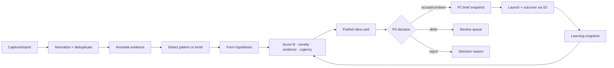

# Iteratus — Trends and Ideas

Parent portfolio: [[Fullkit Product Portfolio PRD]]. Technical placement: [[Fullkit Technical Architecture]]. Downstream product: [[P2 - Creative Intelligence and Supply]]. Shared analytical spine: [[S2 - Creative Loop]].

> [!summary] Product decision
> Iteratus is a **standalone opportunity-radar product**, lightly stitched to P2. It owns research evidence, trend observations and proposed idea cards. P2 owns the creative calendar, production demand, briefs, assets, approvals and capacity.

## Product thesis

Foreplay, Kalodata, platform libraries and internal ad history contain useful fragments, but they do not produce a durable EFFEN learning system. Iteratus turns those fragments into traceable creative opportunities:

**source evidence → normalized example → pattern/trend → hypothesis → ranked idea card → P2 decision → market outcome → learning**

The output is not “more inspiration.” The output is an evidence-backed proposal that a strategist can accept, reject, combine, defer or expire.

## Users and jobs

| User | Job to be done |
|---|---|
| Creative strategist | Find fresh patterns and convert them into usable angles without losing source context |
| Performance marketer | Connect creative opportunities to current audience, product and campaign needs |
| Creative lead | Decide which ideas deserve scarce calendar and production capacity |
| Researcher/operator | Capture, tag, compare and refresh external evidence efficiently |
| Growth operator | Feed current constraints and inspect whether accepted ideas created useful learning |

## Standalone versus stitched

### Iteratus owns

- Source/connector registry and permitted collection method
- External source snapshots and provenance
- Competitor/reference entities
- Research collections and annotations
- Trend observations and pattern clusters
- Creative hypotheses and evidence links
- Idea cards, scores, expiry and handoff decisions
- Feedback snapshots used to improve ranking

### P2 owns

- Marketing/creative calendar
- Growth Engine creative demand orders
- Accepted concept and brief
- Producers, assignments and capacity
- Production jobs and generation/tool runs
- Internal assets, variants, reviews, usage rights and approvals
- Launch readiness and iteration work

### Light-stitch rule

Iteratus publishes an immutable, versioned idea-card snapshot to P2. P2 may transform or combine it without changing the original research record. Neither product requires a synchronous call to stay operational.

## Scope

### Inputs

- Foreplay exports/collections or permitted integration
- Kalodata exports or permitted integration
- Meta, TikTok, Google and marketplace public/authorized creative evidence
- Own governed ad/creative performance from BigQuery S2 marts
- Search, customer-service and sales-objection signals
- Human notes, screenshots, URLs and uploaded research packs

Collection must follow the provider's API/export permissions and terms. Iteratus should not depend on brittle or prohibited scraping as its core ingestion strategy.

### Outputs

- Research collection
- Trend observation with evidence and time window
- Pattern/cluster with examples and counterexamples
- Hypothesis specifying audience, problem, angle, format and falsification signal
- Ranked idea card with evidence, fit, novelty, risk, confidence and expiry
- P2 handoff packet
- Retrospective learning tied to launched internal work

## Non-goals

- Replacing Foreplay, Kalodata or platform ad libraries
- Producing final creative assets
- Owning the marketing calendar or production schedule
- Publishing campaigns to ad platforms
- Treating competitor performance claims as verified commercial truth
- Copying external creative without rights/originality review
- Using raw asset volume as the product's success metric

## Core workflow

### Idea-card contract

Every proposed idea must state:

- title and one-sentence opportunity;
- target brand, market, audience and product context;
- customer problem/desire and proposed angle;
- recommended hook, format, proof style and channel;
- linked evidence, source dates and provenance;
- what is observed versus inferred;
- novelty/duplication relationship to EFFEN's own concept history;
- brand, claims, legal and usage-rights risks;
- expected useful window and expiry;
- confidence plus the cheapest falsification test.

## Operational schema

Recommended logical Postgres namespace: `iteratus`. Per [[Fullkit Technical Architecture]], the MVP may use prefixed `app.iteratus_*` tables until independent permissions or deployment justify a physical schema. External binary files remain in object storage; the database stores references, hashes and metadata.

| Table | Grain and important fields |
|---|---|
| `sources` | One research source/connector: provider, source type, access method, terms/permission note, status |
| `source_accounts` | One workspace connection: source, brand scope, external account, secret reference, sync state |
| `research_collections` | One named research initiative: owner, objective, brand/product/market, time window, status |
| `collection_items` | One collection-to-evidence membership with curator note and rank |
| `source_snapshots` | One captured external record version: external ID/URL, captured time, source timestamp, content hash, metadata, media reference |
| `reference_entities` | One competitor, creator, advertiser, product or category reference with aliases |
| `creative_examples` | One normalized example: source snapshot, entity, channel, format, language, duration, hook/transcript/CTA fields |
| `annotations` | One human/AI annotation: target object, taxonomy version, label/value, evidence span, confidence, reviewer |
| `trend_observations` | One observed signal by market/category/window: description, first/last seen, velocity, saturation, evidence strength |
| `pattern_clusters` | One versioned group of similar examples: method, centroid/summary, novelty, status |
| `pattern_memberships` | One example-to-cluster relation with similarity and curator decision |
| `hypotheses` | One testable creative proposition: audience, problem, angle, mechanism, expected behavior, falsification rule |
| `idea_cards` | One versioned proposal: hypothesis, brand/product/channel fit, novelty, evidence, urgency, risk, confidence, expiry, status |
| `idea_evidence_links` | One idea-to-snapshot/observation/pattern link with support/counterexample role |
| `scoring_runs` | One ranking run: method/prompt/model version, input snapshot, score components, output and reviewer |
| `handoff_decisions` | One P2 decision: accept/combine/defer/reject, reason, target brief/concept reference, actor, time |
| `feedback_snapshots` | One governed outcome returned from S2: activation, spend band, creative life, performance classification, learning note |
| `research_audit_events` | Append-only mutation/access history for evidence and decisions |

### Important constraints

- Uniqueness on source plus external object/version or content hash.
- Preserve capture time separately from the source's publish/start date.
- Store raw provider payloads privately and immutable where permitted.
- AI annotations never overwrite human annotations; they are separate versioned assertions.
- All score components retain method/prompt/model version.
- External creative cannot become a P2 production asset without originality and rights review.

## Analytical models

BigQuery candidate models:

| Model | Grain/purpose |
|---|---|
| `dim_external_creative_example` | Conformed external evidence with provider and taxonomy lineage |
| `fct_trend_signal_daily` | Date × market × category/pattern; observation volume, velocity and saturation |
| `fct_idea_pipeline` | Idea version × decision stage; cycle time and acceptance |
| `fct_idea_outcome` | Accepted idea/concept × launch; activation and governed result classifications |
| `fct_pattern_learning` | Pattern family × brand/product/channel/time; attempts, outcomes and confidence |
| `fct_research_source_yield` | Source × period; useful evidence, accepted ideas and validated learning per cost/hour |

Own ad performance remains governed in S2/Growth marts. Iteratus receives only the dimensions and aggregates needed for research and ranking.

## APIs and events

### Read APIs

- `GET /iteratus/evidence`
- `GET /iteratus/trends`
- `GET /iteratus/idea-cards`
- `GET /iteratus/idea-cards/{id}/evidence`
- `GET /iteratus/similar-internal-concepts`

### Command APIs

- `POST /iteratus/import-jobs`
- `POST /iteratus/annotations`
- `POST /iteratus/hypotheses`
- `POST /iteratus/idea-cards`
- `POST /iteratus/idea-cards/{id}/submit`
- `POST /iteratus/idea-cards/{id}/decision`

### Domain events

- `research_snapshot_captured`
- `trend_observation_published`
- `idea_card_proposed`
- `idea_card_accepted`
- `idea_card_combined`
- `idea_card_deferred`
- `idea_card_rejected`
- `idea_card_expired`
- `idea_feedback_recorded`

The accepted-event payload carries an immutable idea version and evidence summary. P2 replies with its new concept/brief identifier.

## AI boundary

AI may:

- transcribe and summarize permitted media;
- propose taxonomy tags and semantic similarity;
- cluster examples and surface counterexamples;
- draft hypotheses and idea cards;
- detect likely duplicates against internal concept history;
- explain score components.

AI may not:

- claim competitor spend, revenue or profitability without verified evidence;
- copy an external asset as a production instruction;
- publish directly into P2's production calendar;
- conceal source uncertainty;
- train a shared model on provider/customer data without a permitted data-processing basis.

Human approval is mandatory for publishing an idea card and accepting it into P2.

## KPIs

### Product usefulness

- Median evidence-capture-to-idea cycle time
- Idea acceptance/combine/defer/reject rate
- Accepted ideas that become launched concepts
- Validated-learning rate per accepted idea
- Duplicate/stale idea rate

### Research quality

- Evidence completeness and source freshness
- Human agreement with AI annotations/cluster suggestions
- Counterexample coverage
- Source yield per cost and operator hour
- Rights/claims review failure rate

### Portfolio impact

- Share of P2 briefs originating from Iteratus versus internal performance/customer signals
- Concept-family diversity
- Time from detected opportunity to first market test
- Incremental contribution or approved proxy by idea family, with confidence label

## MVP sequence

### Stage 0 — Taxonomy and manual evidence

- Define source permissions and creative taxonomy.
- Manual import for Foreplay/Kalodata exports, URLs and screenshots.
- Human annotation, collections and versioned idea cards.
- Manual P2 accept/reject handoff.

### Stage 1 — Own-data context

- Read governed S2 concept/asset/performance history.
- Similarity and duplicate warnings.
- Return P2 launch/outcome snapshots to idea cards.

### Stage 2 — Assisted research

- Scheduled permitted connectors/imports.
- AI transcription/tagging/clustering with review queue.
- Ranking by evidence, brand fit, novelty, urgency and production feasibility.

### Stage 3 — Closed learning loop

- Growth Engine sends current creative demand and constraints.
- Iteratus ranking incorporates validated historical outcomes without overfitting platform proxies.
- Source-yield and pattern-learning views guide future research time.

## Dependencies and risks

1. Provider export/API rights and changing terms.
2. External metrics may be estimates, biased or incomparable.
3. Inspiration can collapse into imitation without provenance and originality gates.
4. AI clustering can amplify superficial sameness and reduce creative diversity.
5. Feedback based only on platform ROAS can reward false attribution; use governed outcome classifications.
6. Small sample sizes make idea-level causal claims weak; preserve uncertainty.
7. P2 must record concept and source lineage consistently or the feedback loop will break.

## Definition of done for MVP

- A researcher can capture evidence with source and time provenance.
- A strategist can publish a versioned idea card with observed/inferred labels.
- P2 can accept, combine, defer or reject it with a reason.
- An accepted idea creates a linked P2 concept/brief snapshot, not shared mutable state.
- A launched result returns to the exact idea version through S2.
- The system can show which sources and patterns produced useful learning without claiming causality it cannot support.
