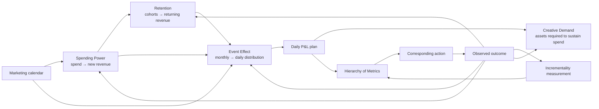

# CTC Growth Engine Methodology Research

> Research Input 02 for [[Growth Engine]]. This note separates CTC's reusable operating mechanics from its product packaging, proprietary implementation claims, and marketing claims.

## Executive Synthesis

CTC's system is best understood as six connected layers:

1. **Commercial data foundation** — marketing, orders, customers, costs, inventory, calendar, and distribution data.
2. **Qualitative plan** — a 12-month calendar of promotions, launches, cultural moments, and lifecycle activity.
3. **Connected model chain** — Spending Power, Retention, Event Effect, and Creative Demand.
4. **Daily P&L map** — monthly financial outcomes decomposed into daily expectations by channel and campaign.
5. **Measurement-learning system** — incrementality experiments and confidence-weighted factors that move the models closer to causal reality.
6. **Operating cadence** — compare actual to expected, diagnose top-down, take a corresponding action, and measure the outcome.

The system's central product insight is not forecasting accuracy by itself. It is a **closed decision loop** that connects planning, prediction, diagnosis, execution, and measurement in one operating environment.

## The System in One Map



## Four Workflows Versus Four Models

CTC uses two different sets of four that should not be conflated.

### Four operating workflows

1. Forecasting and target setting
2. Creative strategy
3. Media measurement
4. Media buying and execution

These are the organizational responsibilities the Prophit Engine connects under one accountable operator.

### Four analytical and planning models

1. Spending Power
2. Retention
3. Event Effect
4. Creative Demand

The first three create the revenue and daily P&L forecast. Creative Demand evaluates whether the creative supply chain can execute the resulting media plan. It is an execution-feasibility model rather than a direct revenue model.

## Forecasting Methodology

### Four-step operating model

1. **Qualitative planning:** design the commercial calendar before choosing the numbers.
2. **Quantitative modeling:** translate spend, cohorts, and moments into expected commercial outcomes.
3. **Build the map:** reconcile the models into a P&L and decompose it into daily targets.
4. **Operate daily:** compare actuals to expectations, diagnose the gap, and act while the period is still recoverable.

### What the forecast is for

The forecast is a control system, not a promise that the point estimate is correct. Its useful outputs are:

- The expected state for each important input
- The material variance from expectation
- Whether the problem is primarily volume or efficiency
- The amount of time remaining to recover
- The corresponding set of possible actions
- A record of which assumptions proved wrong

### Marketing calendar as revenue architecture

The calendar should include:

- Promotions and discounts
- Product and collection launches
- Email and SMS sends
- VIP and loyalty activity
- Cultural and seasonal moments
- Marketplace events
- Competitive periods
- External events that affect demand
- Inventory or distribution constraints

The calendar is not only descriptive. Each tagged event becomes a future model input and a historical training observation.

### Demand architecture: the three-layer revenue cake

The older demand-forecasting material adds a useful decomposition that sits underneath the connected model chain:

```text
total demand revenue
= existing-customer revenue
+ owned-audience revenue
+ paid-acquisition revenue
```

1. **Existing customers:** the most stable layer because the customer file already exists. Forecast it from acquisition cohorts, retention behavior, first-product, acquisition source, offer, and seasonality.
2. **Owned audiences:** demand reached through email, SMS, organic social, organic search, communities, and other permissioned or earned distribution. Forecast it from audience size, contact volume, reach, engagement, conversion, and revenue per activity.
3. **Paid acquisition:** the most volatile layer because spend, auction prices, conversion, offer response, creative supply, and marginal efficiency all move together.

Uncertainty generally increases from the bottom to the top. This is not a fifth proprietary forecast model. It is a **demand-composition lens** that explains where revenue is expected to originate and how much confidence to place in each portion.

Fullkit should preserve:

- `demand_layer`: existing customer, owned audience, or paid acquisition
- `demand_source`: email, SMS, organic search, paid social, marketplace, and so on
- Attribution method and confidence
- Planned revenue, actual revenue, and variance by layer
- Activity drivers for owned channels, not only attributed revenue
- Overlap and deduplication state when more than one channel touched the order

The model should not call owned distribution "free." It still consumes content, software, people, and opportunity cost. It should also avoid forcing every order into a falsely precise channel. A residual or blended state is preferable to double counting.

### Model lineage: Lightspeed cohort model -> CTC Growth Map

The demand-forecasting article explicitly says CTC's Growth Maps were adapted from Lightspeed's standardized ecommerce model. The two sources are complementary rather than competing models:

- **Lightspeed supplies the financial skeleton:** monthly paid spend and CAC produce new paid buyers; an organic-halo assumption adds organic buyers; successive acquisition cohorts follow an in-month retention curve; cohort diagonals convert cohort time into calendar-month transactions; AOV converts transactions into revenue; shipping, returns, discounts, COGS, headcount, and overhead complete the P&L, with later versions extending to balance sheet and cash flow.
- **CTC adds the demand-composition and operating lens:** existing customers, owned audiences, and paid acquisition are separated by uncertainty and controllability, then joined to real-time performance, variable costs, marketing actions, inventory, and daily course correction.

For Fullkit, Lightspeed is a strong transparent baseline for validating the cohort and P&L arithmetic before more complex Spending Power, Event Effect, or Creative Demand models are introduced. Its fixed CAC, organic-halo, AOV, retention, and percentage-of-AOV cost assumptions should remain explicit scenario inputs rather than silently becoming observed truth.

This source lineage does not create another Fullkit model or require a schema change. It strengthens the evaluation contract for the existing cohort, demand-layer, commercial-daily, and scenario-vintage models.

### Daily map

The monthly commercial plan must reconcile to daily expectations for:

- Revenue
- New-customer revenue
- Returning-customer revenue
- Orders and customers
- Ad spend
- MER and acquisition efficiency
- Contribution margin
- Channel and campaign allocations
- Marketing-event effects
- Creative delivery requirements

## Model 1 — Spending Power

### Purpose

Estimate how efficiently a proposed amount of advertising spend will convert into new-customer revenue.

### CTC definitions

```text
ACONS = total ad spend / new-customer revenue
aMER  = new-customer revenue / total ad spend
```

ACONS is the inverse of aMER. Lower ACONS represents greater acquisition efficiency.

CTC models the relationship between spend and ACONS using a monthly slope and intercept:

```text
expected_acons = intercept + slope × planned_spend
spending_power = 1 / slope
expected_new_customer_revenue = planned_spend / expected_acons
```

The slope represents efficiency degradation as spend grows. “Spending Power” is intended to describe how much additional spend the brand can absorb before acquisition efficiency deteriorates materially.

### Strategy points on the curve

The system exposes at least three possible objectives:

1. **Maximize month-one contribution:** positive first-order contribution without relying on retention.
2. **Acquire at first-order break-even:** maximize volume while expecting future purchases to provide the upside.
3. **Maximize lifetime contribution:** accept a longer payback period when modeled cohort value and available capital justify it.

This is a capital-allocation choice, not merely a media-efficiency choice. Cash constraints, inventory, gross margin, retention confidence, and payback tolerance determine the appropriate point.

### Data requirements

- Daily total ad spend
- New-customer revenue and count
- Reliable new-versus-returning identity
- CAC and first-order contribution
- Gross and contribution margin
- Seasonality and market
- Event calendar
- Known anomalies and non-repeatable events
- Platform and channel allocations
- Historical valid spend range

### Fullkit implementation stance

Do not assume a linear relationship is universally adequate. Begin with transparent candidate models and compare out-of-sample performance:

- Linear and piecewise regression
- Log or log-log response curves
- Monotonic/isotonic regression
- Saturation curves
- Last-year and trailing-period baselines
- Ensemble only after individual models are observable

Never present a recommendation outside the supported historical spend range without a prominent extrapolation warning.

### CAC precursor model and public failure lessons

CTC's earlier CAC work modeled three primary signals plus seasonality:

1. Spend volume
2. Consumer confidence
3. Previous-month CAC
4. Seasonal effects

The published experiments are valuable because they include failure evidence. An aggregate one-month forecast reportedly missed by 6.3% while remaining inside its stated 90% interval. A later brand-specific, four-month forecast materially overpredicted CAC. Actual spend was below plan, marketing performance shifted, the brand entered a new operating regime, and forecast accuracy degraded with horizon.

This suggests several Fullkit rules:

- Do not hold CAC constant while increasing spend.
- Treat CAC as a response and diagnostic output, not a fixed planning primitive.
- Prefer aMER or ACONS for the primary spend-response curve because CAC also moves with new-customer AOV.
- Recalculate the counterfactual using actual spend before labeling the acquisition model wrong.
- Use different feature sets for near-term and long-horizon forecasts. Recent CAC and current consumer-confidence signals are useful near term but unavailable or unstable far ahead.
- Add marketing events, product mix, offer, nAOV, creative regime, brand search demand, and channel mix when the sample supports them.
- Generate intervals and probability-of-breach outputs, not only a point CAC.
- Use daily or weekly observations to increase sample size, while controlling for autocorrelation, lag leakage, and campaign-driven endogeneity.
- Detect structural breaks when agencies, channel strategy, product mix, measurement, or creative systems change.
- Evaluate with rolling-origin backtests and compare against simple seasonal and last-period baselines.

Useful identities:

```text
CAC = ad_spend / new_customers
aMER = new_customer_revenue / ad_spend
new_customers = new_customer_revenue / new_customer_AOV
```

The maximum spend before the business crosses its contribution or payback boundary is the practical **growth-velocity constraint**. The purpose of the curve is to locate and safely move that boundary, not merely predict a reported CAC.

## Model 2 — Retention

### Purpose

Forecast returning-customer revenue from every historical and planned acquisition cohort.

### Core metric

CTC defines monthly **LTV Lift** as the percentage of a cohort's first-order revenue that returns as repeat revenue at a given cohort age.

```text
ltv_lift(cohort, age) = returning_revenue_at_age / first_order_revenue

returning_revenue(month) =
  Σ first_order_revenue(cohort) × expected_ltv_lift(cohort_age)
```

The reported curve normally decays sharply in early months and approaches a lower terminal rate.

### Important distinction

The total customer file is not the relevant operating asset. The engine needs an **active customer file**, with lapse defined per brand from observed repurchase timing. CTC uses the point by which 80% of second purchases have historically occurred as one lapse boundary.

### Model governance signals

- Actual versus modeled lift by cohort age
- Curve shape drift
- Level or calibration drift
- Fit quality, including an R-squared warning threshold
- Promotion and acquisition-volume regime changes
- Quarterly review plus off-cycle retuning

### Data requirements

- Stable customer identity
- First-order date and first-order revenue
- Repeat-order dates and revenue
- Refunds and cancellations
- Product/category composition
- Acquisition source and promotion
- Market and currency
- Cohort-age calendar
- Gross or contribution value, not only revenue

### Fullkit implementation stance

Ship the cohort matrix before the predictive model. The first useful version is a governed actual cohort table with transparent baselines. Only introduce OLS, decay curves, survival models, or hierarchical pooling when they beat those baselines out of sample.

## Model 3 — Event Effect

### Purpose

Convert a monthly forecast into a daily forecast by learning how tagged commercial moments redistribute demand.

### Two main signals

1. **Return Ratio:** the event's tendency to shift demand toward returning customers.
2. **aMER Lift:** the event's effect on new-customer acquisition efficiency relative to an ordinary day.

### Monthly constraint

Event multipliers should redistribute the monthly plan rather than silently inflate it. Hot event days are balanced by proportionate compression around them so daily values still reconcile to the approved monthly revenue and spend totals.

### Data requirements

- Canonical event taxonomy
- Event start and end timestamps
- Brand, market, product, offer, and audience
- New and returning revenue
- Spend and acquisition efficiency
- Baseline day-of-week and seasonal effects
- Comparable prior events
- Email, SMS, site, marketplace, and ad participation

### Sample-size and uncertainty rules

CTC states that the model needs at least 10 tagged historical events and that uncertainty remains wide below roughly 20–30 observations. Fullkit should store the observation count, dispersion, and confidence for every event multiplier and fall back to a conservative baseline when evidence is weak.

### Fullkit implementation stance

Event tagging must begin during data-infrastructure work. An untagged promotion cannot become a useful training observation later. Start with a rules-based event calendar and empirical summaries; introduce hierarchical regression only when the taxonomy and sample sizes justify it.

## Model 4 — Creative Demand

### Purpose

Estimate how much new creative is required to sustain the approved media plan.

### Portfolio health inputs

CTC's published Creative Score uses five measures:

1. Zero-revenue rate
2. Spend concentration in top ads
3. ROAS degradation after launch
4. Spend degradation after launch
5. Evergreen share beyond 30 days

The measures are benchmarked against the broader managed portfolio and combined into a composite health score.

### Recommendation inputs

- Same-month prior-year creative volume
- Planned year-over-year spend change
- Creative portfolio health
- Evergreen carry-forward capacity
- Sanity checks where last year's supply was already insufficient

### Required outputs

- Required assets per month and marketing moment
- Required concept, format, product, and message coverage
- Existing evergreen capacity
- Replacement requirement from expected decay
- Expected activation range
- Expected outlier range with uncertainty
- Production cost and lead time
- Delivered versus required creative

### Fullkit implementation stance

Do not optimize asset count. Optimize the expected incremental contribution of the creative portfolio after production cost, correlation between similar assets, brand risk, and operational capacity.

The composite score must remain decomposable. Operators should see every component, benchmark, weight, and change over time rather than receiving only a single score.

## Measurement — Progressive Truth

### Purpose

Build a continuously improving approximation of the causal relationship between advertising spend and total commercial outcomes.

### The progression

1. Start from an aggregate benchmark when the brand has no experiment of its own.
2. Add the first brand-specific result, weighted by confidence rather than replacing the prior completely.
3. Accumulate results into a brand-specific distribution.
4. Weight results by similarity of season, event state, spend level, market, and other context.
5. Retest continuously as channel efficacy changes.

This should be implemented as versioned evidence, not as one mutable “incrementality factor” cell.

### Core formulas

```text
incrementality_factor = incremental_revenue / platform_reported_revenue
normalized_incremental_revenue = platform_reported_revenue × current_incrementality_factor
iROAS = normalized_incremental_revenue / ad_spend
iCM = incremental_contribution_margin attributable to the spend
```

iCM is the more useful allocation target when variable costs, product mix, and customer value differ materially across channels.

### Geo holdout test record

The engine needs to store:

- Hypothesis and channel
- Treatment and control geographies
- Pre-period and test period
- Spend level and scale change
- Outcome coverage across .com, marketplaces, and retail where available
- Synthetic-control or matching specification
- Power assumptions
- Lift estimate
- Confidence interval and p-value
- Post-treatment windows
- Data-quality and contamination warnings
- Finalization state
- Applicable context and expiry

### Scale degradation

An incrementality result measured at one spend level should not be assumed at twice the spend. Scale-in experiments and response curves are required to learn how incremental return degrades as investment grows.

### Total distribution

Upper-funnel media can realize revenue outside the direct-response store. The measurement boundary must reflect the brand's actual distribution footprint, including marketplaces, retail, or other channels when observable.

### Long-term effects

Post-treatment effects may be included only when observed and supported by the experiment. Long-term multipliers should not be added merely to justify spend.

### Congruence test

The measurement layer is subordinate to business reality:

```text
iROAS improving + revenue growing + contribution margin expanding
→ likely congruent; continue testing

iROAS improving + revenue or contribution margin flat/declining
→ measurement drift; investigate and recalibrate
```

## Hierarchy of Metrics

CTC's published diagnostic framework has three levels.

### Level 1 — Business outcomes

- Contribution margin
- Revenue
- Total ad spend
- MER

This level identifies whether the business is on target but not why.

### Level 2 — Customer economics

- New versus returning revenue
- Paid versus organic acquisition
- New orders and customers
- CAC, AOV, retention, and cohort value

This level identifies which economic engine contains the gap.

### Level 3 — Channel and campaign controls

- Channel iROAS and iCM
- Spend versus plan
- Campaign performance
- Bids, budgets, audiences, and creative

This is where corresponding actions occur, but only after Levels 1 and 2 establish context.

### Volume versus efficiency

Every material miss is first classified as:

- **Volume:** insufficient revenue, orders, customers, spend, distribution, or creative supply.
- **Efficiency:** excessive cost or insufficient commercial output for the inputs used.

The classes can coexist, but the distinction narrows the action set.

### Over-efficiency

Performance materially above an economically derived efficiency target can mean the system is underspending and leaving profitable demand uncaptured. A “green” ROAS is not automatically a win.

The correct channel target should be derived from:

- Contribution-margin requirement
- Measured incrementality
- Customer lifetime contribution and payback tolerance

## Adaptive Media Planning

### Calendar before budget

The media plan should follow expected demand conditions rather than spreading a fixed budget evenly. The optimal mix changes with seasonality, promotions, competition, product availability, and channel opportunity.

### Portfolio objective

The desired objective is total incremental contribution across the portfolio, subject to constraints:

```text
maximize Σ expected_incremental_contribution(channel, spend)

subject to:
- cash and payback limits
- inventory constraints
- channel minimums and maximums
- experiment reserves
- brand and market constraints
- confidence and supported spend ranges
```

### Adaptive cadence

- Daily monitoring and exception detection
- Weekly rebalancing for ordinary adjustments
- Monthly reforecasting and larger allocation changes
- Emergency changes when predefined materiality thresholds are breached
- Prebuilt scenarios for supply disruption, demand shocks, competitive events, and viral upside

CTC's published percentages and day-count triggers should be stored as configurable examples, not hard-coded as universal laws.

## Operating Cadence

### Plot / Pivot / Profit

1. Plot actual performance against daily expectation.
2. Identify the deviation and diagnose the root cause.
3. Take the corresponding action while the period is still recoverable.

### What / So What / Now What

- **What:** What changed relative to expectation?
- **So What:** Which model input or business layer explains the material gap?
- **Now What:** What specific action will be taken, by whom, under what limits, and how will success be measured?

Fullkit should implement this as structured decision data, not merely prose in a daily Slack update.

## Three Layers of Clarity

### Data clarity

One reconciled commercial state, shared definitions, freshness, lineage, and explicit uncertainty.

### Decision clarity

The hierarchy, targets, constraints, and methodology make the next useful action understandable.

### Communication clarity

The decision, owner, execution state, rationale, and outcome are visible without reconstructing context from meetings and messages.

## Same Engine, Different Operating Modes

CTC's product packaging reveals a reusable architecture principle.

| Mode | System responsibility | Human responsibility |
|---|---|---|
| Infrastructure | Connect data, calculate metrics, expose current state | Interpret and act independently |
| Guided / Lite | Build forecast and recommend monthly actions | Brand executes |
| Assisted | Daily diagnosis and drafted actions | Brand approves or collaborates |
| Managed | Operator executes in ad accounts | Brand owns product, story, and major strategy |
| Bounded autonomy | System executes reversible actions within approved limits | Human monitors exceptions and outcomes |

Fullkit should build one Growth Engine with configurable responsibility and permissions, not separate products with duplicated logic.

## Fullkit Data Products Required

### Governed analytical models

- `fct_commercial_daily`
- `fct_growth_expectation_daily`
- `fct_channel_daily`
- `fct_campaign_daily`
- `fct_creative_daily`
- `fct_customer_cohort`
- `fct_cohort_ltv_lift`
- `fct_marketing_event_daily`
- `fct_event_effect_observation`
- `fct_creative_portfolio_health`
- `fct_incrementality_test_result`
- `fct_channel_incrementality_factor`
- `fct_model_prediction_accuracy`
- `fct_product_daily`

### Shared dimensions

- `dim_brand`
- `dim_market`
- `dim_channel`
- `dim_campaign`
- `dim_creative`
- `dim_product`
- `dim_customer_growth_state`
- `dim_marketing_event`
- `dim_model_version`
- `dim_metric`

### Operational records

- Growth plan and scenario
- Marketing event
- Target and expectation
- Model version and model run
- Variance and materiality state
- Diagnosis and evidence
- Recommendation
- Approval and policy decision
- Action and execution receipt
- Experiment and test specification
- Measurement factor version
- Outcome and learning

## Implementation Order for Fullkit

### Phase A — Preserve the future training data now

- Canonical marketing-event taxonomy
- Campaign, ad, creative, product, offer, market, and audience identifiers
- New-versus-returning classification
- Complete variable-cost model
- Distribution revenue coverage
- Model and target versioning

### Phase B — Ship transparent actuals and baselines

- Daily contribution-margin scoreboard
- Actual versus plan
- Cohort matrix
- Spend versus acquisition-efficiency curve
- Event historical summaries
- Creative portfolio-health components
- Manual What / So What / Now What record

### Phase C — Add models behind evaluation gates

- Candidate-model registry
- Backtests and out-of-sample accuracy
- Supported ranges
- Prediction intervals
- Drift and congruence tests
- Human model approval

### Phase D — Add measurement learning

- Experiment registry
- Geo-holdout workflow
- Confidence-weighted factor versions
- Channel normalization
- Scale-degradation learning
- Total-distribution reconciliation

### Phase E — Add gated execution

- Corresponding-action library
- Budget and bid drafts
- Creative-demand work orders
- Approval policies
- Execution receipts and rollback
- Outcome evaluation

## Claims and Inconsistencies to Treat Carefully

### Forecast accuracy and GMV base

CTC pages variously describe approximately 3% or 3.15% forecast accuracy across $3B in managed GMV and $4B in forecasted or managed GMV. These may refer to different populations, periods, or definitions. Fullkit should not inherit the claim without a defined metric contract covering:

- Forecast version used
- Forecast creation date
- Target versus forecast distinction
- Revenue, spend, and contribution-margin error formulas
- Weighting by brand or GMV
- Inclusion and exclusion rules
- Effect of within-period reforecasting
- Distribution of errors, not only the average

### Three models versus four

CTC forecasting pages often name three quantitative revenue models. The modeling page names four because it includes Creative Demand. Fullkit should preserve the distinction: three models forecast commercial outcomes; the fourth models execution capacity.

### Model implementation details vary

Different pages describe the Spending Power model as a linear equation, an ensemble, or an ensemble of many sub-models. Retention is described through OLS, ARIMA/OLS, and decay behavior. These descriptions are compatible at a high level but insufficient to reproduce the proprietary implementation.

Fullkit should reproduce the **decision problem and evaluation contract**, not pretend to reproduce CTC's black-box model from marketing copy.

### Benchmark transfer

Cross-brand benchmarks are useful priors, not truths. Category, price point, market, distribution, creative strategy, promotion intensity, and measurement design can make the aggregate misleading for an individual brand.

### CAC modeling result as a useful negative result

The public CAC model misses are more informative than a polished accuracy claim. They show sensitivity to budget execution, short histories, regime changes, omitted events, and forecast horizon. Fullkit should retain every forecast vintage, planned input, realized input, interval, and error decomposition so model learning is not confused with execution variance.

### Service outcomes

Revenue-growth, contribution-margin-growth, and team-replacement claims are self-reported. They should be treated as hypotheses and product inspiration rather than validation of causal impact.

## Source Pack

### Forecasting

- [Forecasting methodology](https://commonthreadco.com/pages/methodology-forecasting)
- [The forecasting system behind CTC's managed GMV](https://commonthreadco.com/blogs/coachs-corner/forecasting-system-ctc-canon-profit-predictable)
- [Ecommerce forecasting methodology](https://commonthreadco.com/blogs/coachs-corner/ecommerce-forecasting-methodology)

### Demand and CAC extensions

- [Lightspeed standardized ecommerce cohort and P&L model](https://medium.com/lightspeed-venture-partners/introducing-the-lightspeed-standardized-e-commerce-model-8dd76265eb70)
- [Designing an Operating System for Profit - unlisted recording](https://youtu.be/vlUbCwVICJ0)
- [Unleash Marketing-Led Forecasts - companion presentation article](https://commonthreadco.com/blogs/bridges/marketing-led-forecast)
- [Ecommerce demand forecasting and the three-layer revenue cake](https://commonthreadco.com/blogs/coachs-corner/ecommerce-demand-forecasting)
- [How to predict customer acquisition cost](https://commonthreadco.com/blogs/coachs-corner/how-to-predict-cac)
- [Forecasting CAC in uncertain times - transcript](https://commonthreadco.com/blogs/ecommerce-playbook/forecasting-cac-in-uncertain-times)
- [[Designing an Operating System for Profit - Video Analysis]]
- [[CTC Video Research Pack 04]]
- [[CTC Video Research Pack 05]]

### Modeling and media planning

- [Modeling methodology](https://commonthreadco.com/pages/methodology-modeling)
- [The four models behind CTC's revenue forecast](https://commonthreadco.com/blogs/coachs-corner/the-4-models-behind-ctcs-revenue-forecast)
- [Contribution-margin media planning](https://commonthreadco.com/blogs/coachs-corner/how-to-build-an-ecommerce-media-plan-that-actually-drives-contribution-margin)

### Measurement and diagnosis

- [Marketing measurement methodology](https://commonthreadco.com/pages/methodology-measurement)
- [Hierarchy of Metrics](https://commonthreadco.com/blogs/coachs-corner/the-hierarchy-of-metrics-how-prophit-engineers-diagnose-every-ecommerce-problem)

### Operating system and service modes

- [Prophit Engine Lite](https://commonthreadco.com/blogs/coachs-corner/prophit-engine-lite-the-growth-system-for-brands-under-1m)
- [The seven-figure growth system](https://commonthreadco.com/blogs/coachs-corner/the-7-figure-growth-system)
- [How the Profit Engine works](https://commonthreadco.com/blogs/coachs-corner/how-the-profit-engine-works)
- [How the Prophit Engine creates clarity](https://commonthreadco.com/blogs/coachs-corner/how-the-prophit-engine-creates-total-clarity)
