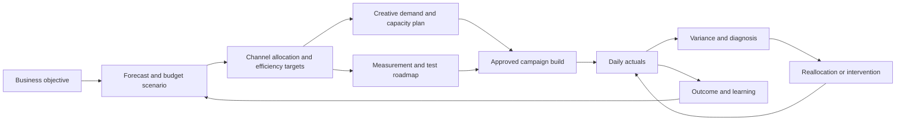

# CTC Video Research Pack 04

> Research Input 04 for [[Growth Engine]]. Six CTC videos covering system integration, product positioning, operating roles, clarity, stage-specific growth, and the guided operating mode for smaller brands.

## Executive Synthesis

This pack adds three important ideas to Fullkit:

1. **The Growth Engine is a connected plan graph.** Budget, creative demand, measurement, media allocation, activation, daily variance, and learning cannot be independent modules.
2. **Operating responsibility is configurable product state.** The same data and decision system can support self-service, guided, assisted, managed, and bounded-autonomy modes.
3. **Growth prescription must be maturity-aware.** The revenue-stage roadmap is useful as a prior, but Fullkit should diagnose the actual capability gap and binding constraint before recommending a lever.

## Source Map

| Video | Duration | Primary contribution |
|---|---:|---|
| [Inside our Prophit System](https://www.youtube.com/watch?v=bn8UqGMywvI) | 10:12 | Connects budget, creative demand, and testing |
| [Why We Built the Prophit Engine](https://www.youtube.com/watch?v=9UQAGfWqPAs) | 24:41 | Product thesis, role consolidation, and responsibility boundary |
| [The Profit Engine Explained](https://www.youtube.com/watch?v=T2atKNvRVmo) | 30:05 | Four workflows and the tooling behind them |
| [Your Path to Perfect Clarity](https://www.youtube.com/watch?v=Mi_bky7FCBA) | 25:59 | Data, decision, and communication clarity |
| [The $1M to $10M Ecom Growth Map](https://www.youtube.com/watch?v=vpiZJQtGzDA) | 40:39 | Stage-specific priority levers |
| [The Growth System for Brands Under $1M](https://www.youtube.com/watch?v=F075c2OgD4g) | 10:51 | Sparse-data and guided-service mode |

## Integrated System Map



The central Fullkit requirement is lineage: every creative requirement, test, allocation, and activated campaign should point back to the objective, scenario, assumptions, and model version that generated it.

## Video 1 - Inside our Prophit System


> "how much to spend, how much creative you actually need, and what to test next"

The presentation joins three decisions that are usually separated:

- **Budget:** recommended spend based on the selected commercial objective and marginal efficiency
- **Creative:** a decomposable creative score and the assets required to sustain the plan
- **Testing:** an incrementality roadmap for resolving the uncertainties that materially affect allocation

### Fullkit interpretation

A budget recommendation is not complete unless the system also answers:

- Can inventory and cash support it?
- Is sufficient creative supply scheduled?
- Who will produce each asset and by when?
- Which channel assumptions are benchmark priors versus brand-specific evidence?
- What experiment would most improve the next allocation decision?

The test queue should be ranked by expected decision value, not novelty:

```text
test_priority
= uncertainty
x spend_or_margin_at_risk
x expected_decision_impact
x probability_of_actionable_result
- test_cost_and_operational_risk
```

## Video 2 - Why We Built the Prophit Engine


> "It's technology plus ideology." - 06:53, [episode transcript](https://commonthreadco.com/blogs/ecommerce-playbook/why-we-built-the-prophit-engine)

The useful product thesis is not simply role replacement. One operator gets leverage from:

- A governed database
- Embedded methodology and metric hierarchy
- Forecasting and data-science services
- AI-assisted analysis
- Workflow automation
- A clear outcome contract

The brand still owns or supplies important transformative work: future product and marketing moments, creative production capacity, retention execution, and specialist channels not covered by the operating service.

### Fullkit interpretation

Fullkit needs a versioned responsibility map for every operating function:

```text
function -> accountable owner -> producer -> approver -> SLA -> escalation path
```

This lets the same Growth Engine support a software customer, an internal growth team, an EFFEN operator, or a managed-service client without changing the underlying commercial truth.

Vendor-reported accuracy, growth, contribution, and labor-savings claims remain hypotheses until independently reproduced with defined populations and counterfactuals.

## Video 3 - The Profit Engine Explained


> "one person with clarity, accountability, and capacity" - 05:31, [episode transcript](https://commonthreadco.com/blogs/ecommerce-playbook/profit-engine-explained)

The four connected workflows are:

1. Forecasting and target setting
2. Creative strategy and supply planning
3. Media measurement and budget allocation
4. Meta media buying and campaign activation

The supporting models include Spending Power, Retention, Event Effect, and Creative Demand. MMM and aggregate incrementality benchmarks supply an initial media mix; brand-specific geo tests progressively replace the priors. Creative assets move from the capacity plan into an ad log and then into a push-to-build activation workflow.

### Fullkit interpretation

The defensible advantage is **latency compression**:

```text
data latency
+ diagnosis latency
+ approval latency
+ build latency
+ measurement latency
= time from event to learning
```

Fullkit should measure each interval. A six-second build action is useful only if the target, asset, approval, and measurement contract are already correct.

One operator must not become one unchecked point of failure. Budget limits, four-eyes approval, workload thresholds, substitute ownership, and audit history remain required.

## Video 4 - Your Path to Perfect Clarity


> "This isn't about finding a unicorn hire. It's about building a system that makes the right decision obvious." - [companion article](https://commonthreadco.com/blogs/coachs-corner/how-the-prophit-engine-creates-total-clarity)

The three clarity layers are:

1. **Data clarity:** one reconciled view across marketing, finance, customers, inventory, and plans
2. **Decision clarity:** a visible hierarchy connecting business outcomes to controllable causes
3. **Communication clarity:** one accountable explanation of what happened, why it matters, and what happens next

### Fullkit interpretation

The Growth Operator UI should distinguish these layers explicitly. A meeting that spends most of its time reconstructing reality is a data-clarity failure. A meeting with agreed facts but no decision is a decision-clarity failure. A correct decision without an owner, due date, or acknowledgement is a communication-clarity failure.

Fewer participants help only when the remaining operator has complete context and suitable controls. Consolidation without data access, authority, or challenge mechanisms merely centralizes blind spots.

## Video 5 - The $1M to $10M Ecom Growth Map


> "Most brands don't need more noise - they need ruthless prioritization." - [episode page](https://commonthreadco.com/blogs/ecommerce-playbook/1m-to-10m-ecommerce-growth-map)

The published heuristic is:

| Revenue context | Proposed primary lever |
|---|---|
| $1M to $2M | Establish repeatable creative volume, around 100 ads per month in CTC's example |
| $2M to $3M | Build a marketing calendar with a meaningful moment each month |
| $3M to $4M | Develop offer-market fit and an offer-testing discipline |
| $4M to $5M | Scale the creative operation substantially, around 100 ads per week in the example |
| $5M to $6M | Product development designed to increase customer value and repeat revenue |
| $6M to $7M | Add incremental tactics after the core systems exist |
| $7M to $8M | Adapt media buying and account structure to the brand's proven growth mechanism |
| $10M+ | Improve operator quality, organizational design, and leverage |

### Fullkit interpretation

These thresholds are not causal laws. A brand can reach a revenue level while skipping a capability, or solve one lever unusually well and jump stages. Fullkit should therefore assess capabilities directly and use revenue only as context.

The output should be a **binding-constraint recommendation**:

- Current capability gap
- Evidence and comparison period
- Economic opportunity if resolved
- Required resources and owner
- Expected time to effect
- Falsification condition
- Next review date

The most valuable product is not a library of tactics. It is a system that prevents the organization from spreading resources across ten low-return initiatives while the main constraint remains unresolved.

## Video 6 - The Growth System for Brands Under $1M


> "Having a plan is the thing that will put the fire out for you." - 02:29, [episode transcript](https://commonthreadco.com/blogs/ecommerce-playbook/growth-system-for-brands-under-1m)

The Lite operating mode contains:

1. Connect commerce, marketing, cost, expense, and calendar data into one source of truth.
2. Build a 12-month model showing the continuation baseline, target gap, and available levers.
3. Provide monthly operator guidance plus a weekly cohort support mechanism, while the brand executes.

### Fullkit interpretation

Smaller brands have fewer observations, more volatility, and less operational capacity. The correct response is not to hide uncertainty:

- Use transparent priors or templates only when labeled
- Widen prediction intervals
- Show which conclusions are brand-specific versus borrowed
- Prefer high-impact monthly guidance over noisy daily intervention
- Keep implementation ownership explicit
- Re-estimate rapidly as new observations arrive

PE Lite, PE7, and the full managed engine should be one product architecture with different responsibility, cadence, automation, and support settings.

## Consolidated Fullkit Product Additions

### New first-class objects

- Responsibility assignment
- Growth readiness assessment
- Growth lever hypothesis
- Creative capacity plan
- Measurement roadmap
- Operator capacity state
- Service mode and cadence policy

### New analytical contracts

- `fct_growth_readiness_assessment`
- `fct_growth_lever_return`
- `fct_creative_capacity_plan`
- `fct_operator_capacity`
- `fct_responsibility_coverage`
- `dim_growth_capability_stage`

### Required controls

- Approval limits and separation of duties
- Operator workload and continuity thresholds
- Scenario-to-activation lineage
- Sparse-data confidence labeling
- Change logs for methodology and responsibility
- Explicit distinction between optimization work and transformative growth work

## Critical Assessment

- CTC's accuracy, growth, contribution-margin, staffing-replacement, and cost-saving numbers are self-reported and use changing populations or definitions across pages.
- Creative-volume benchmarks are capacity heuristics, not universal targets. Quality, independence of attempts, production cost, marginal return, and channel fit matter.
- Revenue stage correlates with some organizational needs but does not identify the cause of a plateau.
- Consolidating roles may reduce handoffs, but it also concentrates operational and key-person risk.
- MMM and incrementality benchmarks are useful priors; channel allocation should progressively shift toward brand-specific causal evidence.
- A fast activation workflow amplifies both correct and incorrect decisions. Speed must remain downstream of evidence, policy, and approval.
