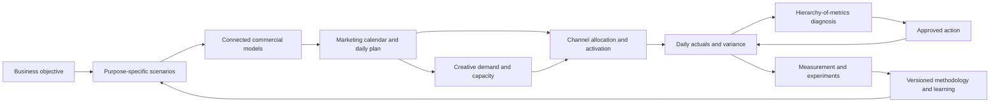

# CTC Video Research Pack 05

> Research Input 05 for [[Growth Engine]]. Twenty-eight CTC videos covering the full Prophit operating sequence: objective, modeled paths, marketing-calendar plan, creative supply, channel execution, daily diagnosis, progressive measurement, and institutional learning.

## Executive Synthesis

This pack confirms that Fullkit should not build forecasting, creative analytics, measurement, and media operations as unrelated products. They are modules in one governed Growth Engine.

The complete loop is:



The new conclusions are:

1. **A forecast is a governed operating commitment, not one number.** Board, budget, and bonus scenarios serve different audiences and risk tolerances and must remain explicitly related rather than silently blended.
2. **The marketing calendar is a model input.** Promotions, launches, cultural moments, and owned-channel actions explain much of daily revenue variability and must be represented as planned interventions with expected effects.
3. **Daily operating behavior is product state.** What happened, why it matters, what will be done, who owns it, and whether it worked should be stored as records rather than lost in meetings and messages.
4. **Creative is a supply chain and capital-allocation problem.** Spend targets create asset demand; asset demand creates production orders, capacity requirements, lead times, costs, and expected-value thresholds.
5. **Measurement resolves decisions, not abstract truth.** Experiments should be prioritized until uncertainty is low enough to make a financially responsible decision.
6. **Methodology is an executable, versioned product asset.** The playbook must be encoded with evidence, evaluation cases, applicability rules, exceptions, and outcome monitoring.

## Source Map

### Group A - System thesis, operating model, and institutional knowledge

| Video | Duration | Primary contribution |
|---|---:|---|
| [Unlock Predictable Growth: The Prophit System Explained](https://www.youtube.com/watch?v=9cz8tguzwJk) | 5:24 | Concise system overview: data, models, and operational workflow |
| [Unlocking Profit: The Hardest Part of Scaling](https://www.youtube.com/watch?v=_L_kagMUwU4) | 24:35 | Shared financial definitions and contribution-margin clarity |
| [The Prophit System, Pt. 1: Setting a Business Objective](https://www.youtube.com/watch?v=rmrn6LY7V6M) | 35:46 | Objective before tactics |
| [The Prophit System, Part 2: Model the Possibilities](https://www.youtube.com/watch?v=Kc_KcY467Xw) | 46:00 | Scenario model that produces marching orders |
| [The Prophit System, Part 3: Building a Creative System](https://www.youtube.com/watch?v=PvJArCYH728) | 48:14 | Financial goal translated into creative requirements |
| [The Prophit System, Part 4: Channel-Specific Media Plan](https://www.youtube.com/watch?v=EU19bg75Kdo) | 30:44 | Forecast translated into daily channel decisions |
| [The Prophit System, Part 5: Executing Against the Plan](https://www.youtube.com/watch?v=wZwyiLf-6Dg) | 45:11 | All elements joined into daily execution |
| [How One Methodology Runs 170+ Brands](https://www.youtube.com/watch?v=UmfikyCo0rQ) | 24:05 | Canonical methodology across disciplines |
| [12 Years of Agency Knowledge in One Document](https://www.youtube.com/watch?v=bDJRINefLok) | 46:41 | Tribal knowledge converted into AI-usable operating knowledge |
| [An Inside Look at CTC's Exact Client Growth Strategy](https://www.youtube.com/watch?v=IxP4pDzfPrc) | 23:30 | Integrated decision prism and units of growth |

### Group B - Forecasting, models, scenarios, and calendar planning

| Video | Duration | Primary contribution |
|---|---:|---|
| [Stop Guessing Your Ecommerce Budget](https://www.youtube.com/watch?v=z9mYlMqCvHs) | 41:40 | Spend, creative, and channel-expansion decisions as one model |
| [The Marketing Calendar Is Your Real Revenue Model](https://www.youtube.com/watch?v=fvY1FCIIWOU) | 35:51 | Planned marketing behavior as the main revenue-variability input |
| [From Campaigns to Cash Flow](https://www.youtube.com/watch?v=H-_MedFD6so) | 35:02 | Forecast operationalization and daily expectations |
| [How Do I Project Growth for My $3M Brand?](https://www.youtube.com/watch?v=kQX_ZjOLbLY) | 19:10 | Constraint-based forecast for sparse or smaller histories |
| [The Modeling System That Powers 30%+ Revenue Growth](https://www.youtube.com/watch?v=b6mvdK774d4) | 22:01 | Four interlocked models and explicit optimization points |
| [How We Forecast $4B in GMV to 3% Accuracy](https://www.youtube.com/watch?v=agsLE7078qI) | 23:15 | Useful-model philosophy, Plot/Pivot/Profit, and execution discipline |
| [Understanding Seasonality by Month and Day](https://www.youtube.com/watch?v=8O4Q0l7TWTo) | 39:51 | Brand-specific monthly and day-of-week opportunity curves |
| [The Forecasting Framework Every Brand Needs Before Q4](https://www.youtube.com/watch?v=gEGhiDnbuQ8) | 25:44 | Quantitative model plus qualitative calendar and ownership |
| [CFO Summit - Turning Your Marketing Calendar Into a Financial Forecast](https://www.youtube.com/watch?v=pNRyVV26eiw) | 56:54 | Finance-marketing alignment around planned actions |
| [2026 Forecast Planning: Board vs Budget vs Bonus](https://www.youtube.com/watch?v=7uZRPgLW52Q) | 36:28 | Three scenarios with distinct organizational purposes |

### Group C - Daily operation, diagnosis, and course correction

| Video | Duration | Primary contribution |
|---|---:|---|
| [What a Profit Engineer Actually Does All Day](https://www.youtube.com/watch?v=h3ONl3BGFEE) | 28:21 | Weekly reset/diagnose/align/ship/learn cadence |
| [How We Diagnose Every Ecommerce Problem](https://www.youtube.com/watch?v=tdLcX9vawbE) | 31:27 | Business-to-customer-to-channel-to-campaign diagnosis |
| [CFO Summit: How to Get Your Forecast Back on Track](https://www.youtube.com/watch?v=PeyVnwmEzCM) | 47:28 | Signal-to-action latency, accountability, and daily recovery |

### Group D - Creative demand, portfolio health, and production operations

| Video | Duration | Primary contribution |
|---|---:|---|
| [Stop Gambling on Creative - 6-Pillar Assessment](https://www.youtube.com/watch?v=lq3ExjrrBEo) | 27:56 | Creative maturity, production economics, and diversity |
| [How the Prophit System Forecasts Creative Volume](https://www.youtube.com/watch?v=MgIqh0UfDMo) | 39:27 | Spend-derived monthly asset plan and producer assignment |
| [The Branded Ads System Behind 170+ Brands](https://www.youtube.com/watch?v=P_x7pjB2U6k) | 25:46 | Brief-to-live production pipeline and performance feedback |

### Group E - Retention and progressive measurement

| Video | Duration | Primary contribution |
|---|---:|---|
| [Why Retention Starts at Acquisition](https://www.youtube.com/watch?v=20JvH6NZ7KA) | 41:49 | Acquisition cohorts as the beginning of lifecycle economics |
| [The Measurement Roadmap: How It Works](https://www.youtube.com/watch?v=3QGsJBO78X0) | 30:45 | Decision-oriented incrementality roadmap and shrinking error bars |

## 1. One Traceable Plan Graph


The five-part 2023 series makes the dependency order explicit:

```text
objective
-> modeled possibilities
-> selected scenario
-> creative requirements
-> channel plan
-> daily execution
-> measured learning
```

This is more than a navigation flow. Each downstream object should retain the identifiers of its parents. A campaign recommendation without an objective, scenario, model vintage, calendar context, and approval contract is an orphaned action.

### Fullkit interpretation

Add a `plan_graph_id` and parent references across:

- Objective
- Scenario and forecast vintage
- Model run and assumption set
- Marketing event and expected effect
- Daily metric target
- Creative demand order
- Channel allocation
- Recommendation and approval
- Activated change
- Experiment and outcome

The UI can expose different modules, but the database must preserve one decision lineage.

## 2. Purpose-Specific Scenario Forecasting


> "Board sits on the likely to happen end of the spectrum." - 04:39, [episode transcript](https://commonthreadco.com/blogs/ecommerce-playbook/2026-forecast-planning-board-vs-budget-vs-bonus-explained)

The three-scenario pattern is useful because the organization is answering three different questions:

| Scenario | Decision served | Typical posture | Misuse to prevent |
|---|---|---|---|
| Board / bank | What is the most likely defensible outcome? | Conservative, evidence-heavy | Sandbagging or hiding known upside |
| Operating budget | What should we resource, buy, and commit to? | Expected case plus approved interventions | Treating aspiration as inventory or cash certainty |
| Bonus / stretch | What could the organization achieve with exceptional execution? | Ambitious but modeled | A target with no incremental actions or capacity |

The difference must be expressed through changed inputs and interventions, not only a percentage uplift. Examples include additional marketing moments, better event execution, more creative capacity, a changed spend curve, or a different retention program.

### Fullkit interpretation

New scenario fields:

```text
scenario_purpose
decision_audience
risk_posture
probability_band
approved_interventions
resource_commitment_allowed
inventory_commitment_allowed
compensation_linked
parent_scenario_id
```

Every scenario should expose the bridge from the continuation baseline to the requested outcome. The engine should reject an upside scenario when the required actions, capacity, cash, inventory, or causal assumptions are absent.

## 3. Connected Models and Optimization Points


> "These four models form a connected system where each output feeds the next." - 01:28, [episode transcript](https://commonthreadco.com/blogs/ecommerce-playbook/the-modeling-system-that-powers-30-revenue-growth)

The model roles remain:

1. **Spending Power:** spend -> new-customer efficiency and revenue
2. **Retention:** acquisition cohorts -> future returning revenue
3. **Event Effect:** monthly expectation -> event-aware daily distribution
4. **Creative Demand:** spend plan -> required creative supply

The first three estimate commercial demand and economics. Creative Demand tests execution feasibility. Fullkit should preserve this distinction so creative capacity is not presented as a revenue forecast by itself.

The videos also reinforce three capital-allocation points:

- Maximum month-one contribution margin
- Maximum revenue at an approved contribution boundary
- Maximum contribution over a selected LTV horizon

### Fullkit interpretation

Add a model dependency ledger:

```text
model_run_id
upstream_run_ids
input_snapshot_id
target_metric_contract_id
optimization_objective
constraint_set_id
forecast_horizon
prediction_interval
evaluation_status
applicability_status
```

The ledger should make it possible to re-create what the engine knew when a decision was made. Model results must be evaluated against transparent baselines and must not inherit CTC's reported accuracy claims.

## 4. Marketing Calendar as a Quantitative Input


> "Marketing calendar actions are the primary thing that drive revenue variability." - 02:14, [episode transcript](https://commonthreadco.com/blogs/ecommerce-playbook/marketing-calendar-revenue-model)

The calendar needs to represent more than dates and labels. Each event is a planned intervention with:

- Event type: promotion, launch, cultural moment, brand milestone, VIP access, owned-channel send, or other
- Products, collections, cohorts, and channels affected
- Offer and merchandising state
- Start, peak, and decay windows
- Baseline expectation and incremental effect
- Historical analogs and their comparability
- Creative, inventory, cash, and operational requirements
- Owner, approvals, dependencies, and readiness state

The calendar then connects qualitative judgment to quantitative models. If an event over- or under-performs, the engine should update the event-effect evidence without rewriting unrelated baseline demand.

### Important correction

Calendar correlation is not automatically causal. Promotions are often scheduled during high-demand periods, and event design changes year to year. Fullkit should retain baseline, observed lift, confounders, and measurement confidence separately.

## 5. Seasonality as Portfolio Allocation

The month/day analysis shows that opportunity is brand-specific. The useful question is not only "How do we repair weak Tuesdays?" It is also "Should marginal capital ride the strongest days and months?"

### Fullkit interpretation

Add:

- Month-of-year and day-of-week effects with uncertainty
- Interaction between calendar event and natural seasonality
- Planned-spend versus optimal-spend gap by day
- Marginal contribution curve by time bucket
- Portfolio allocation recommendation across days, channels, and events

Avoid universal weekday rules. The system must validate stability over time and distinguish consumer-demand effects from the brand's own historical scheduling behavior.

## 6. Daily and Weekly Operating Ledger


> "Did we meet our expectations? Do we exceed them? Why? Do we miss them? Why?" - 00:20, [episode transcript](https://commonthreadco.com/blogs/ecommerce-playbook/what-a-profit-engineer-actually-does-all-day)

The recurring week is:

| Day | Default operating job |
|---|---|
| Monday | Reset plan from weekend evidence |
| Tuesday | Diagnose the controllable levers |
| Wednesday | Align material decisions and approvals |
| Thursday | Ship changes and verify execution |
| Friday | Close the loop, update assumptions, prepare weekend watch |

Daily action still occurs inside this weekly rhythm. The cadence is a default workflow, not a rule that delays urgent action.

### Fullkit interpretation

Create a daily operating ledger:

```text
What: facts and variance against plan
So what: cause hypothesis, evidence, confidence, and economic consequence
Now what: action, owner, approval, due time, expected effect, and rollback
Result: executed state, observed outcome, and assumption disposition
```

New objects:

- Daily operating note
- Assumption and falsification test
- Intervention order
- Action acknowledgement
- Escalation and contingency plan
- Weekly plan reset
- Weekly close-the-loop review

This is the core of a **Growth Control Tower** module. It turns the mart from passive reporting into a controlled system of work.

## 7. Hierarchy of Metrics as a Diagnosis Graph

The diagnosis path is:

```text
business outcome
-> customer composition
-> channel incrementality and efficiency
-> campaign or operational action
```

The key principle is that local efficiency cannot overrule the financial objective. A channel can be "over-efficient" because it is under-spending relative to the economically correct target.

### Fullkit interpretation

Each diagnosis should store:

- Starting miss and comparison window
- Decomposition path traversed
- Volume-versus-efficiency classification
- Candidate causes considered and rejected
- Causal confidence and measurement source
- Recommended lever and expected financial effect

The graph must permit a no-action result. Not every red metric is worth correcting, and not every local improvement increases contribution margin.

## 8. Signal-to-Action Latency as a Product KPI

> "The problem isn't the miss. It's the lag between the signal and action." - [CFO Summit transcript](https://commonthreadco.com/blogs/ecommerce-playbook/cfo-summit-get-forecast-back-on-track)

The videos repeatedly emphasize that early error is useful only if it produces a timely response. Fullkit should measure:

```text
event -> data available -> variance detected -> diagnosis accepted
-> approval -> action executed -> effect observable -> learning recorded
```

These intervals distinguish a data-latency problem from an organizational or execution problem. Faster action is not always better: approval and observation windows should reflect materiality, reversibility, and statistical power.

## 9. Creative as Supply Chain and Capital Allocation


> "If you have fewer ads, you have fewer shots on goal." - 05:24, [episode transcript](https://commonthreadco.com/blogs/ecommerce-playbook/stop-gambling-on-creative-use-this-6-pillar-assessment-framework)

The six creative-assessment pillars are:

1. Volume and velocity
2. Marketing-moment coverage
3. Account/portfolio health
4. Production diversity and distinct delivery entities
5. Expected value greater than production cost
6. Production-system maturity and feedback speed

The Creative Demand workflow then turns spend and calendar plans into:

- Monthly asset count
- Evergreen versus moment allocation
- Product/SKU and persona coverage
- Static, video, UGC, and other format mix
- Producer/vendor assignment
- Brief, due date, review, approval, and launch state
- Cross-channel usage rights and reuse potential

### Fullkit interpretation

The plan should optimize **independent, economically sensible attempts**, not raw file count.

```text
expected_creative_value
= probability_of_outlier
x expected_incremental_contribution_if_outlier
- production_cost
- trafficking_and_review_cost
- brand_and_compliance_risk
```

The probability estimate must account for correlation among variants. Minor text or image changes may not create independent attempts or distinct delivery entities.

New analytical contracts:

- `fct_creative_demand_order`
- `fct_creative_vendor_capacity`
- `fct_creative_production_cycle`
- `fct_creative_expected_value`
- `fct_creative_entity_cluster`
- `fct_creative_persona_product_coverage`

## 10. Retention Begins with Acquisition

Acquisition should not be evaluated only on first-order CAC. The acquired customer arrives with a product, offer, channel, creative promise, persona, geography, and first-order economics that shape downstream value.

### Fullkit interpretation

Extend the cohort spine so LTV can be analyzed by:

- Acquisition channel and campaign
- Creative concept and asset lineage
- Landing page and offer
- First SKU/bundle and margin
- New-customer segment or persona proxy
- Promotion and calendar context
- Consent and owned-audience entry

Use these features to discover durable cohort differences, but guard against selection bias. High-LTV cohorts may choose different products or channels rather than being caused by them. Lifecycle interventions need holdouts when causal claims matter.

## 11. Progressive Measurement and Decision Sufficiency

> "Your job is not to get to perfect information. It's to get to information that gives you enough confidence to make a decision." - 00:00, [Measurement Roadmap transcript](https://commonthreadco.com/blogs/ecommerce-playbook/the-measurement-roadmap-how-it-works)

This sharpens the measurement-roadmap requirement from Research Input 04. A test belongs on the roadmap when resolving the uncertainty may change an economically material action.

The stopping rule is decision sufficiency, not perfect attribution:

- What decision is blocked?
- What range of true effects would change that decision?
- Which test can shrink the interval across that boundary?
- What is the cost, power, and operational risk?
- When should the evidence be refreshed?

Fullkit should preserve platform-reported, modeled, and experiment-derived truth as separate layers. Incrementality factors require scope, context, version, confidence interval, and expiry.

## 12. Methodology as an Executable Knowledge Layer


The Canon/AI material argues that written methodology plus governed data lets a newer operator draw on institutional experience. For Fullkit, the defensible form is not a single giant prompt or static handbook.

Create versioned methodology units with:

```text
method_id and version
decision_problem
required_inputs
applicability conditions
procedure or decision tree
expected output contract
approval policy
counterexamples and exceptions
evaluation cases
observed outcomes
owner and review date
```

Every AI-supported diagnosis should cite both the data snapshot and methodology version used. A rule that repeatedly fails should be downgraded or retired rather than silently reinforced.

## 13. Shared Financial Definitions Before Optimization

The financial-clarity material reinforces a prerequisite already central to Fullkit: revenue, costs, contribution margin, new customer, returning customer, ad spend, refunds, discounts, taxes, and fulfillment must have governed contracts.

### Fullkit interpretation

Add or strengthen a metric-contract registry with:

- Business definition and formula
- Source systems and precedence
- Grain and currency/time-zone rules
- Inclusion/exclusion policy
- Reconciliation tests
- Validity dates and version
- Owner and downstream consumers

The Growth Engine must refuse high-impact optimization when the target metric does not reconcile or when finance and marketing are using incompatible definitions.

## Product Shape for Fullkit

These should be modules of one Growth Engine, all backed by the Growth Mart and operational write models:

| Module | Primary job | Key write state |
|---|---|---|
| Growth Plan | Objective, scenarios, models, calendar, targets | Objectives, assumptions, scenarios, forecast vintages |
| Growth Control Tower | Daily pace, diagnosis, action, accountability | Notes, hypotheses, approvals, interventions, outcomes |
| Creative Supply Planner | Asset demand, capacity, briefs, production economics | Orders, assignments, deadlines, approvals, asset lineage |
| Measurement Roadmap | Prioritize and learn from causal tests | Test queue, design, factors, confidence, expiry |
| Methodology Registry | Encode and evaluate operating knowledge | Methods, versions, cases, applicability, performance |

The Growth Mart remains the governed analytical read model. These modules are a hybrid decision-and-action product above it.

## Consolidated New Objects and Contracts

### First-class operational objects

- Scenario purpose and scenario bridge
- Forecast vintage and model dependency ledger
- Marketing intervention and readiness state
- Daily operating note
- Assumption and falsification test
- Intervention order and rollback plan
- Weekly reset and close-the-loop review
- Creative demand order and vendor capacity commitment
- Methodology unit and evaluation case
- Decision-confidence threshold

### Analytical contracts

- `fct_forecast_scenario_vintage`
- `bridge_scenario_intervention`
- `fct_marketing_event_readiness`
- `fct_daily_operating_note`
- `fct_assumption_test`
- `fct_signal_action_latency`
- `fct_creative_demand_order`
- `fct_creative_vendor_capacity`
- `fct_creative_expected_value`
- `fct_acquisition_cohort_lifecycle`
- `fct_methodology_evaluation`
- `dim_metric_contract`
- `dim_scenario_purpose`
- `dim_methodology_version`

## Controls and Boundaries

- Board, budget, and bonus scenarios must never be silently substituted for one another.
- Inventory and cash commitments require the approved operating scenario, not the stretch scenario.
- Daily action authority must be bounded by budget, reversibility, brand, compliance, and separation-of-duties policies.
- Creative volume must be constrained by expected value, capacity, diversity, and brand risk.
- AI diagnosis must expose data and methodology lineage and allow human challenge.
- Causal language must track the evidence class: descriptive, predictive, experimental, or inferred.
- A recommendation should be downgraded or blocked when data, metric contracts, model evaluation, or capacity are insufficient.

## Critical Assessment

- The videos are produced by the vendor selling the methodology; reported forecast accuracy, revenue growth, contribution growth, hit rates, and labor leverage are self-reported.
- The public material describes the decision logic more clearly than the exact model implementation. Fullkit should reproduce the decision problem, transparent baselines, and evaluation contract rather than claim parity with proprietary models.
- Marketing events, seasonality, and media spend are jointly determined. Historical associations need confounder controls and, where material, experimentation.
- Creative hit-rate statistics do not imply independent Bernoulli trials. Variants share concepts, producers, products, audiences, and delivery treatment.
- One accountable operator reduces handoffs but creates concentration and continuity risk. Workload limits, substitute ownership, approval boundaries, and audit logs remain mandatory.
- Daily action can overfit noise. Materiality thresholds, observation windows, and explicit no-action states protect the system from thrashing.
- A codified methodology can scale institutional bias. Versioning, evaluation, exceptions, and retirement rules are therefore product requirements.

## Visual Evidence Archive

All 28 public YouTube cover images are stored in `Reference/Media/Research Input 05/` under their video IDs. Representative source captures are embedded above; the complete source map preserves every video URL, duration, and contribution.

## Selected Companion Sources

- [What a Profit Engineer Actually Does All Day](https://commonthreadco.com/blogs/ecommerce-playbook/what-a-profit-engineer-actually-does-all-day)
- [Stop Gambling on Creative - 6-Pillar Assessment](https://commonthreadco.com/blogs/ecommerce-playbook/stop-gambling-on-creative-use-this-6-pillar-assessment-framework)
- [How the Prophit System Forecasts Creative Volume](https://commonthreadco.com/blogs/ecommerce-playbook/how-prophit-system-forecasts-creative-volume)
- [The Marketing Calendar Is Your Real Revenue Model](https://commonthreadco.com/blogs/ecommerce-playbook/marketing-calendar-revenue-model)
- [The Modeling System That Powers 30%+ Revenue Growth](https://commonthreadco.com/blogs/ecommerce-playbook/the-modeling-system-that-powers-30-revenue-growth)
- [How We Forecast $4B in GMV to 3% Accuracy](https://commonthreadco.com/blogs/ecommerce-playbook/how-we-forecast-4b-in-gmv-to-3-accuracy)
- [The Measurement Roadmap](https://commonthreadco.com/blogs/ecommerce-playbook/the-measurement-roadmap-how-it-works)
- [Hierarchy of Metrics](https://commonthreadco.com/blogs/ecommerce-playbook/how-we-diagnose-every-ecommerce-problem-the-hierarchy-of-metrics)
- [Understanding Seasonality by Month and Day](https://commonthreadco.com/blogs/ecommerce-playbook/seasonality-media-buying-month-day)
- [Board vs Budget vs Bonus](https://commonthreadco.com/blogs/ecommerce-playbook/2026-forecast-planning-board-vs-budget-vs-bonus-explained)
- [CFO Summit: Get the Forecast Back on Track](https://commonthreadco.com/blogs/ecommerce-playbook/cfo-summit-get-forecast-back-on-track)
- [12 Years of Agency Knowledge in One Document](https://commonthreadco.com/blogs/ecommerce-playbook/12-years-of-agency-knowledge-in-one-document)
- [Why Retention Starts at Acquisition](https://commonthreadco.com/blogs/ecommerce-playbook/why-retention-starts-at-acquisition)
