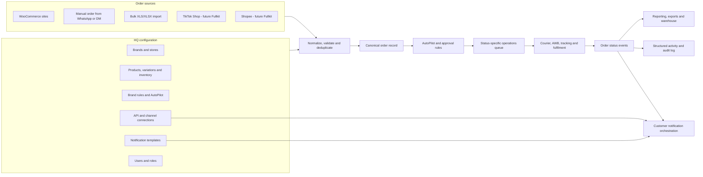
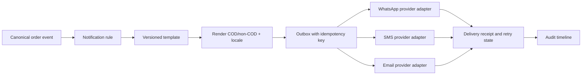

# Fighter Walkthrough - Order Operations and Integrations

This is the second first-party Fighter capture. It extends [[Fighter Walkthrough - WordPress Integration and HQ Dashboard]] from the WordPress connection boundary into the day-to-day order operating system.

Schema derived from this evidence: [[Fullkit Schema Blueprint]].

> [!warning] Sensitive evidence
> The original screenshots included personal profile data, customer contact/address data, tracking identifiers, a live WhatsApp connection token, and API keys/secrets for multiple domains. Those originals were not copied into the vault. Sensitive screenshots below are privacy-safe AI-edited working copies and are not pixel-forensic evidence. Rotate every credential visible in the originals, including the WasapBot connection credential and every API Manager key/secret pair, then verify that each old credential fails.

## Executive finding

Fighter appears to be a **centralized multi-brand order operating system**, not merely a WooCommerce reporting dashboard:

1. HQ defines products, variations, stock, brands, rules, channel/API connections, and notification behavior.
2. Orders arrive from WooCommerce, manual sales capture, or spreadsheet imports.
3. A rules layer called **AutoPilot** can approve newly ingested WooCommerce orders.
4. Staff work status-specific order queues and courier/tracking actions.
5. Status events drive customer notifications over WhatsApp, SMS, and email templates.
6. Reports, CSV exports, and an activity log sit downstream of the operational order record.

The screenshots support this flow, but they do not yet prove the permission model, the exact status state machine, who creates AWBs/tracking numbers, or whether courier webhooks update statuses automatically.

## Reconstructed operating architecture

## 1. User profile and account

![[Assets/Fighter Walkthrough/2026-07-15 - Order Operations/01 - My Account Profile - Redacted.png]]

### Observed

- The logged-in account is tagged **Sales Team** and **Active**.
- The profile shows a prominent RM balance on the left.
- Account controls include Overview, Update Account, Update Password, Update Avatar, Login Histories, and Log Out.
- The profile record carries a seller code, company, registration date, and personal/contact fields.

### Important correction to verify

Nadeem described the RM figure as the user's sales. It exactly matches the dashboard's Wallet headline from the earlier capture, so it is more likely a **wallet/ledger balance** than cumulative sales. Treat its meaning as unresolved until the Wallets module explains the balance.

### Fullkit requirement candidate

Separate these concepts rather than placing them on one profile card:

- User identity and authentication.
- Employment/team role and permissions.
- Seller/agent identity, if the business model needs it.
- Attributed sales performance.
- Commission and wallet ledger balance.
- Login and security history.

## 2. Make Order - manual sales capture

![[Assets/Fighter Walkthrough/2026-07-15 - Order Operations/02 - Make Order Product Catalog.png]]

![[Assets/Fighter Walkthrough/2026-07-15 - Order Operations/03 - Product Variation and Stock.png]]

### Observed flow

The manual-order tool is a searchable product catalogue and cart rather than a blank customer/order form:

- Search by product title, variation name, or SKU.
- Filter by category, brand, vendor, free shipping, COD/non-COD, domestic, and international eligibility.
- Product cards expose product ID, category, brand, shipping/payment flags, description, price range, quantity, variation selection, and Add to Cart.
- Variation options show package/variation name, variation code, price, and units left.
- The cart is built first, followed by a Continue step; the customer, payment, and shipping form is presumably later in the flow and has not been captured.

### Interpretation

This supports sales staff entering orders collected from WhatsApp, DMs, calls, or other conversations without visiting the storefront. Inventory visibility is embedded at the point of sale.

### Fullkit improvements

- Provide a **quick-entry mode** optimized for chat orders: paste or parse customer/order text, then review extracted fields.
- Search products by human name, SKU, barcode, variation, and common alias.
- Show available-to-promise stock, reserved stock, incoming stock, and the reason an item cannot be sold.
- Preserve the originating conversation/channel and salesperson attribution.
- Warn before cross-border, COD, free-shipping, or stock rules are violated.
- Save incomplete work as a draft without mixing drafts into operational analytics.

## 3. Bulk Orders

![[Assets/Fighter Walkthrough/2026-07-15 - Order Operations/04 - Bulk Orders New Batch.png]]

### Observed

- A batch has a free-text Source, template version, payment method, and shipping provider.
- The import accepts XLS/XLSX files up to 8 MB.
- A downloadable template library is versioned; only `TV-000-001` is currently available in the screenshot.
- Payment and courier are selected once for the batch.

### Product critique

This is spreadsheet ingestion, not a general bulk-order pipeline. A single payment/courier selection for the batch may be convenient but becomes limiting when rows differ.

### Fullkit requirement candidate

- Versioned import schema with field-level validation before creation.
- Row-level payment, courier, brand, store, and error handling.
- Preview, deduplication, dry run, idempotency key, and partial-retry support.
- Downloadable rejection file with exact row/field reasons.
- Source connector and import-run IDs retained on every created order.
- Import summary: received, valid, duplicate, rejected, created, and later cancelled.

## 4. Orders and order statuses

![[Assets/Fighter Walkthrough/2026-07-15 - Order Operations/05 - In Transit Orders - Redacted.png]]

![[Assets/Fighter Walkthrough/2026-07-15 - Order Operations/06 - Order Row Schema - Redacted.png]]

### Observed queue model

The Orders navigation is primarily a set of status queues:

- Draft
- New
- Pending
- In Transit
- Returned
- Rejected
- Completed
- All Orders

The in-transit queue screenshot shows pagination across many pages and a point-in-time count of 1,367 in-transit orders. Counts are interface observations, not reconciled operating records.

### Confirmed visible order schema

| UI column/element | Data carried today | Fullkit treatment |
| --- | --- | --- |
| ID | Fighter order ID | Keep internal ID plus immutable source order ID and source channel |
| Customer | Name, phone, address | Link to a customer profile; apply privacy/permission controls |
| Source | WooCommerce badge and connected domain | Make channel, store, brand, entity, country, and salesperson first-class fields |
| Items | Item quantity and code | Normalize into order lines with SKU/variation, price, discount, tax and COGS references |
| Status | One operational status | Separate order, payment, fulfilment, shipment, notification and exception states |
| Payment & Shipping | Gateway/payment method plus courier | Store as linked payment and shipment records, not two labels in one field |
| Amount | Currency and amount | Store currency, gross, discount, shipping, tax, refunds and collected amount separately |
| Date | Display timestamp | Store created, approved, paid, packed, shipped, delivered, returned and updated timestamps |
| Actions | Detail/download actions and tracking/AWB value | Role-gated actions with labels, confirmation, audit and retry state |

### Who updates the order?

**Observed evidence:** the Activities screen records `New Order Created From WooCommerce` followed by `AutoPilot: Order Approved`. This confirms that at least one transition is automatic.

**Likely but unconfirmed:** operations or warehouse staff use the order queue/action controls to generate or download fulfilment documents and work the shipment. Courier integration then supplies or receives the tracking number.

**Still unknown:**

- Whether operation staff have separate Fighter accounts and roles.
- Which transitions are manual, AutoPilot-driven, or courier-webhook-driven.
- Who creates the Ninja Van booking/AWB.
- Whether tracking and status write back to WooCommerce.
- Whether a returned shipment is set by courier event, staff, Claimify, or reconciliation.

### Better Fullkit operations view

Status tabs are useful for work queues but weak as the primary analytical model. Fullkit should provide:

- My work, unassigned, SLA-risk, failed automation, payment exception, fulfilment exception, and notification-failure queues.
- Filters for brand, store, channel, country, currency, product/SKU, payment method, courier, assignee, age, and risk.
- Saved views and bulk actions with preview/undo where safe.
- A single order timeline showing every state transition and external event.
- Explicit ownership: current team, assignee, next action, due time, and blocker.

## 5. Reports

### Lite

![[Assets/Fighter Walkthrough/2026-07-15 - Order Operations/07 - Order Reports Lite.png]]

Lite reporting is a fixed set of time windows: today, yesterday, this week, last week, this month, last month, this year, last year, and all time. Each table reports status, orders, points, and sales.

### Basic

![[Assets/Fighter Walkthrough/2026-07-15 - Order Operations/08 - Order Reports Basic.png]]

Basic reporting adds monthly order, sales, and percentage breakdowns and groups outcomes into:

- New + Pending + In Transit.
- Rejected + Returned.
- Completed.

An Advanced order report is visible in navigation but was not captured.

### Critique and Fullkit direction

Fighter's reports summarize status counts and face-value sales, but they do not appear to explain operational performance or economics. Fullkit should distinguish:

- Ordered GMV, approved GMV, shipped GMV, delivered/collected revenue, refunds and net revenue.
- Order acceptance, cancellation, shipment, delivery, rejection and return rates.
- Time to approve, pack, hand over, deliver and resolve a return.
- Queue age and SLA breach by brand/team/assignee.
- Performance by channel, store/domain, brand, SKU, campaign/source, gateway, courier, country and currency.
- Gateway fees, shipping cost, COD remittance, discounts, COGS and contribution margin where the source data supports them.
- Definitions, freshness timestamp, drill-through and reconciliation status on every metric.

## 6. Exports

Nadeem confirmed that orders can be exported to CSV, but no export screen was included in this capture.

### Next evidence needed

- Available export types and columns.
- Date-window limits and maximum rows.
- Filters by status, brand, domain, channel and country.
- Whether IDs are stable and timestamps include timezone.
- Whether exports include customer PII, item lines, tracking, payment IDs and activity history.
- Whether exports are synchronous downloads or queued jobs.

### Fullkit requirement candidate

Provide versioned, repeatable exports with a manifest, schema version, applied filters, generated-at time, row count, checksum, masking policy and audit record. CSV should be one output option, not the integration contract itself.

## 7. Notifications

### Templates

![[Assets/Fighter Walkthrough/2026-07-15 - Order Operations/09 - Notification Templates.png]]

Observed template dimensions:

- Filter by reason, platform, and recipient.
- Separate message bodies for non-COD and COD orders.
- Reasons include New Order, Out for Delivery, In Transit Order, Order Completed, Order Rejected, and Order Returned.
- Platforms shown include WhatsApp and email.
- Recipient shown is Customer.
- Variables include customer name, order ID, shipping/courier name, tracking number, order total, and item names/quantities.
- Sales-team users are told to contact HQ/admin to add, edit, or change template status.

### Connections

![[Assets/Fighter Walkthrough/2026-07-15 - Order Operations/10 - Notification Connections - Redacted.png]]

Observed connection model:

- WhatsApp connection: name, phone number, provider, instance ID and access token.
- Existing provider: WasapBot.
- Connection registry includes status, default connection and management actions.
- SMS connection: connection name, brand/sender ID, provider and secret/token.
- Provider shown: SMS Niaga.
- Email templates exist, but the email connection/setup screen was not captured.

### Fullkit notification architecture

Fullkit should add template versioning, preview/test send, localization, consent/opt-out enforcement, per-brand sender policy, fallback rules, delivery receipts, retries, spend/rate limits, and an exception queue. Provider secrets belong in encrypted secret storage and must never be displayed again after creation.

## 8. API Manager and connected domains

![[Assets/Fighter Walkthrough/2026-07-15 - Order Operations/11 - API Manager - Redacted.png]]

### Observed

- HQ can create a Custom API connection for a domain/URL.
- Existing rows are WooCommerce connections tied to individual domains.
- Each row carries a key, secret, status and management actions.
- Multiple brand/country domains are managed in one long list.

### Why this is inefficient and risky

- Full API keys and secrets are repeatedly visible in the interface.
- The list is organized around credentials/domain rather than brand, store, channel and business purpose.
- The screenshot does not show scopes, environment, creator, created date, expiry, last use, last successful sync, freshness, rate limit, webhook health or error state.
- Manual one-domain-at-a-time issuance does not scale cleanly to WooCommerce plus TikTok Shop, Shopee and future channels.

### Proposed Fullkit integration registry

| Field | Purpose |
| --- | --- |
| Integration ID | Stable internal identity |
| Workspace/entity | Legal and data-access boundary |
| Brand and store | Operational owner and storefront identity |
| Channel type | WooCommerce, TikTok Shop, Shopee, gateway, courier or messaging |
| Environment | Production or sandbox |
| Authentication type | OAuth, signed webhook, API token or service account |
| Secret reference | Pointer to encrypted secret storage; never plaintext in UI/database logs |
| Scopes | Explicit read/write capabilities |
| Sync direction | Inbound, outbound or bidirectional by object |
| Last success/failure | Health and freshness |
| Cursor/checkpoint | Safe incremental sync/replay |
| Rate-limit state | Backoff and quota visibility |
| Owner and approver | Accountability |
| Rotation/expiry | Credential lifecycle |

## 9. Activities and audit history

![[Assets/Fighter Walkthrough/2026-07-15 - Order Operations/12 - Activities - Redacted.png]]

### Observed

- The log records an activity ID, human-readable activity text, and date/time.
- Events alternate between WooCommerce order creation and AutoPilot approval in the visible sample.
- The screenshot shows hundreds of pages, suggesting a centralized tenant-wide log.

### What this proves

WooCommerce ingestion and automatic approval are separate recorded events. This is the strongest evidence so far for the order's entry into Fighter and the first automated state transition.

### Fullkit audit-event requirement

Human-readable sentences should be a rendering of structured events, not the stored event model. Each event should carry:

- `event_id`, `event_type`, `occurred_at`, `recorded_at`.
- `actor_type` and `actor_id` for user, system, connector, rule or courier.
- `object_type`, `object_id`, `source_system` and `source_object_id`.
- `brand_id`, `store_id`, `integration_id` and correlation/causation IDs.
- Before/after values or a field-level change set for mutations.
- Idempotency key, processing result, error/retry state and trace link.
- Privacy-safe metadata with immutable retention and role-gated access.

## 10. Wallets - not used by EFFEN

Nadeem reports that the sales manager explained why EFFEN no longer uses Wallets. The supplied screenshot does not show that explanation, so the rationale remains uncaptured, but the current operating decision is clear: Wallets are not a Fullkit requirement.

The repeated RM figure in Fighter is therefore treated as a legacy/vendor wallet display, not as user sales or a Fullkit source of truth. [[Fullkit Schema Blueprint]] excludes wallet accounts, wallet transactions, balances and withdrawals while retaining payments, settlements and reconciliation.

## Roles and operational access

The current account is a Sales Team user, but the screenshots do not establish the full permission model. The in-house version should define it explicitly:

| Role | Likely responsibilities to validate |
| --- | --- |
| HQ admin | Brands, stores, users, rules, templates, integrations and configuration |
| Sales team | Manual orders, own/customer orders and attributed performance |
| Customer service | Customer/order history, notification history and permitted corrections |
| Operations/warehouse | Approval exceptions, picking/packing, AWB, shipment and return handling |
| Finance | Payment reconciliation, COD remittance, refunds and commissions only if confirmed |
| Analyst/manager | Reports and privacy-safe exports |
| System automation | AutoPilot, connector sync, notification and courier events |

Every write action should be permissioned, attributable and reversible where the business process allows it.

## Proposed Fullkit information architecture

Fighter's sidebar mixes sales-team, operations, integration, analytics and account concerns. A clearer in-house structure would be:

1. **Command Center** - exceptions, SLA risks, failed syncs and current workload.
2. **Orders** - all orders, saved queues, manual create, imports and drafts.
3. **Customers** - identity, consent, history, value and service context.
4. **Catalog & Inventory** - products, variations, stock, reservations and availability.
5. **Fulfilment** - picking, packing, courier bookings, AWBs, tracking and returns.
6. **Messaging** - templates, rules, delivery history and exceptions.
7. **Integrations** - stores, marketplaces, gateways, couriers and provider health.
8. **Analytics & Exports** - operational metrics, reconciled outcomes and governed extracts.
9. **Audit** - activity/event timeline and automation traces.
10. **Administration** - brands, entities, stores, roles, security and settings.
11. **Commissions & Payables** - separate bounded module only if EFFEN's operating model confirms the need; no wallet.

## Proposed requirements from this walkthrough

These are staged product requirements, not yet accepted decisions:

- Fullkit should be a central order operating system, not one dashboard per website.
- Brand, store/domain, channel, country, currency, payment method and courier must be first-class dimensions.
- Order, payment, fulfilment, shipment, notification and return states must be separate but linked.
- Manual/chat orders, spreadsheet imports and marketplace orders must enter the same canonical order model with source provenance.
- Operations need exception- and SLA-based queues, not only status tabs.
- Notifications should react to canonical events through versioned templates and provider adapters.
- Integrations need encrypted credential storage, scopes, rotation and health/freshness monitoring.
- Activities should be a structured immutable event/audit stream.
- Analytics should measure flow, time, failure, collection and economics rather than merely count current statuses.

## Next walkthrough priorities

Capture only privacy-safe screens; never include live secrets, customer details or complete tracking identifiers.

1. One order detail page and its full status/action timeline.
2. The action behind the folder icon, download icon and tracking/AWB control.
3. AutoPilot configuration and Brand Rules.
4. Operations/warehouse user account, role and permissions.
5. WooCommerce write-back behavior and courier webhook behavior.
6. Export configuration, available columns, date limits and sample schema.
7. Notification Overview and Histories, including delivery/error state.
8. Email connection setup.
9. Product/inventory administration and stock reservation behavior.
10. Capture the sales manager's actual wallet explanation and confirm whether any commission/payable workflow remains.
11. Advanced reports and whether any report drills into orders.
12. Login Histories and credential rotation/audit controls.
