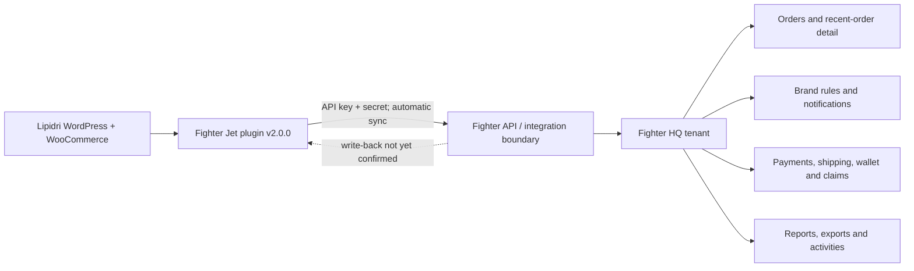

# Fighter Walkthrough - WordPress Integration and HQ Dashboard

This is the first dated capture from Nadeem's walkthrough of the current Fighter setup. It complements [[Fighter Teardown]] with first-party tenant evidence from the Lipidri WordPress site and the Fighter HQ account.

Continuation: [[Fighter Walkthrough - Order Operations and Integrations]].

> [!warning] Credential and customer-data handling
> The supplied WordPress screenshot exposed a reusable API key and API secret. Rotate/revoke that credential and verify the old pair no longer works. The supplied dashboard also contained customer names, phone numbers, locations, and order IDs. The originals were not copied into the vault. The images below are privacy-safe AI-edited working copies, so use them for product discovery rather than pixel-forensic evidence. Never store replacement secrets or unredacted customer screenshots in Obsidian.

## Working direction

- **Nadeem hypothesis:** Fighter and Luxana are close reference implementations for the in-house commerce backend EFFEN wants to build.
- **Observed fact:** the Lipidri WordPress installation has a Fighter Jet plugin configured against an EFFEN/Fighter HQ account.
- **Agent inference:** the plugin is the store-side adapter and Fighter HQ is the operational control plane. The screenshots do not yet prove the exact payload, transport, direction, or timing of synchronization.

## Evidence 1 - Fighter Jet WordPress configuration

![[Assets/Fighter Walkthrough/2026-07-15 - Fighter Jet WordPress Configuration - Redacted.png]]

### Observed configuration surface

| Field or control | Observed value/state | What it appears to control |
| --- | --- | --- |
| Plugin | Fighter Jet | WordPress/WooCommerce connection to Fighter |
| Plugin version | 2.0.0 | Store-side integration version |
| Status | Activate checked | Whether the integration is enabled |
| Name | HQ IJI | Connection/account display name; meaning still needs confirmation |
| Business | EFFEN International Sdn Bhd | Fighter tenant/business association |
| Domain | lipidri.com | Connected storefront identity |
| API Key | Redacted | Machine credential; exact scope and issuer unknown |
| API Secret | Redacted | Machine credential; exact rotation/revocation flow unknown |
| Synchronization | Automatic | Sync mode; frequency and trigger are unknown |
| Action | Update Configuration | Persists or refreshes the connection settings |

### WordPress-side inputs we currently know are required

1. An enabled Fighter Jet plugin.
2. A connection or HQ name.
3. The legal/business tenant.
4. The connected storefront domain.
5. An API key and API secret issued outside the plugin or through Fighter's API Manager.
6. A synchronization mode, currently set to automatic.

The screenshot does **not** establish whether WordPress supplies products, stock, orders, customers, payment events, shipment events, or all of them. That contract is the next thing to discover.

## Evidence 2 - Fighter HQ dashboard

![[Assets/Fighter Walkthrough/2026-07-15 - Fighter HQ Dashboard - Redacted.png]]

### Observed dashboard snapshot

Captured 2026-07-15 from the EFFEN International Sdn Bhd tenant. Values are a point-in-time UI observation, not reconciled business records.

| Surface | Observed value or behavior |
| --- | --- |
| Tenant welcome | EFFEN International Sdn Bhd, verified indicator |
| Logged-in identity | HQ IJI |
| Fighter version | 2.27.0 |
| Wallet headline | RM 4,573,260.50 |
| Sales headline | RM 7,247,281.80 |
| Teams | 0 |
| Orders | 34,746 |
| Order states | New, Pending, In Transit, Returned, Rejected, Completed |
| Recent-order columns | ID, Customer, Payment & Shipping, Status, Amount |
| Visible payment examples | COD and CHIP |
| Visible courier example | Ninja Van |
| Visible currency behavior | MYR and SGD can appear in the same operating view |
| Team performance | Seven-day panel exists; shown as unavailable in this capture |

### Observed navigation surface

| Module | Capability suggested by the UI | Discovery status |
| --- | --- | --- |
| Dashboard | Aggregate order, wallet, sales, team, and recent-order view | Screenshot captured |
| Make Order | Manual single-order creation | Not inspected |
| Bulk Orders | Batch order intake or processing | Not inspected |
| Orders | Order queue and order detail | Not inspected |
| Brand Rules | Per-brand processing configuration | Not inspected |
| Sales Pages | Hosted or connected sales-page management | Not inspected |
| Claimify | Claims/returns/recovery workflow | Not inspected |
| Reports | Operational and financial reporting | Not inspected |
| Exports | Data extraction | Not inspected |
| Notifications | Event-triggered messages | Not inspected |
| API Manager | Credential/API management | Not inspected |
| Wallets | Ledger, balances, commissions, or payouts | Not inspected |
| Activities | Audit/activity trail | Not inspected |
| My Account | User profile and account controls | Not inspected |

## Current integration model

Only the solid path from the plugin configuration into the Fighter environment is supported by the screenshots. The write-back path and each domain object remain open questions.

## Candidate data contract for Fullkit

This is a discovery scaffold, not an accepted schema.

| Domain object | Fields visible or implied in the current UI | What Fullkit must learn before replacing it |
| --- | --- | --- |
| Tenant/store connection | business, connection name, domain, active state, sync mode | Tenant/brand/store hierarchy; credential scopes; health check |
| Order | external order ID, status, amount, currency | Source ID, timestamps, item lines, discounts, totals, state transitions, deduplication |
| Customer | name, phone, location/address | Canonical identity key, normalization, consent, retention, cross-brand access |
| Payment | method such as COD or CHIP | Gateway transaction IDs, authorization/capture/refund state, fees, payout matching |
| Shipment | courier such as Ninja Van | AWB, label, pickup, tracking events, return-to-sender, COD remittance |
| Brand rule | Module is present | Rule types, evaluation order, overrides, versioning, failure behavior |
| Notification | Module is present | Channels, templates, event triggers, retries, opt-outs, delivery logs |
| Wallet/ledger | Headline balances and Wallets module are present in Fighter | EFFEN does not use Wallets; Fullkit excludes stored-value wallet tables but retains payments, settlements and reconciliation |
| Claims | Claimify module is present | Claim types, evidence, state machine, liability, refund/replacement effects |
| Export/report | Dedicated modules are present | Formats, row-level fields, time windows, rate limits, freshness, historical retention |
| Activity/audit | Activities module is present | Actor, action, object, before/after values, timestamp, IP/device, retention |

## Questions for the next Fighter walkthrough

### 1. Provisioning and authentication

- Where are the API key and secret created: Fighter API Manager, onboarding, or support?
- Is one credential pair issued per tenant, brand, domain, or WordPress site?
- What permissions does the pair grant?
- Can it be rotated without downtime, revoked immediately, and audited?
- Does the plugin authenticate directly to `api.fighter.my`, and is every request encrypted in transit?

### 2. Synchronization contract

- What objects synchronize: orders, customers, products, variations, stock, coupons, payments, shipments, refunds, or notifications?
- Is automatic sync webhook-driven, scheduled polling, WordPress cron, or a mixture?
- Which direction is authoritative for each object?
- What is the normal sync delay?
- How are retries, rate limits, partial failures, duplicate events, and replay handled?
- Is there a connection-health or last-successful-sync screen?

### 3. Order lifecycle

- What creates an order in Fighter: Woo checkout, manual Make Order, Bulk Orders, sales pages, API, or all of them?
- What are the exact allowed state transitions among New, Pending, In Transit, Returned, Rejected, and Completed?
- Which status maps back to WooCommerce, and which system wins after a conflict?
- Can staff edit customer, line-item, payment, and shipping data after creation?
- Does Activities show a complete before/after audit trail?

### 4. Payments, shipping, and claims

- How are COD and CHIP represented internally?
- Does Fighter generate the Ninja Van AWB, or only display courier data created elsewhere?
- Where are gateway fees, COD remittance, failed delivery, return-to-sender, refunds, and claims recorded?
- What do the wallet headline and colored sub-balances mean?
- Are sales and wallet values gross, collected, settled, payable, or net of returns/fees?

### 5. Multi-brand and multi-entity behavior

- Does one HQ tenant contain multiple brands and domains?
- Can each brand have its own courier account, payment gateway, WhatsApp number, notification templates, stock pool, and business entity?
- Can the same customer be resolved across brands, and should staff be allowed to see that cross-brand history?
- How are MYR and SGD orders, settlements, and reports separated or converted?

### 6. Data access for the in-house build

- What does API Manager expose beyond credential creation?
- Can Orders, Reports, Exports, Activities, Wallets, and Claims be exported with stable IDs?
- What is the maximum export window and historical retention?
- Are there documented endpoints, webhooks, schemas, and sandbox credentials?
- Can we run a read-only shadow integration without changing live operations?

## Next capture sequence

Capture screenshots or screen notes in this order, with credentials and customer details obscured before sharing:

1. API Manager overview, excluding every credential value.
2. Orders list, filters, bulk actions, and status tabs.
3. One order detail page with customer data removed but field labels preserved.
4. Order activity/history and status-change controls.
5. Brand Rules and per-brand integration settings.
6. Notifications, templates, triggers, and delivery logs.
7. Exports and Reports, including date-window limits and available columns.
8. Payment, settlement and reconciliation views; Wallets are out of Fullkit scope unless explicitly reintroduced.
9. Claimify workflow and return/refund effects.
10. Make Order and Bulk Orders input fields.

## Immediate actions

| Priority | Action | Owner/status |
| --- | --- | --- |
| P0 | Rotate/revoke the API key and secret visible in the original screenshot; verify the old pair fails | Nadeem/EFFEN - required |
| P0 | Confirm the exact sync objects, direction, trigger, and source of truth | Next walkthrough |
| P0 | Record the order state machine and WooCommerce status mapping | Next walkthrough |
| P1 | Inspect API Manager and determine whether read-only shadow access is possible | Pending |
| P1 | Inspect one redacted order detail and its activity history | Pending |
| P1 | Map per-brand rules, payment, courier, and notification configuration | Pending |
| P2 | Compare each confirmed Fighter behavior against Luxana and the Fullkit candidate schema | After the Fighter audit |
