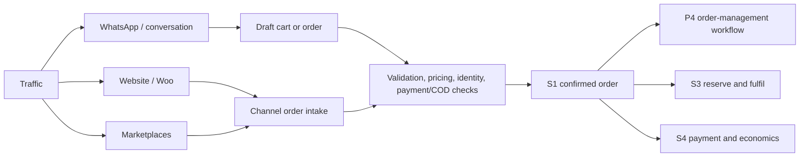

# S1 - Customer and Order Hub

> [!important] Product relationship
> S1 is shared infrastructure, not the Customer Revenue Engine or the P4 operations UI. It owns the canonical customer, identity, conversation, and order records those products use. P1 owns lifecycle and service workflows; the AI Sales Closer owns opportunity/session state; P4 owns the seller and operations experience. None of them gets a second customer or order table.

Canonical logical schema: [[Fullkit Schema Blueprint]]. Portfolio and workflow context: [[PRD]], [[Fullkit Product Portfolio PRD]], and [[Fullkit Technical Architecture]].

## Purpose

S1 gives EFFEN one operational answer to four questions:

1. Who is this person across phone, email, WhatsApp, Woo, Fighter, and marketplace identifiers?
2. What did they ask, buy, pay for, receive, return, or consent to?
3. What is the latest accepted state of every order regardless of where conversion happened?
4. Which authorized product or operator may act next?

S1 is the operational face of the CDP. Cloud SQL stores live customer and order state. BigQuery/dbt calculates governed history, cohorts, and LTV. RudderStack collects behavioral events, builds the derived identity graph and profile traits, and activates audiences. RudderStack does not accept order commands or silently redefine customer identity.

## Three conversion paths, one confirmed-order contract

`order_confirmed` means Fullkit accepted a normalized, idempotent order with a valid store, customer identity, currency, product snapshot, totals, and payment/COD state. A conversational promise, checkout attempt, payment link, or marketplace webhook is not automatically a confirmed order.

During the read-first strangler phase, the originating system remains authoritative for the fields it still controls. Fullkit records that authority per integration/object and rejects competing writes. After a channel or brand cuts over, S1 becomes the write authority for the accepted fields. There must never be two writers for the same order state.

## Source-of-truth boundaries

| Object | Live operational authority | Analytical representation | Boundary rule |
|---|---|---|---|
| Customer record and verified identities | S1 in Cloud SQL | `dim_customer`, identity graph, Customer 360 | Phone/email are identities, never primary keys |
| Profile traits and segments | Governed BigQuery/dbt + RudderStack Profiles | `cdp` profile snapshots | Derived and freshness-labelled; never overwrite canonical identity silently |
| Conversation/message history | S1 normalized record; provider receipt retained | Message and service facts | Channel provider owns transport receipt, not customer/order truth |
| Order and independent state dimensions | S1 after acceptance/cutover; source channel during shadow fields | Order facts and funnel marts | Order, payment, fulfilment, shipment, notification, and exception states remain separate |
| Payment truth | S4 | Payment and reconciliation facts | S1 references payment state; it does not mark money collected |
| Physical stock and warehouse movement | S3 | Inventory and fulfilment facts | S1 requests reservation/fulfilment; it does not edit stock |
| Delivery scan | Courier event normalized through S1 | Delivery-performance facts | Delivery is not automatically the accounting definition of completed revenue |

## Canonical operational schema

The current physical namespaces remain `app`, `private`, `reporting`, and `identity`. Internal keys use `bigint generated always as identity`; public order numbers and external IDs are separate.

### Customer and identity

| Table | Purpose and minimum contract |
|---|---|
| `app.customers` | Canonical person record: `workspace_id`, names, locale, status, first/last seen timestamps |
| `app.customer_identities` | Phone, email, marketplace, WhatsApp, and source identities with normalized/display values, verification, primary flag, and source integration |
| `app.customer_addresses` | Reusable customer addresses with recipient, E.164 phone, country, and default state |
| `app.customer_consents` | Channel/purpose consent, source, capture evidence, captured/revoked timestamps |
| `app.customer_merge_events` | Reviewable survivor/merged pair, reason, confidence, approver, and timestamp |
| `identity.user_profiles` | Internal user subject profile; separate from commerce customers |
| `identity.workspace_memberships` | Workspace role and status; the authorization source, not editable profile metadata |

Required constraints include uniqueness of a normalized identity inside the approved workspace/cross-brand boundary and auditability of every merge. Cross-brand visibility is policy, not a default.

### Conversation primitives shared by P1 and the AI closer

| Table | Purpose and minimum contract |
|---|---|
| `app.conversations` | Channel-neutral thread with `customer_id`, brand/store, channel, external thread ID, status, queue, opened/closed timestamps |
| `app.conversation_participants` | Customer, operator, bot, or external participant with role and channel identity reference |
| `app.messages` | Direction, sender, immutable body/content reference, provider ID, reply-to ID, intent label, sent/received timestamps |
| `app.message_delivery_events` | Provider delivery/read/failure events, external event ID, occurred/received timestamps |
| `app.conversation_assignments` | Queue/member assignment history and SLA timestamps |
| `app.service_cases` | Optional service issue linked to customer, conversation, order, intent, severity, owner, and resolution |

S1 owns these shared records. P1-specific journey definitions/enrolments and AI-closer opportunities, objections, recommendations, tool calls, and handoffs live in their own bounded product schemas and reference S1 IDs.

### Orders and intake

| Table | Purpose and minimum contract |
|---|---|
| `app.orders` | Canonical order with source, ownership, independent state columns, totals, timestamps, idempotency key, and optimistic `version` |
| `app.order_items` | Product/variant reference plus immutable name, SKU, price, discount, tax, and total snapshots |
| `app.order_addresses` | Shipping/billing snapshots; later customer-address edits do not rewrite history |
| `app.order_state_events` | Append-only transition history with state type, from/to state, actor, reason, and occurrence time |
| `app.order_assignments` | Team/member ownership history for operations queues |
| `app.order_notes` | Author, visibility, body, and timestamp; not a substitute for structured events |
| `app.import_batches` | Manual/bulk source, template version, defaults, file reference, counts, state, and timestamps |
| `app.import_rows` | Raw row, validation state, errors, and created order reference |

For integrated orders, `(integration_id, source_order_id)` is unique. Manual, import, website, marketplace, and closer-created orders all require idempotency keys. Current states never replace `order_state_events`.

### Fulfilment, shipment, return, and notification

| Table | Purpose and minimum contract |
|---|---|
| `app.fulfillments` | Order-facing fulfilment record, selected S3 location, state, assignee, packed/handed-over timestamps |
| `app.fulfillment_items` | Split-fulfilment quantity by order item |
| `app.shipments` | Courier integration, service, tracking/AWB reference, state, and lifecycle timestamps |
| `app.shipment_events` | Immutable courier events with provider identity, scan type/location, occurred/received timestamps |
| `app.returns` / `app.return_items` | Return request, reason, state, item quantity/condition/resolution; S3 owns resulting physical movements |
| `app.sender_profiles` | Brand/channel sender identity linked to integration and secret reference |
| `app.notification_templates` / `app.notification_template_versions` | Versioned, localized, approved transactional templates |
| `app.notification_rules` | Trigger, conditions, template, sender, and state |
| `app.notification_jobs` / `app.message_attempts` | Idempotent job plus provider attempts, receipts, failures, and retry state |

### Shared reliability tables

S1 commands also use `private.integrations`, `private.webhook_events`, `private.source_records`, `private.sync_runs`, `private.sync_cursors`, `private.idempotency_keys`, `app.domain_events`, `app.audit_events`, and `app.outbox_events`. Raw provider payloads remain private and replayable; normalized columns remain queryable.

## BigQuery marts and CDP models

| Layer | Models | Grain/use |
|---|---|---|
| `core` dimensions | `dim_customer`, `dim_customer_identity`, `dim_brand`, `dim_store`, `dim_channel` | Conformed identifiers across every source |
| `core` facts | `fct_orders`, `fct_order_items`, `fct_order_state_events`, `fct_conversation_messages`, `fct_shipments`, `fct_returns` | Immutable history and lifecycle events |
| Customer marts | `customer_360`, `customer_cohorts`, `customer_retention`, `customer_lifecycle_eligibility` | Governed profile, retention, and activation inputs |
| Commerce marts | `order_funnel`, `channel_conversion`, `delivery_performance`, `service_performance` | Conversion and operational diagnosis |
| CDP | identity graph, profile snapshots, audience memberships | Derived RudderStack Profiles outputs with merge provenance |
| Quality | missing source orders, duplicate IDs, state regressions, unlinked customers, event/outbox lag | Release and action gates |

LTV must remain four labelled metrics: `gross_ltv`, `net_ltv`, `contribution_ltv`, and later `predicted_ltv`. Every surface states currency, observation window, definition version, and warehouse freshness.

## API surface

### Read APIs

- Customer context: identity, consent, recent orders, open cases, current traits with freshness.
- Order detail/history: independent state dimensions, items, payment reference, fulfilment and delivery history.
- Order status for customer-facing use: a redacted projection, not the internal record.
- Conversation context: recent thread/messages, queue, handoff, and linked order.
- Eligibility context: permitted channels and lifecycle/offer flags supplied by governed services.

### Command APIs

- Identify/create customer, add/verify identity, capture/revoke consent, propose/approve merge.
- Create draft order, validate price/stock, confirm, approve, cancel, reject, assign, annotate.
- Link conversation to customer/order, append normalized message, assign/handoff/close conversation.
- Request fulfilment or cancellation from S3; request payment/checkout action from S4.
- Schedule/cancel an approved notification job.

Every mutating endpoint requires workspace scope, actor, idempotency key, validation, audit entry, and transactional outbox event. AI clients receive narrower tool-specific endpoints and never arbitrary SQL.

## Event contract

Core events include:

- `customer_identified`, `customer_identity_verified`, `customer_merge_proposed`, `customer_merged`, `customer_consent_updated`
- `conversation_started`, `message_received`, `message_sent`, `message_delivered`, `message_engaged`, `conversation_handed_off`, `conversation_closed`
- `checkout_started`, `order_draft_created`, `order_created`, `order_confirmed`, `order_approved`, `order_cancelled`, `order_rejected`
- `fulfilment_requested`, `order_packed`, `order_shipped`, `order_delivered`, `order_returned`

Every event carries globally unique `event_id`, `occurred_at`, `received_at`, workspace/brand/store, source channel, aggregate IDs, actor, correlation/causation IDs, schema version, and replay-safe source identity.

## Producers and consumers

| Producers | Data/commands supplied | Consumers | Use |
|---|---|---|---|
| Woo/Novomira, Fighter, Shopee, Lazada, TikTok Shop | Customer, checkout, order, and status events | P4 Commerce Operations | Unified seller/operations queue |
| WhatsApp and other conversation adapters | Threads, messages, delivery receipts | P1 and AI Sales Closer | Service, retention, and closing |
| Courier adapters | AWB and tracking events | P4, P1, customers | Fulfilment and proactive status replies |
| RudderStack/BigQuery serving layer | Traits, cohorts, lifecycle eligibility | P1, Growth Engine, AI closer | Governed decision context |
| S3 | Availability, reservation, fulfilment receipts | S1/P4 | Order progression |
| S4 | Payment, refund, collection, economic state | S1/P4/Growth Engine | Safe order status and economics |

## Quality, privacy, and security

- Normalize phone to E.164 and email to a canonical comparison form, while preserving display/source values.
- Customer merges are reversible or at minimum reconstructable from immutable provenance; low-confidence merges require review.
- Encrypt or tokenize identities where cleartext is unnecessary. Restrict re-identification to authorized operational roles.
- Enforce consent and suppression before promotional sends; transactional necessity must be an explicit purpose, not a bypass flag.
- Separate HQ, sales, customer service, operations, warehouse, finance, analyst, and automation permissions. Apply least privilege and RLS as defence in depth.
- Store secrets only in secret management. Logs and model traces must omit full message bodies, credentials, and unnecessary PII.
- Index every foreign key and the queue/history paths defined in [[Fullkit Schema Blueprint]]. Use cursor pagination.
- Test uniqueness, replay, late/out-of-order events, state transition legality, deletion propagation, and source coverage.

## Implementation stages

### Stage 0 - shadow and normalize

- Ingest Woo/Fighter/marketplace/customer/conversation sources read-only.
- Create customer, identity, order, item, state-event, integration, audit, and outbox primitives.
- Publish `fct_orders`, `dim_customer_identity`, source coverage, and quality gates.
- Record field-level ownership while external systems remain writers.

### Stage 1 - read-side hub

- Deterministic identity resolution plus reviewed merges.
- Customer 360 and labelled LTV traits served to the Fullkit API.
- Unified order/customer/conversation lookup and integration-health views.
- Consent capture and privacy workflow across Cloud SQL, BigQuery, and RudderStack.

### Stage 2 - conversations and lifecycle readiness

- WhatsApp/channel adapters, normalized threads, templates, delivery receipts, and SLA queues.
- P1 lifecycle products consume S1 context through APIs/events.
- Automated transactional order updates with duplicate-send prevention.

### Stage 3 - confirmed-order write side

- Pilot one brand/channel, with Fighter retained as fallback.
- Accept orders from conversation, website, and marketplace intake through the same contract.
- Enforce S3 reservation and S4 payment gates before downstream transitions.
- Cut over field authority only after parity, replay, reconciliation, and rollback tests pass.

## Decisions required

- Cross-brand identity/visibility policy and PDPA retention/deletion rules.
- Exact order, payment, fulfilment, shipment, notification, and exception state machines.
- Confirmed/completed/collected revenue definitions.
- Per-channel field authority during shadow and after cutover.
- Who creates AWBs and which system may update tracking.
- Conversation retention, redaction, AI-training eligibility, and human-handoff policy.
