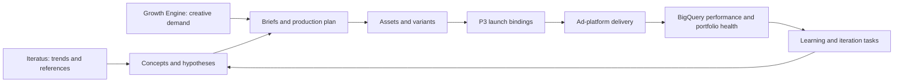

# S2 - Creative Loop

> [!important] Product relationship
> S2 is the shared creative truth beneath Iteratus, P2 Creative Intelligence & Supply, P3 Marketing Execution, and the [[Growth Engine]]. Iteratus owns trend discovery and idea exploration. P2 owns creative demand, planning, production, review, and learning. P3 owns campaign execution. S2 connects them with IDs and events; it does not collapse them into one product.

Portfolio and platform context: [[Fullkit Product Portfolio PRD]], [[Fullkit Technical Architecture]], and [[Fullkit Schema Blueprint]].

## Purpose

S2 closes the loop from inspiration to commercial learning:

The spine answers:

- Where did an idea come from, and which claim/message/product/persona does it express?
- Which demand plan, brief, producer, tool run, and approval created each asset?
- Where was the asset activated, under which campaign/ad IDs and commercial moment?
- How did it deliver, decay, diversify the portfolio, and affect economic outcomes?
- What should be iterated, retired, or supplied next?

## Source-of-truth boundaries

| Object | Authority | Boundary rule |
|---|---|---|
| Trend signal, swipe, competitor reference | Iteratus | S2 stores a stable reference and selected snapshot/provenance, not Iteratus's internal workspace |
| Creative demand and capacity requirement | Growth Engine plan + P2 accepted production state | Every demand order links to objective, scenario/model run, calendar moment, and owner |
| Concept, brief, production job, asset lineage, review | P2/S2 in Cloud SQL | Production tools are processors, not the system of record |
| Campaign/ad delivery state | P3 and external ad platform | S2 stores launch bindings; it does not issue media commands directly |
| Delivery and performance facts | BigQuery normalized platform/ad-commerce facts | Platform metrics are observed signals, not automatic proof of incrementality |
| Learning/iteration decision | P2/Growth Engine operational decision state | Every recommendation preserves evidence, method version, approval, action, and outcome |

## Operational namespace and conventions

The existing blueprint uses `app`, `private`, and `reporting`. For MVP, these tables can be prefixed inside `app` (for example `app.creative_assets`). The logical bounded namespace is `creative`; it may become a physical PostgreSQL schema once P2 needs independent roles or deployment. The names below use `creative.*` to make ownership explicit.

All rows carry `workspace_id`; brand-scoped rows also carry `brand_id`. Use time-ordered internal IDs, `timestamptz`, immutable external IDs, indexed foreign keys, versioned taxonomies, and exact costs. Binary media lives in object storage; PostgreSQL stores metadata, checksums, rights, and safe references.

## Canonical operational schema

### Inspiration, concepts, and briefs

| Table | Purpose and minimum contract |
|---|---|
| `creative.inspiration_sources` | Source system/type, external object ID, URL/reference, creator/account, capture time, rights/usage state, provenance checksum |
| `creative.external_creative_snapshots` | Selected immutable metadata/screenshot/transcript reference from Foreplay, Kalodata, ad libraries, or owned ads |
| `creative.trend_signal_refs` | Stable Iteratus signal ID, taxonomy, observed window, confidence, selected context, imported version |
| `creative.concepts` | Product, audience/persona, problem, promise, angle, hook, format hypothesis, status, owner, source lineage |
| `creative.concept_sources` | Many-to-many link from concepts to Iteratus intakes, inspiration/signal references, customer evidence, or governed owned-performance evidence |
| `creative.briefs` / `creative.brief_versions` | Versioned objective, audience, message, claim constraints, format, deliverables, references, due date, approver |
| `creative.claim_refs` | Approved knowledge/claim/policy reference; the full regulated knowledge remains in its owning knowledge system |

External references are evidence, not copied ownership. Rights and source provenance must survive even when a URL or SaaS record disappears.

### Demand, calendar, and capacity

| Table | Purpose and minimum contract |
|---|---|
| `creative.demand_orders` | Required assets by objective, brand/product, moment, format, delivery entity, due date, priority, quantity, expected value, status |
| `creative.demand_order_lines` | Product × persona × message × format requirement including placement, language, market, quantity, raw-source and diversity constraints |
| `creative.calendar_items` | Dated commitment referencing the Growth Engine marketing moment/calendar version, owner, priority and production window |
| `creative.resources` | Internal producer, vendor or tool capacity resource with discipline, capability, state and cost rate |
| `creative.capacity_periods` | Resource × period × discipline capacity, committed units and unavailable units |

Targets such as 50 posters/week and 10-20 raw videos/week are capacity commitments, not success metrics. Track distinct concepts, raw sources, delivery entities, approved and activated assets, cycle time, cost, hit rate, durability, and incremental contribution after production cost.

### Production, assets, review, and rights

| Table | Purpose and minimum contract |
|---|---|
| `creative.production_jobs` | Brief/demand reference, job type, producer, state, due date, cost budget/actual, started/completed timestamps |
| `creative.job_assignments` | Production job to human/vendor/tool resource, committed units, service level, acceptance and handoff history |
| `creative.tool_runs` | Canva, CapCut, Higgsfield, Flow, Claude or other tool; input/output refs, model/version, prompt/template ref, cost, status, errors |
| `creative.assets` | Logical asset identity linked to concept/job, owner, asset type, current version and state |
| `creative.asset_versions` | Immutable file/content version with object-storage ref, checksum, media type, duration/dimensions, language and copy |
| `creative.asset_relations` | Directed parent/child source, edit, crop, localization, format or generation lineage between asset versions |
| `creative.asset_entity_tags` | Governed product, persona, hook, message, format, creator, visual motif, CTA, offer, and delivery-entity tags |
| `creative.reviews` / `creative.approvals` | Reviewer, criteria, decision, comments/ref, policy version, decided timestamp |
| `creative.usage_rights` | Territory, channel, start/end, talent/music/source rights, evidence, restrictions, expiration state |

Tool runs are lineage, not permission to auto-publish. Final activation requires a valid approval and usage-rights gate.

### Activation binding, iteration, and learning

| Table | Purpose and minimum contract |
|---|---|
| `creative.launch_packages` | Immutable approved asset/copy/destination handoff with allowed markets/channels and expiry |
| `creative.launch_bindings` | Launch package to P3 campaign, ad set, ad, placement, account, market, offer, landing page, and activation timestamps |
| `creative.experiment_bindings` | Asset/concept to experiment/hypothesis/treatment/control IDs |
| `creative.iteration_tasks` | Evidence-backed change request, parent asset/concept, owner, due date, status, expected outcome |
| `creative.learning_records` | Observation, evidence window, metric/method version, confidence, falsification note, recommendation, decision, and outcome |
| `creative.portfolio_actions` | Approve, activate, pause-request, retire, replace, or scale-request with actor, reason, approval, and execution receipt |

P3 executes activation/pause/budget commands. S2 records the requested action and P3 receipt so creative learning remains traceable without giving P2 media-account write access.

## BigQuery dimensions, facts, and marts

| Layer | Models | Grain/use |
|---|---|---|
| Dimensions | `dim_creative_asset`, `dim_creative_concept`, `dim_message`, `dim_hook`, `dim_format`, `dim_creator`, `dim_delivery_entity`, `dim_commercial_moment` | Versioned taxonomy and lineage |
| Delivery facts | `fct_campaign_daily`, `fct_creative_daily` | Date x account/campaign/ad/creative; spend, delivery, platform results, activation age |
| Production facts | `fct_creative_production_job`, `fct_creative_capacity_plan`, `fct_creative_cost` | Throughput, cycle time, capacity, rework, and cost |
| Portfolio marts | `fct_creative_portfolio_health`, `creative_activation`, `creative_decay`, `creative_rotation`, `creative_coverage` | Activation/outlier rate, evergreen share, half-life, coverage and replacement need |
| Learning marts | `creative_iteration_outcomes`, `creative_experiment_results`, `creative_entity_performance` | Concept/entity diversity and measured outcomes |
| Quality | unbound platform creatives, missing source lineage, missing rights/approval, stale taxonomy, duplicate checksums | Activation and recommendation gates |

Minimum `fct_creative_daily` fields include platform/account/campaign/ad/creative IDs, asset/concept IDs, date, spend, impressions, reach, frequency, clicks, video milestones, platform conversions, attributed orders/revenue, new-customer and contribution proxies, active state, asset age, commercial moment, and metric/attribution version.

Creative performance must not equate high platform spend with causal value. The Growth Engine may rank evidence using controlled tests, modeled incrementality, orders, new-customer contribution, cohort quality, and production cost, with uncertainty visible.

## API surface

### Read APIs

- Search portfolio by product, message, format, entity, status, rights, activation, and performance state.
- Retrieve concept/asset lineage from source through brief, tool runs, approvals, launches, and outcomes.
- Query demand versus committed/delivered/approved/activated capacity.
- Serve a governed creative context pack to AI strategists; never raw warehouse access.

### Command APIs

- Import/reference an Iteratus inspiration or trend signal.
- Create/version concept and brief; create/accept/split a creative demand order.
- Assign producer, record tool run, register asset/variant, tag entities, submit review, approve/reject.
- Bind an approved asset to a P3 launch object.
- Create iteration/retirement/replacement request and close it with measured outcome.

Every command emits audit/outbox events and uses role-scoped permissions. Automated suggestions cannot approve claims, rights, or publication.

## Event contract

- `trend_signal_selected`, `concept_created`, `concept_approved`, `brief_published`
- `creative_demand_created`, `creative_demand_committed`, `production_job_started`, `asset_created`, `asset_reviewed`, `asset_approved`
- `asset_bound_to_launch`, `creative_activated`, `creative_paused`, `creative_retired`
- `creative_outlier_detected`, `creative_decay_detected`, `iteration_requested`, `iteration_completed`, `creative_learning_recorded`

Events include upstream plan/scenario/model/calendar IDs, asset/concept lineage, brand/product/market, actor, method/taxonomy version, and correlation/causation IDs.

## Producers and consumers

| Producer | Supplies | Consumer | Uses |
|---|---|---|---|
| Iteratus | Curated trend/signal/reference IDs and snapshots | P2/S2 | Ideation evidence |
| Growth Engine | Creative demand, commercial moment, expected value, constraints | P2 | Production planning |
| P2 and production tools | Concepts, briefs, jobs, assets, costs, approvals | P3 | Approved launch supply |
| P3/ad adapters | Campaign/ad identifiers and execution receipts | S2/BigQuery | Activation binding |
| Meta/Google/TikTok extracts | Delivery and platform results | BigQuery/Growth Engine | Portfolio diagnosis |
| S1/S4 | Orders, customers, contribution economics | Growth Engine/S2 marts | Downstream outcome evidence |

## Quality, rights, and security

- Unique external source identity per integration/object and immutable source snapshot/checksum.
- Unique asset binary checksum inside a workspace unless an explicit duplicate/version relationship exists.
- No activation without approved rights, claim/policy check, and current asset approval.
- Version all briefs, taxonomies, claim refs, methods, and learning rules; never rewrite historical meaning.
- Keep platform tokens and production-tool secrets private. Use separate roles for ideation, producer, reviewer, approver, media operator, and analyst.
- Restrict raw competitor snapshots and licensed source material according to terms and rights evidence.
- Treat AI prompts/outputs as potentially sensitive production records; redact secrets and unnecessary customer data.
- Reconcile platform creative IDs to S2 assets daily; quarantine unbound or conflicting identifiers.
- Index every foreign key and common portfolio/due-date/status query. Partition large BigQuery daily facts by date and cluster around brand/account/creative only after query patterns are measured.

## Implementation stages

### Stage 0 - preserve identifiers

- Ingest ad-account, campaign, ad set, ad, and creative identifiers into BigQuery.
- Define the creative taxonomy, external-ID map, and source provenance contract.
- Build `fct_creative_daily` and an unbound-creative quality queue.

### Stage 1 - portfolio registry

- Concepts, briefs, assets/variants, entity tags, approvals, rights, and launch bindings.
- Owned-ad data joined to the asset registry.
- Read-only portfolio health: activation, durability, rotation, coverage, and cost.

### Stage 2 - demand and production operations

- Growth Engine creative-demand orders, marketing-calendar bindings, capacity plans, jobs, assignments, reviews, and SLA queues.
- Record delivery entity diversity and raw-source requirements, not only output count.
- Integrate Canva/CapCut/Higgsfield/Flow as tool runs without making them authorities.

### Stage 3 - assisted intelligence and closed-loop learning

- AI proposes concepts, briefs, iteration tasks, and evidence summaries from governed context.
- Human approval remains mandatory for claims, rights, brand safety, and publication.
- Outcome measurement closes recommendations into reusable learning records.
- Bounded automated actions begin only after evaluation, reversibility, and P3 policy gates pass.

## Decisions required

- Canonical creative taxonomy, definition of a distinct concept, and what counts as an activated asset.
- Attribution/incrementality evidence hierarchy for creative decisions.
- Rights retention and source-capture policy for Foreplay, Kalodata, ad libraries, and talent/music.
- P2/P3 ownership of approval, launch, pause, and retirement actions.
- Capacity unit and SLA by poster, raw video, edit, format, and delivery entity.
- Storage, media proxy, transcript, and privacy policy for production artifacts.
