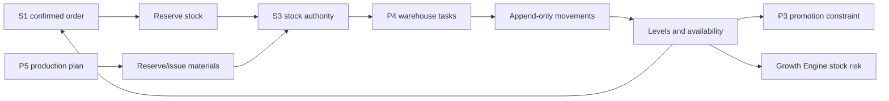

# S3 - Inventory

> [!important] Product relationship
> S3 is stock truth, not the P4 WMS user interface and not P5 production planning. P4 orchestrates order and warehouse work through S1/S3 APIs. P5 decides what, how much, and when to manufacture; S3 records which raw materials, packaging, WIP, and finished goods physically exist and move.

Portfolio and platform context: [[Fullkit Product Portfolio PRD]], [[Fullkit Technical Architecture]], and [[Fullkit Schema Blueprint]].

## Purpose

S3 answers, by item and location:

- What is on hand, reserved, available to promise, in transit, damaged, quarantined, or expected?
- Which accepted business event caused each movement?
- Can S1 confirm an order, P3 promote a product, or P5 release a work order without creating an inventory failure?
- Does system stock reconcile with physical count and the external WMS, if one exists?

The MVP replaces Excel with a canonical SKU registry, levels, reservations, and an append-only movement ledger. A full WMS adds receiving, putaway, pick/pack, transfers, counts, and return disposition. These are stages, not separate stock authorities.

## Source-of-truth rule: one authority per location

For each inventory location, exactly one system may accept physical stock commands:

- If Fullkit owns the location, S3 is authoritative and P4 is its workflow UI.
- If a bought WMS owns the location, that WMS is authoritative for physical movement. Fullkit sends idempotent commands and mirrors its receipts/events into S3.
- Marketplace-managed stock remains source-authoritative until explicit inventory synchronization and conflict rules are accepted.

Cached `inventory_levels` accelerate reads. The movement ledger, accepted reservations, and count adjustments must be sufficient to explain the balance.

## Source-of-truth boundaries

| Object | Authority | Boundary rule |
|---|---|---|
| Product and sellable variant identity | S3 catalog in Cloud SQL | External listings map to canonical variant IDs; channel titles/SKUs remain source references |
| Price | Versioned S3 price list for operational quoting | Actual order price is snapshotted in S1; realized economics is S4 |
| On-hand/reserved/available | S3 or designated external WMS per location | `available_qty = on_hand_qty - reserved_qty`; never three independently editable numbers |
| Physical movement | Append-only S3 movement or normalized external-WMS receipt | Direct level edits are prohibited |
| Order/fulfilment intent | S1/P4 | S3 accepts or rejects reservation/pick/ship commands and returns receipts |
| Production intent/BOM/work order | P5 | S3 owns material reservation, issue, return, scrap, and finished-good receipt movements |
| Cost and contribution | S4/BigQuery | S3 supplies quantity and cost-version references, not accounting truth |

## Canonical operational schema

### Catalog and pricing

| Table | Purpose and minimum contract |
|---|---|
| `app.products` | Workspace/brand product, description/category, lifecycle state |
| `app.product_variants` | Canonical sellable SKU, product, attributes, weight/dimensions, barcode, status |
| `app.channel_listing_mappings` | Integration/store listing and source SKU to canonical product/variant |
| `app.price_lists` | Currency, country, channel, validity window, status |
| `app.variant_prices` | Variant amount and validity window inside a price list |
| `app.inventory_items` | Future generalized item master: `raw_material`, `packaging`, `wip`, `finished_good`, `consumable`; finished goods reference a product variant |
| `app.units_of_measure` / `app.item_uom_conversions` | Governed base/purchase/production units and exact conversion factors |

`inventory_items` can be introduced when P5 starts. Until then, `product_variants` are the stocked items. Avoid prematurely duplicating both models without an accepted migration rule.

### Locations, levels, reservations, and movements

| Table | Purpose and minimum contract |
|---|---|
| `app.inventory_locations` | Workspace, name, type, country, authority system, external location ref, status |
| `app.inventory_levels` | Location/item or variant, `on_hand_qty`, `reserved_qty`, `updated_at`, optimistic `version` |
| `app.inventory_reservations` | Demand source/order item/work order, location, quantity, status, expiry, idempotency key |
| `app.inventory_movements` | Append-only location/item delta, movement type, source object, lot/bin refs, occurred/recorded times, idempotency key |
| `app.inventory_adjustments` | Proposed adjustment, reason, evidence/count ref, approver, state; posts movement only when approved |
| `app.inventory_transfers` / `app.inventory_transfer_lines` | Source/destination, item quantities, dispatch/receipt states and timestamps |

`inventory_levels` is unique by location and stocked item. Reservation/update is atomic. Every foreign key is indexed. Quantities use exact numeric values when fractional units are possible; never floating point.

### WMS depth for P4

The owned WMS module uses the logical `wms` namespace defined in [[P4 - Commerce Operations and WMS]]. These are the detailed physical-execution records behind S3, not a second stock ledger. Per [[Fullkit Technical Architecture]], the MVP may physically prefix them under `app`.

| Table | Purpose and minimum contract |
|---|---|
| `wms.warehouses` / `wms.zones` / `wms.bins` | Physical hierarchy, capability, restrictions, scan code and active state |
| `wms.lots` / `wms.bin_balances` | Item lot/batch/expiry/quality identity and detailed bin-level balance projection |
| `wms.receipts` / `wms.receipt_lines` | Purchase/production/return inbound reference, expected/received quantity and discrepancies |
| `wms.putaway_tasks` | Receipt line to destination bin, assignee, priority, state and scan evidence |
| `wms.fulfillment_waves` / `wms.wave_fulfillments` | Released group of S1 fulfilments and sequence/cutoff policy |
| `wms.pick_tasks` / `wms.pick_task_lines` | Fulfilment demand, allocation, source bin/lot, quantity, assignee and scan/state history |
| `wms.pack_jobs` / `wms.packages` / `wms.shipment_handovers` | Picked items, parcel, weight/dimensions, QC, S1 shipment and courier custody evidence |
| `wms.stocktake_sessions` / `wms.stocktake_counts` | Frozen scope, expected/blind count, variance, recount and approval; accepted variance posts canonical S3 adjustment/movement |
| `wms.return_receipts` / `wms.return_inspections` | S1 return item, received quantity, condition, disposition and resulting restock/quarantine/scrap movement |

S1 retains customer/order-facing `fulfillments`, `shipments`, and `returns`. S3 retains the physical tasks and movements. Generic transfer and adjustment authority remains in `app.inventory_transfers`, `app.inventory_adjustments` and `app.inventory_movements`; P4 must not introduce duplicate editable transfer/adjustment truth. Shared IDs and events connect them.

### Reliability and provenance

All commands use `private.integrations`, `private.webhook_events`, `private.source_records`, `private.idempotency_keys`, `app.domain_events`, `app.audit_events`, and `app.outbox_events`. External WMS payloads remain private; normalized location/item/event identities are queryable.

## BigQuery dimensions, facts, and marts

| Layer | Models | Grain/use |
|---|---|---|
| Dimensions | `dim_product`, `dim_product_variant`, `dim_inventory_item`, `dim_location`, `dim_supplier`, `dim_lot` | Conformed catalog/location history |
| Facts | `fct_inventory_movement`, `fct_inventory_reservation`, `fct_inventory_snapshot_daily`, `fct_receipt`, `fct_pick_pack`, `fct_stocktake_variance`, `fct_return_disposition` | Append-only events and daily state |
| Availability marts | `inventory_available`, `inventory_velocity`, `inventory_stock_cover`, `stockout_risk`, `lost_demand_risk` | Operational and Growth Engine decisions |
| Fulfilment marts | `fulfilment_performance`, `warehouse_productivity`, `delivery_readiness` | P4 service levels and bottlenecks |
| Product mart | `fct_product_daily` | Demand, contribution reference, availability, stock cover, promotion state, forecast requirement |
| Quality | negative availability, unexplained level/ledger gap, expired reservations, duplicate movements, unmapped listings, count variance | Command and reporting gates |

Operational availability is served from Cloud SQL. BigQuery snapshots are historical analysis and planning inputs; they must never reserve stock.

## API surface

### Read APIs

- Catalog/variant resolution and channel listing mapping.
- Available-to-promise by product/variant, location, market, and quantity.
- Reservation, movement, lot, receipt, transfer, count, pick/pack, and return-disposition history.
- Stock constraint context for Growth Engine, P3, P4, and P5 with freshness and authority labels.

### Command APIs

- Create/expire/commit/release reservation.
- Receive, put away, allocate, pick, pack, dispatch, transfer, count, adjust, quarantine, restock, scrap.
- Reserve/issue/return material and receive finished goods for P5 work orders.
- Sync an external WMS command and accept its idempotent execution receipt.

Commands validate workspace/location authority, item state, quantity, version, reason, actor, and idempotency. High-risk adjustments and stocktake postings require approval. AI may propose or prepare tasks but cannot bypass quantity, location, or approval checks.

## Event contract

- `inventory_item_created`, `channel_listing_mapped`, `price_version_published`
- `inventory_reserved`, `inventory_reservation_failed`, `inventory_released`, `inventory_committed`
- `stock_received`, `stock_put_away`, `stock_moved`, `stock_adjusted`, `stock_quarantined`, `stock_scrapped`
- `pick_started`, `pick_completed`, `pack_completed`, `fulfilment_handed_over`
- `stocktake_started`, `stocktake_variance_detected`, `stocktake_posted`
- `return_received`, `return_restocked`, `return_quarantined`, `return_scrapped`

Each event includes item/variant, location and optional bin/lot, exact quantity/UOM, source type/ID, order/work-order/return correlation, authority system, occurred/received timestamps, and schema version.

## Producers and consumers

| Producer | Supplies | Consumer | Uses |
|---|---|---|---|
| S1/P4 | Confirmed order and fulfilment demand | S3 | Reserve, pick, pack, dispatch |
| External WMS/marketplaces | Physical stock events and snapshots | S3 mirror/reconciliation | Location authority and visibility |
| P5 | Material/finished-good demand and work-order receipts | S3 | Reserve/issue/return/receive movements |
| Warehouse operators | Scan, receipt, count, disposition evidence | S3 | Physical truth |
| S3 | ATP, reservation, fulfilment and stock-risk events | S1, P3, P4, P5, Growth Engine | Confirmation, promotion, operations, production, planning |
| S4 | Cost-version references | BigQuery product/economics marts | Inventory value and contribution analysis |

## Quality, controls, and security

- One accepted stock authority per location and a versioned mapping of ownership changes.
- Append-only movements; corrections use reversing/adjustment movements with reason and approval.
- Atomic reservation and optimistic locking prevent overselling. Negative availability is blocked unless an explicit, audited policy permits it.
- Unique idempotency keys for every external event and inventory command; retry must not post twice.
- Reconcile levels to movements and periodic physical counts. Surface discrepancies; never silently force a balance.
- Enforce lot/expiry/quality and bin restrictions where applicable.
- Separate catalog editor, operations, warehouse picker/packer, stock controller, approver, production, finance-read, and automation roles.
- Mobile/scanner clients receive task-scoped endpoints, never database credentials.
- Index all foreign keys plus active reservation, item/location, open task, and movement-history access paths. Measure before adding partial/covering indexes.

## Implementation stages

### Stage 0 - catalog and shadow stock

- Canonical products/variants, listing mappings, locations, external snapshots, and source coverage.
- Compare Fighter/marketplace/Excel balances without issuing writes.
- Establish one authority per location and an exception queue.

### Stage 1 - inventory MVP

- Levels, reservations, movements, adjustments, ATP API, audit, and outbox.
- Replace the warehouse stock Excel for one location/brand.
- Connect S1 confirmed orders to reservation/release/commit.

### Stage 2 - light WMS

- Receipts, bins, putaway, pick/pack, transfers, stocktakes, and return disposition.
- P4 role-specific UI over S1/S3 shared infrastructure.
- Courier handover remains connected to S1 shipment state.

### Stage 3 - production and WMS depth

- Generalized inventory items, UOM, lots/batches, quality states, and P5 work-order integrations.
- Decide build versus external WMS by workflow depth, API/event quality, total operating cost, and lock-in.
- If external, migrate location authority with dual-read reconciliation and a controlled cutover, never dual write.

## Decisions required

- Shared versus brand-specific stock and the canonical SKU scope.
- Location/bin/lot depth, fractional UOM needs, expiry and QC requirements.
- Fullkit versus external-WMS authority per location.
- Reservation expiry, backorder, oversell, substitution, and allocation policies.
- Marketplace stock-sync direction and conflict precedence.
- Return/rejection/refund/claim disposition flow.
- P5 item-master migration from finished variants to raw material, packaging, WIP, and finished goods.
