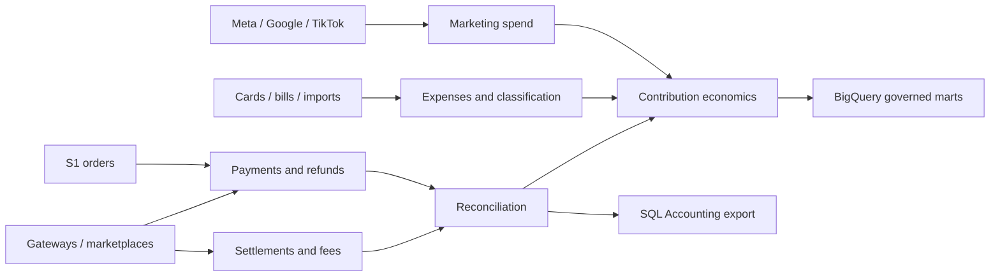

# S4 - Money

> [!important] Product relationship
> S4 is the shared commerce-money truth used by P1, P3, P4, P6 Finance Control and the [[Growth Engine]]. It is not a replacement general ledger. SQL Accounting remains the official accounting ledger; P6 owns review, close, classification, commission, and export workflows over S4. Wallets and withdrawals remain excluded.

Portfolio and platform context: [[Fullkit Product Portfolio PRD]], [[Fullkit Technical Architecture]], and [[Fullkit Schema Blueprint]].

## Purpose

S4 connects every order and marketing cost to the money actually authorized, collected, refunded, settled, charged, classified, and exported. It answers:

- Was an order paid, COD-collected, refunded, or still economically unresolved?
- Did the gateway or marketplace payout agree with order/payment truth?
- Which fees, commissions, shipping, fulfilment, COGS, discounts, and ad spend belong to the order/channel/product/brand?
- What is gross, net, and contribution revenue under a versioned definition?
- Which exceptions block finance close or a Growth Engine decision?

## Source-of-truth boundaries

| Object | Authority | Boundary rule |
|---|---|---|
| Order commercial terms | S1 immutable order/item snapshots | S4 references them; refunds/fees do not rewrite the order |
| Payment authorization/capture/refund | Verified gateway/marketplace/COD event normalized in S4 | UI or AI may not mark payment collected without accepted evidence |
| Settlement/payout | Provider statement/API normalized in S4 | A payment and a payout are different events |
| Ad-platform spend | Shared normalized integration fact | Meta daily spend, Meta invoice, card charge, and GL posting are distinct records |
| Commerce subledger/reconciliation | S4 in Cloud SQL | Append-only economic events and reviewed matches |
| Official financial accounts and statutory books | SQL Accounting | Fullkit exports approved entries; it does not become the GL |
| Historical metrics and contribution models | BigQuery/dbt | Versioned governed definitions, never ad hoc browser calculations |

## Wallet decision

Do not implement `wallet_accounts`, `wallet_transactions`, `wallet_balances`, or `withdrawal_requests`. If commissions remain required, approved commission entries become a payables/accounting export. Attributed sales are calculated from orders under an explicit status/revenue definition, never from a wallet balance.

## Canonical operational schema

Money uses exact `numeric(19,4)` or a documented higher precision, ISO-4217 currency, `timestamptz`, immutable external IDs, indexed foreign keys, and lower-case status keys. Never use floating point for money.

### Payments, refunds, and settlements

| Table | Purpose and minimum contract |
|---|---|
| `app.payments` | Order, integration, external payment ID, method, currency, amount, status, authorization/capture timestamps |
| `app.payment_events` | Append-only provider/COD events with type, external event ID, amount, occurred time, payload reference |
| `app.refunds` | Order/payment, external ref, currency/amount, reason, status, request/completion times |
| `app.refund_events` | Provider event and state transition history for a refund |
| `app.settlement_batches` | Integration, external settlement ID, period, currency, gross/fee/net totals, settled timestamp |
| `app.settlement_lines` | External transaction, line type, gross/fee/net, currency, occurred time, source refs |
| `app.reconciliation_matches` | Settlement line to payment/order/refund, match state/method/confidence, reviewer/timestamp |
| `app.reconciliation_exceptions` | Typed mismatch, amount, severity, owner, due date, resolution and evidence |

Use uniqueness on `(integration_id, external_payment_id)`, provider event identity, and `(integration_id, external_settlement_id)`. A correction posts a new event or reviewed match; it does not erase source history.

### Cost and contribution inputs

| Table | Purpose and minimum contract |
|---|---|
| `app.variant_cost_versions` | Variant/item, cost type, currency, exact amount, valid window, source, approval |
| `app.order_item_cost_snapshots` | Order item, cost-version refs, quantity, COGS amount at the accepted accounting point |
| `app.order_cost_entries` | Order/item/shipment reference, cost type, provider/source, currency/amount, occurred time, status |
| `app.fee_entries` | Payment, marketplace, fulfilment, shipping, commission, or platform fee with source line and state |
| `app.exchange_rate_versions` | Currency pair, rate, provider, effective time, method/version; used only under approved policy |

Cost types must distinguish COGS, payment fee, marketplace fee, fulfilment cost, shipping charge/subsidy, commission, refund/return loss, and other approved categories. Historical contribution must retain the cost and metric versions used.

### Marketing spend, cards, and expense classification

| Table | Purpose and minimum contract |
|---|---|
| `app.marketing_spend_records` | Platform/account/campaign/date, currency, exact spend, source integration, source version, ingestion state |
| `app.expense_documents` / `app.expense_lines` | Invoice—including ad-platform invoices—receipt or statement evidence and immutable source lines with billing period, tax/currency/totals and storage checksum |
| `app.card_accounts` | Masked card identity, legal entity, issuer, currency, status; no credentials/full PAN |
| `app.card_transactions` | Card, external transaction, merchant, date, currency/amount, source, state |
| `app.cost_centers` / `app.expense_categories` | Governed finance classification dimensions |
| `app.expense_allocations` | Transaction/invoice/line to brand, entity, cost centre, category, campaign/product where justified, exact allocated amount, rule version, confidence, reviewer |

Marketing spend is ingested once through a shared adapter and consumed by P3, P6, and the Growth Engine. Do not build three Meta extracts with three totals.

### Commission and accounting bridge

| Table | Purpose and minimum contract |
|---|---|
| `app.commission_rules` / `app.commission_rule_versions` | Rule identity plus versioned beneficiary scope, qualifying order/revenue definition, formula, validity window, approver and status |
| `app.commission_runs` | Period, definition/rule versions, state, totals, prepared/approved/exported actors and times |
| `app.commission_entries` | Run, beneficiary ref, order, rule version, base amount, commission amount, exception state |
| `app.accounting_export_batches` | Legal entity, period, target system, schema version, state, checksum, approval and export receipt |
| `app.accounting_export_lines` | Source object, account/tax/cost-centre mapping, debit/credit amount, currency, reference, export state |
| `app.accounting_export_receipts` | SQL Accounting import/posting response, accepted/rejected counts, external batch reference and evidence |

Commission calculation is deterministic and reviewable. AI may explain exceptions or draft classification; it cannot approve a run or alter formula results outside the versioned rules.

### Shared reliability tables

S4 uses `private.integrations`, `private.source_records`, `private.webhook_events`, `private.sync_runs`, `private.idempotency_keys`, `app.domain_events`, `app.audit_events`, and `app.outbox_events`. Credentials and raw statements remain private; safe original-file references and checksums support audit.

## BigQuery dimensions, facts, and marts

| Layer | Models | Grain/use |
|---|---|---|
| Dimensions | `dim_legal_entity`, `dim_payment_method`, `dim_provider`, `dim_cost_type`, `dim_cost_center`, `dim_currency` | Governed finance dimensions |
| Payments | `fct_payments`, `fct_payment_events`, `fct_refunds` | Transaction/event history |
| Settlements | `fct_settlement_lines`, `fct_reconciliation_matches`, `fct_reconciliation_exceptions` | Payout matching and close |
| Marketing/expense | `fct_marketing_spend_daily`, `fct_marketing_invoice`, `fct_card_transaction`, `fct_expense_classification` | Spend, bills, charges, classification |
| Order economics | `fct_order_economics`, `fct_order_item_cost`, `fct_channel_economics` | Gross/net/contribution by order/item/channel |
| Growth marts | `fct_commercial_daily`, `fct_channel_daily`, `fct_product_daily` | Contribution-first actuals for Growth Engine |
| Commission/close | `fct_commission_entry`, `finance_close_status`, `contribution_bridge` | Payables export and period close |
| Quality | payout mismatch, unlinked payment, missing cost, currency mismatch, spend invoice/card variance, duplicate event | Release and metric gates |

Metric contracts:

- `gross_revenue`: accepted completed/collected revenue before refunds and returns.
- `net_revenue`: gross revenue less refunds, returns, and discounts under a versioned rule.
- `contribution_margin`: net revenue less versioned COGS, payment/marketplace fees, fulfilment cost, shipping subsidy, commission, and other approved variable costs.
- MER/aMER/CAC/LTV models must cite the same spend, customer, revenue, and contribution definitions rather than recomputing them locally.

## API surface

### Read APIs

- Redacted payment state for S1/P4/customer service; full provider detail only for finance roles.
- Settlement, reconciliation, commission, spend, cost, close, and export exception queues.
- Governed order/channel/product economics with definition and freshness.
- Payment/offer context for the AI closer through a narrow eligibility API, never gateway credentials.

### Command APIs

- Accept verified payment/refund/provider webhook and COD collection evidence.
- Import settlement/invoice/card files; propose/review reconciliation matches.
- Create/version costs, classification rules, and commission rules under approval.
- Prepare/review/approve commission run and SQL Accounting export.
- Propose/review expense classification and resolve close exception.

Payment, refund, settlement, and export commands require idempotency, source checksum, legal-entity/workspace scope, actor, audit, and transactional outbox event. High-impact approvals use four-eyes separation.

## Event contract

- `payment_authorized`, `payment_captured`, `payment_failed`, `cod_collected`
- `refund_requested`, `refund_completed`, `refund_failed`
- `settlement_received`, `settlement_line_matched`, `reconciliation_exception_opened`, `reconciliation_exception_resolved`
- `marketing_spend_ingested`, `invoice_received`, `card_transaction_received`, `expense_classified`
- `cost_version_published`, `commission_run_prepared`, `commission_run_approved`, `accounting_export_completed`

Every event includes legal entity, workspace/brand/store where applicable, currency and exact amount, provider/source identity, occurred/received time, actor, correlation/causation IDs, and rule/definition version.

## Producers and consumers

| Producer | Supplies | Consumer | Uses |
|---|---|---|---|
| S1 | Orders, items, discounts, refunds requested, lifecycle states | S4 | Payment linkage and economics |
| Gateways/marketplaces/COD/couriers | Payment, fee, settlement, collection evidence | S4/P6 | Reconciliation and close |
| Meta/Google/TikTok/shared adapters | Spend and invoice records | P3, P6, Growth Engine | Execution, finance control, performance |
| S3/P4/P5 | Fulfilment, shipping, inventory and production cost refs | S4/BigQuery | Contribution economics |
| Finance/cards/imports | Expenses, mappings, approvals, ledger receipts | S4 | Classification and accounting bridge |
| S4 | Payment/economic state and exceptions | S1, P4, P6, Growth Engine, AI closer | Order progression, operations, finance, planning, safe checkout |

## Quality, controls, and security

- Exact numeric money, validated currency, and explicit exchange-rate version; never floating point or implicit conversion.
- Provider event and file idempotency; immutable raw evidence and checksums; append corrections instead of overwriting history.
- Reconcile payment to settlement and payout to bank/accounting evidence. Surface unmatched and many-to-one cases.
- Never log gateway secrets, payment credentials, full card numbers, or unnecessary customer PII.
- Separate runtime ingestion, finance preparer, reviewer, approver, export operator, analyst, and support roles. No application superuser.
- Apply four-eyes approval to commission, manual payment override, large refund, cost-version publication, adjustment, and accounting export according to thresholds.
- AI has read-only governed context and approval-gated proposal tools. It cannot mark payment paid, issue an unapproved refund, change bank details, or post to SQL Accounting autonomously.
- Index every foreign key plus provider IDs, open exceptions, period/status queues, order/payment lookups, and settlement matching paths.
- Quality gates block contribution/optimization when cost coverage, payout reconciliation, currency, order coverage, or freshness is below the accepted threshold.

## Implementation stages

### Stage 0 - collect and reconcile read-only

- Ingest orders, gateway/marketplace transactions and payouts, ad spend, and safe source files.
- Create payment, settlement, source provenance, audit, outbox, and quality primitives.
- Publish payment/payout coverage and reconciliation exceptions without changing source systems.

### Stage 1 - payment and commission control

- Deterministic order-payment-settlement matcher with Retool review queue.
- Commission rules/runs/entries only after the real workflow and revenue definition are accepted.
- Approved payables/accounting export; no wallet.

### Stage 2 - complete contribution inputs

- Refunds, marketplace/payment/fulfilment/shipping fees, variant cost versions, and order cost snapshots.
- Shared Meta/Google/TikTok spend facts plus invoice/card reconciliation and expense classification.
- Governed gross, net, and contribution marts with coverage labels.

### Stage 3 - finance close and bounded assistance

- Close checklist, exception ownership/SLA, SQL Accounting export receipt and reconciliation.
- AI-assisted classification/explanation with confidence, evidence, and approval.
- Growth Engine actions remain gated when money quality is insufficient or economic definitions disagree.

## Decisions required

- Completed/collected revenue and refund/return recognition definitions.
- Commission beneficiaries, rules, qualifying status, approval, and accounting export format.
- Cost-version method, COGS timing, shipping subsidy, return loss, and shared-cost allocation.
- SQL Accounting import/API capability and chart/tax/cost-centre mapping.
- COD collection and courier-remittance authority.
- Currency and exchange-rate policy for MY/SG and cross-border marketplaces.
- Materiality thresholds and four-eyes approval matrix.
